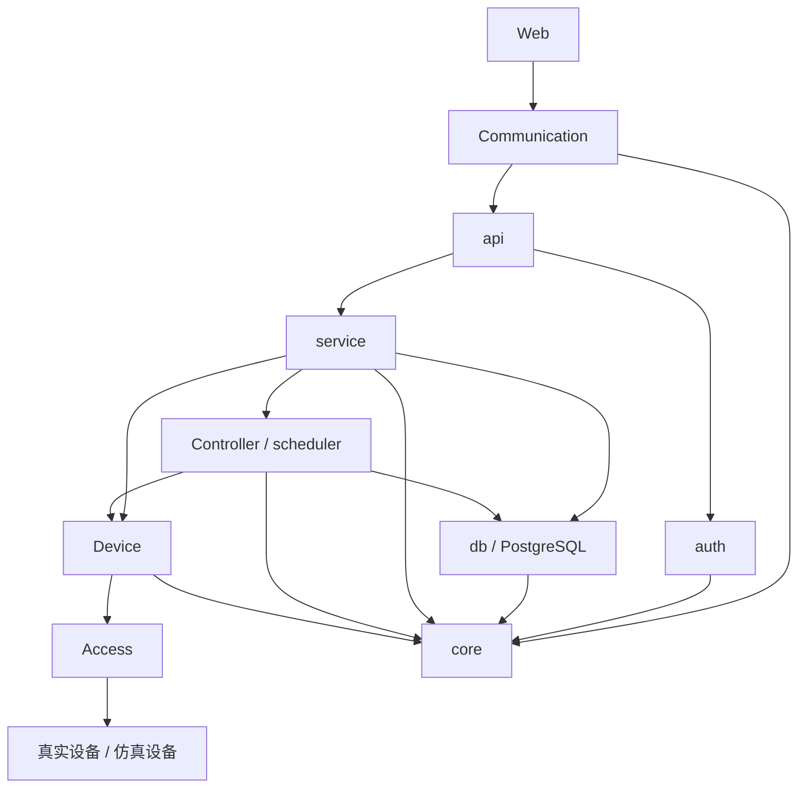
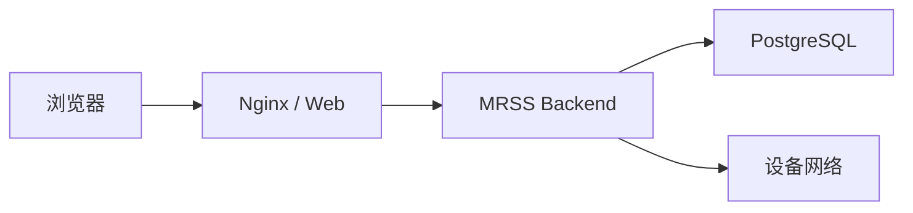
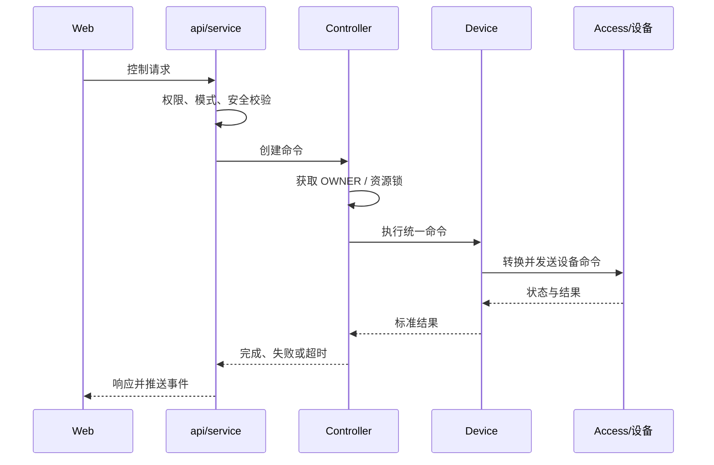

# 第3章 系统总体架构

## 3.1 概述

本章在项目背景和需求分析的基础上，给出 MRSS 一期的软件总体架构，明确系统边界、分层结构、模块职责、依赖关系、部署方式、核心控制链路、数据流、安全边界及扩展原则。

MRSS 一期采用以 Web 和 Backend 为核心的分层架构。Backend 统一承担认证授权、业务服务、设备控制、任务调度、资源仲裁、安全联锁、数据存储和设备接入；真实设备与仿真设备通过统一接口接入。一期不引入 IOC，EPICS 不处于控制主链路中。

## 3.2 架构目标

总体架构应满足以下目标：

1. Web、业务逻辑、控制逻辑和设备协议相互解耦。
2. 仿真设备与真实设备使用相同的上层接口和业务流程。
3. 支持两台机械臂独立控制、双臂协同以及机械臂与相机协同。
4. 统一管理 Manual/Auto 模式、OWNER、资源锁和命令仲裁。
5. 统一处理 SIM、HW、SW 三类急停源和 GLOBAL 全局急停锁存。
6. 单设备故障限制在相关设备与任务范围内。
7. HTTP、WebSocket、TCP、UDP 等通信能力具有统一管理边界。
8. 用户请求、任务、设备命令、告警和审计记录能够端到端关联。
9. 各模块可独立测试、替换和扩展。
10. 为后续 EPICS 接入、设备扩展及分布式部署保留演进空间。

## 3.3 系统边界

### 3.3.1 系统内部

MRSS 一期包含以下组成：

| 组成 | 说明 |
| --- | --- |
| Web | 浏览器端监控、操作、配置和查询界面 |
| Backend | 系统核心服务，包含 api、service、Controller、Device、Access、Communication、db、auth、core 等模块 |
| PostgreSQL | 保存配置、用户、任务、历史、告警和审计数据 |
| 仿真组件 | 模拟机械臂、相机和辐射传感器行为 |
| 配置与运行文件 | YAML 配置、日志、证书及部署脚本 |

### 3.3.2 外部系统与设备

| 外部对象 | 交互内容 |
| --- | --- |
| 瑞尔曼机械臂 | 状态读取、使能、停止、复位和运动控制 |
| 海康相机 | 状态、云台、变焦、聚焦、视频及抓拍 |
| 辐射传感器 | 连续采集、状态及异常信息 |
| 硬件安全系统 | 硬件急停状态和独立安全保护 |
| 运维人员 | 通过 Web 使用系统 |
| 后续 EPICS 平台 | 作为可选外部适配对象，不进入一期主链路 |

## 3.4 总体逻辑架构

MRSS Backend 采用分层和模块化设计：



图中的箭头表示主要调用方向。core 为公共基础层；Communication 为通信能力层；api 负责请求解析和响应组织；service 负责业务编排；Controller 和 scheduler 负责控制与任务执行；Device 维护统一设备模型和生命周期；Access 隔离厂商 SDK、协议和外部系统差异。

## 3.5 分层职责

### 3.5.1 表现层

表现层由 Web 构成，负责：

- 用户登录和权限相关界面；
- 实时监控和设备状态展示；
- 手动控制和任务操作；
- 告警、历史、日志和审计查询；
- 系统与设备配置；
- 接收 WebSocket 实时事件并维护页面状态。

Web 不直接连接设备或数据库，也不承担最终权限和安全判断。

### 3.5.2 接口层

接口层由 api 和 Communication 面向 Web 的部分构成。

api 仅作为 Handler 层，负责：

- 路由绑定；
- 请求解析与参数初步校验；
- 认证上下文提取；
- 调用 service；
- 将业务结果转换为统一 HTTP 响应；
- 建立或管理 WebSocket 会话入口。

api 不实现任务流程、资源仲裁和厂商设备控制逻辑。

### 3.5.3 业务服务层

service 负责业务用例编排，包括：

- 用户、设备、任务、告警和审计业务；
- 权限、模式、安全和资源校验的组织；
- Controller、Device、db 和事件服务的协调；
- 事务边界和业务错误转换；
- 面向 api 提供稳定业务接口。

### 3.5.4 控制与调度层

Controller 与 scheduler 负责：

- 单设备控制命令执行；
- 点动、单点、连续轨迹和协同轨迹；
- 双臂协同；
- 机械臂到位后相机拍照；
- 任务排队、步骤推进、暂停、继续和取消；
- OWNER 与资源锁；
- 命令超时、停止、回滚和失败策略；
- 与全局急停状态联动。

Controller 在本文中表示 Backend 内部控制逻辑，不表示 HTTP API Controller。

### 3.5.5 设备管理层

Device 负责：

- 统一设备对象和状态模型；
- DeviceManager 和 AdapterFactory；
- 设备注册、查找和生命周期管理；
- 状态缓存、能力描述及命令上下文；
- 仿真、真实和混合适配器选择；
- 将具体适配差异隔离在统一接口之后。

### 3.5.6 外部接入层

Access 负责：

- 厂商 SDK 封装；
- HTTP、TCP、UDP 或串口设备协议适配；
- 瑞尔曼、海康和辐射传感器的具体接入；
- 数据编码、解码、单位转换和协议错误映射；
- 后续 EPICS 接口适配。

Access 不负责用户权限、业务任务和跨设备协同。

### 3.5.7 数据访问层

db 负责：

- PostgreSQL 连接和连接池；
- SOCI 会话封装；
- Repository 和事务管理；
- 数据模型与数据库记录转换；
- 数据库异常统一转换；
- 数据迁移和版本管理。

service 和特定控制组件通过 db 接口访问数据，不直接拼接分散的 SQL。

### 3.5.8 认证授权层

auth 负责：

- 密码哈希与校验；
- JWT 签发、解析、过期和失效处理；
- 用户身份上下文；
- RBAC 权限判断；
- 登录安全和关键认证审计。

前端权限仅用于交互展示，最终权限判定必须在 Backend 完成。

### 3.5.9 通信层

Communication 统一管理：

- HTTP 服务；
- WebSocket 连接、订阅与推送；
- 设备侧 TCP/UDP 通信基础能力；
- 请求标识、连接状态和消息分发；
- 超时、重连、心跳、背压和线程切换。

厂商协议语义仍由 Access 处理，Communication 只提供通用传输能力。

### 3.5.10 公共基础层

core 不包含业务逻辑，提供：

- 日志；
- 配置；
- 线程、任务队列和定时器；
- 事件总线；
- 时间、标识和错误码；
- 公共数据结构；
- 序列化与常用工具。

第三方依赖统一放入 lib，不作为业务模块。

## 3.6 Backend 模块结构

建议工程结构如下：

```text
backend/
├── api/
├── service/
├── controller/
├── scheduler/
├── device/
├── access/
│   ├── realman/
│   ├── hikvision/
│   ├── radiation/
│   └── epics/
├── communication/
├── db/
├── auth/
├── core/
├── app/
├── config/
├── tests/
└── lib/
```

其中 app 负责应用装配与启动，不承载可复用业务逻辑；access/epics 仅作为后续预留，一期可不编译或使用空实现。

## 3.7 模块依赖规则

### 3.7.1 允许的主要依赖

| 调用方 | 可依赖模块 |
| --- | --- |
| api | service、auth、Communication、core |
| service | Controller、scheduler、Device、db、auth、core |
| Controller | Device、scheduler、db、core |
| scheduler | Controller、db、core |
| Device | Access、Communication、core |
| Access | Communication、core、必要的第三方 SDK |
| db | core、SOCI、PostgreSQL 驱动 |
| auth | db、core、jwt-cpp |
| app | 各模块公开装配接口 |
| core | 标准库及基础第三方库 |

### 3.7.2 禁止的依赖

1. core 禁止依赖任何业务模块。
2. db 禁止依赖 service、Controller 或 api。
3. Access 禁止依赖 api 和 Web 业务模型。
4. DeviceAdapter 禁止执行用户权限判断。
5. api 禁止直接调用厂商 SDK、SOCI 或 PostgreSQL。
6. Web 禁止直接连接数据库和设备。
7. 模块之间禁止通过全局可变对象形成隐式依赖。
8. 上层禁止根据具体厂商型号编写业务分支，能力差异通过统一能力模型表达。

## 3.8 部署架构

### 3.8.1 一期部署方式

一期默认采用单机集中部署：



Nginx 提供 Web 静态资源和 Backend 反向代理；Backend 以独立 systemd 服务运行；PostgreSQL 独立运行；Backend 通过设备网络连接真实设备，也可以在本机加载仿真适配器。

### 3.8.2 网络边界

| 区域 | 主要内容 | 约束 |
| --- | --- | --- |
| 用户访问区 | 浏览器、运维终端 | 仅通过统一 Web 入口访问 |
| 应用服务区 | Nginx、Backend | 限制管理端口和文件权限 |
| 数据区 | PostgreSQL | 不直接暴露给普通用户网络 |
| 设备控制区 | 机械臂、相机、传感器 | 与办公网络进行必要隔离 |
| 安全回路 | 硬件急停 | 独立于普通软件与网络链路 |

## 3.9 核心请求链路

### 3.9.1 查询请求

1. Web 发起 HTTP 查询。
2. Communication 接收并分发请求。
3. api 解析参数和认证信息。
4. auth 校验身份与权限。
5. service 获取缓存状态或通过 db 查询历史数据。
6. api 返回统一响应。
7. 请求结果按需要记录审计或访问日志。

### 3.9.2 控制请求



控制请求的“已接收”和“执行完成”必须区分。耗时操作通过命令标识跟踪，并通过 WebSocket 推送进度及最终结果。

### 3.9.3 实时事件链路

设备状态、任务进度、传感器数据和告警通过统一事件模型进入事件总线。订阅服务根据事件类别完成：

- 更新内存状态快照；
- 保存关键状态或历史数据；
- 触发告警判断；
- 向 WebSocket 客户端推送；
- 生成审计或系统日志。

客户端重连后先获取完整快照，再接收增量事件。

## 3.10 设备抽象架构

### 3.10.1 统一接口

所有设备适配器至少提供以下通用能力：

- 初始化与关闭；
- 连接与断开；
- 状态读取；
- 能力查询；
- 命令执行；
- 停止与复位；
- 事件回调或状态上报；
- 健康检查。

机械臂、相机和传感器在通用接口基础上扩展各自类型接口。

### 3.10.2 适配器创建

AdapterFactory 根据设备配置中的类型、型号和 adapter 字段创建实现：

| adapter | 行为 |
| --- | --- |
| simulation | 创建仿真适配器 |
| real | 创建真实设备适配器 |
| disabled | 不创建设备连接，状态为 DISABLED |

混合模式允许每台设备独立配置 adapter，不需要全系统统一切换。

### 3.10.3 能力模型

不同型号的能力差异通过能力描述表达，例如：

- 机械臂支持的运动类型、关节数和速度范围；
- 相机是否支持云台、变焦、聚焦和抓拍；
- 传感器支持的单位、量程和采样频率。

上层在下发命令前完成能力判断。

## 3.11 状态管理架构

### 3.11.1 状态分类

| 状态类别 | 示例 | 维护位置 |
| --- | --- | --- |
| 连接状态 | online、last_seen | Device |
| 工作状态 | IDLE、RUNNING、FAULT | Device/Controller |
| 运行模式 | Manual、Auto | 模式管理组件 |
| 资源状态 | OWNER、租约、锁 | 资源管理组件 |
| 安全状态 | SIM、HW、SW、GLOBAL | 安全管理组件 |
| 任务状态 | queued、running、paused、failed | scheduler |
| 业务状态 | 告警、确认、恢复 | service/db |

### 3.11.2 状态一致性

实时状态以内存快照为主，关键状态变化持久化。状态更新应包含版本号或时间戳，避免旧数据覆盖新状态。来源不可信或超时的数据不得被当作正常在线状态。

Backend 重启后从配置和数据库恢复可恢复信息，并重新连接设备、重新读取真实状态；不得直接沿用重启前的 RUNNING 状态。

## 3.12 模式与资源架构

Manual 和 Auto 是控制模式，不是设备工作状态。模式管理组件负责模式切换条件和控制源准入；资源管理组件负责 OWNER 和资源锁。

资源标识至少支持单设备、设备子资源及协同资源组。多资源任务按稳定顺序一次性申请；任何资源获取失败时释放已经获得的资源。锁具有所有者、关联用户或任务、获得时间、租约和状态。

优先级原则为：

1. 硬件安全和全局急停；
2. 软件急停和授权强制停止；
3. 已持有资源的有效控制流程；
4. 普通手动或自动控制申请；
5. 查询和监控请求。

## 3.13 安全架构

### 3.13.1 分层安全

| 层级 | 主要职责 |
| --- | --- |
| 硬件安全层 | 物理急停、安全回路、驱动器保护 |
| 软件安全层 | 急停汇聚、命令阻断、模式和状态校验 |
| 控制安全层 | 参数限制、超时、停止、资源互斥 |
| 访问安全层 | 身份认证、权限和审计 |
| 数据安全层 | 敏感配置保护、数据库权限和备份 |

软件安全不能替代硬件安全。

### 3.13.2 急停主链路

任一 SIM、HW 或 SW 急停源触发后，安全管理组件锁存 GLOBAL 状态，直接通知 Controller 和 Device 停止受影响的危险动作，并阻断新的运动命令。急停解除后必须由授权用户复位，重新确认设备状态，不自动恢复原任务。

急停处理使用独立高优先级通道，不得排在普通任务队列之后。

## 3.14 任务与协同架构

任务由定义、实例、步骤和执行上下文组成。scheduler 管理排队和生命周期，Controller 执行具体步骤，资源管理组件保证互斥，Device 执行设备命令。

典型协同类型包括：

- 双机械臂顺序动作；
- 双机械臂同步点控制；
- 机械臂到位后相机拍照；
- 机械臂动作与传感器采集关联。

每个步骤具有输入、超时、重试、失败策略和结果。协同失败只停止参与该协同关系的资源，除非触发 GLOBAL 急停或系统级安全故障。

## 3.15 数据架构

### 3.15.1 数据分类

| 类型 | 存储方式 | 示例 |
| --- | --- | --- |
| 配置数据 | PostgreSQL/YAML | 用户、设备、阈值、服务参数 |
| 实时状态 | 内存快照 | 在线、模式、OWNER、任务进度 |
| 业务数据 | PostgreSQL | 任务定义、任务实例、照片关联 |
| 时序历史 | PostgreSQL 分区或批量表 | 传感器值、关键设备状态 |
| 告警审计 | PostgreSQL | 告警、确认、操作审计 |
| 运行日志 | 文件/日志系统 | 调试、运行和故障信息 |

YAML 负责进程启动所需静态配置；需要在线管理和追踪的数据进入 PostgreSQL。密码、密钥等敏感信息不得写入普通日志或公开配置。

### 3.15.2 数据关联

系统统一使用 request_id、command_id、task_id、device_id、user_id 和 timestamp 进行关联，使一次控制操作可以从 HTTP 请求追踪到设备命令、执行结果、告警和审计记录。

## 3.16 并发与线程模型

Backend 的主要并发边界如下：

- HTTP/WebSocket I/O 线程只处理网络收发和轻量解析；
- 业务任务提交到工作线程池；
- 慢速设备调用在设备执行器中完成；
- 每台设备或资源采用串行执行上下文，避免命令乱序；
- 数据库操作使用独立连接池；
- 定时采样、重连和超时由定时器调度；
- 急停使用独立高优先级执行路径。

线程之间通过线程安全队列、事件或明确同步原语传递数据，禁止持有模块锁执行慢速网络和数据库操作。

## 3.17 错误与故障隔离

系统采用统一错误模型，至少包含错误码、类别、模块、设备、任务、请求标识、描述、可重试性和时间。

| 故障范围 | 处理原则 |
| --- | --- |
| 单设备通信故障 | 标记设备离线，停止依赖该设备的命令 |
| 单设备执行故障 | 影响该设备及相关任务 |
| 协同步骤故障 | 停止参与协同的资源并执行失败策略 |
| 数据库短时故障 | 保持安全控制，限制依赖持久化的业务 |
| Web 客户端断开 | 清理会话；持续点动必须超时停止 |
| 核心控制不可信 | 阻断新控制并进入安全状态 |
| GLOBAL 急停 | 停止所有受影响危险动作 |

异常不得跨越模块边界以未分类的形式传播；边界层应转换为统一错误。

## 3.18 可观测性架构

系统可观测性包括：

1. 结构化日志：包含时间、级别、模块和关联标识。
2. 运行指标：连接数、请求量、延迟、队列长度、设备在线率和错误率。
3. 健康检查：进程、数据库、线程池、设备连接和关键组件状态。
4. 审计记录：关键用户操作、模式切换、资源抢占和安全事件。
5. 告警：设备、任务、通信、安全和系统资源异常。
6. 状态快照：用于 Web 重连和运维诊断。

## 3.19 配置架构

配置按职责拆分为服务、数据库、认证、设备、通信、任务、告警、日志和仿真配置。配置加载流程为：

1. 读取基础 YAML；
2. 合并环境变量或安全配置；
3. 执行类型、范围和必填项校验；
4. 构造不可变配置快照；
5. 各模块仅获取自身配置；
6. 对允许热更新的参数执行版本化更新。

设备地址、超时、采样周期等可配置；密钥和密码通过受保护来源提供。

## 3.20 启动与关闭总体流程

### 3.20.1 启动顺序

1. 加载并校验配置；
2. 初始化日志和 core；
3. 初始化数据库连接与迁移检查；
4. 初始化 auth；
5. 创建 Communication；
6. 创建 DeviceManager 和适配器；
7. 初始化资源、安全、Controller 和 scheduler；
8. 初始化 service 和 api；
9. 启动设备连接与状态同步；
10. 启动 HTTP/WebSocket 服务；
11. 发布系统就绪状态。

### 3.20.2 关闭顺序

1. 标记系统进入停止状态；
2. 停止接收新的控制和任务；
3. 通知活动任务取消或安全终止；
4. 停止设备运动并释放资源；
5. 停止采样、重连和定时任务；
6. 关闭设备适配器；
7. 停止 HTTP/WebSocket；
8. 刷新日志和待持久化数据；
9. 关闭数据库和 core。

详细生命周期在第14章展开。

## 3.21 关键技术选型

| 领域 | 选型 | 说明 |
| --- | --- | --- |
| Backend 语言 | C++17 | 统一核心服务和设备控制 |
| HTTP/WebSocket | uWebSockets | 沿用现有技术路线 |
| 数据库 | PostgreSQL | 保存业务与历史数据 |
| 数据访问 | SOCI | 数据库访问和兼容封装 |
| 配置 | yaml-cpp | YAML 解析 |
| 身份认证 | JWT / jwt-cpp | 无状态访问令牌 |
| 角色权限 | RBAC | 用户—角色—权限模型 |
| 服务管理 | systemd | 进程启动、停止和恢复 |
| Web 入口 | Nginx | 静态资源与反向代理 |
| 测试替身 | 仿真 Adapter | 支持无硬件开发与验证 |

## 3.22 一期与后续架构边界

### 3.22.1 一期实现

- 单 Backend 集中部署；
- 两台瑞尔曼机械臂；
- 两类海康相机；
- 一类辐射传感器；
- 仿真、真实和混合适配；
- Manual/Auto、OWNER、资源锁；
- 三源急停及 GLOBAL 锁存；
- HTTP/WebSocket、PostgreSQL、日志、告警和审计；
- 双臂及机械臂—相机协同。

### 3.22.2 后续演进

- EPICS 接入；
- 多 Backend 或跨站点调度；
- 消息总线和独立时序数据库；
- 更复杂的协同轨迹规划；
- 高可用数据库与应用集群；
- 高级数据分析和预测性维护；
- 更多机器人、机械臂、相机和传感器。

后续能力应通过新增适配器、服务或部署组件扩展，不破坏一期已稳定的 API 和统一设备模型。

## 3.23 架构约束与检查项

架构评审至少检查：

1. 是否存在 api 直接访问数据库或设备 SDK。
2. 是否存在 service 拼装厂商协议。
3. 是否将 Manual/Auto 与设备工作状态混用。
4. 是否所有运动命令都经过权限、模式、资源和安全校验。
5. 是否能够区分命令接收和命令完成。
6. 是否存在无租约、无清理机制的资源锁。
7. 是否支持 Web 断开后的点动停止。
8. 是否保证急停优先于普通任务队列。
9. 是否能隔离单设备故障。
10. 是否能够使用同一 API 切换仿真和真实适配器。
11. 是否为关键流程提供关联标识、日志和审计。
12. 是否保持 core 无业务依赖。

## 3.24 本章小结

本章确定了 MRSS 一期以 Web、Backend、PostgreSQL 和统一设备适配为核心的总体架构，明确了 api、service、Controller、scheduler、Device、Access、Communication、db、auth 和 core 的职责及依赖关系。同时规定了部署拓扑、控制链路、设备抽象、状态管理、模式与资源、安全、任务、数据、并发、故障隔离和生命周期原则。后续各模块详细设计必须遵守本章确定的边界和依赖规则。
