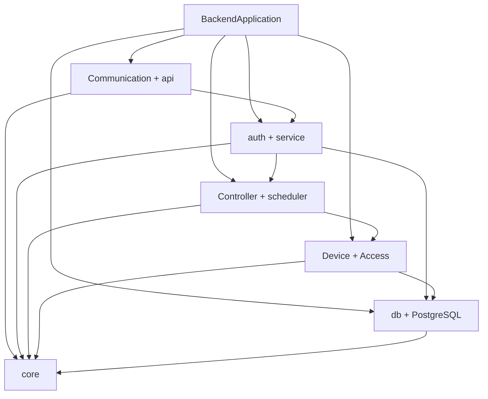
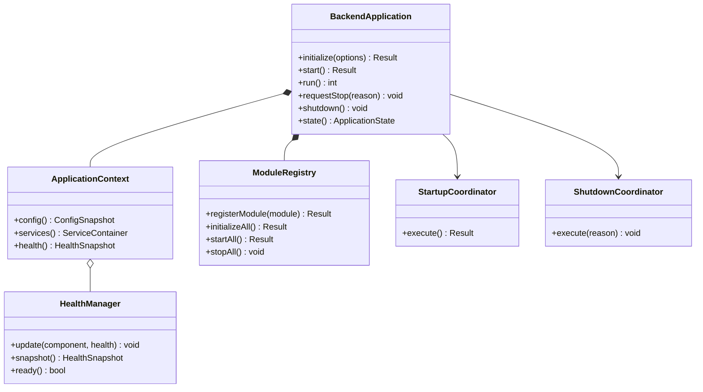
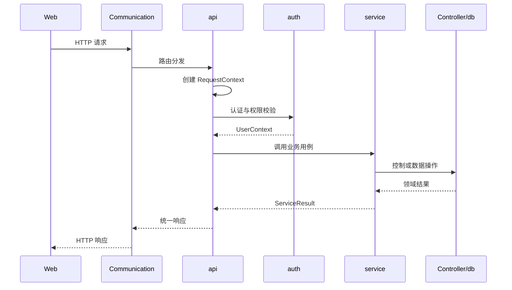
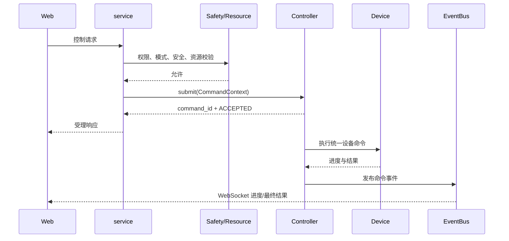
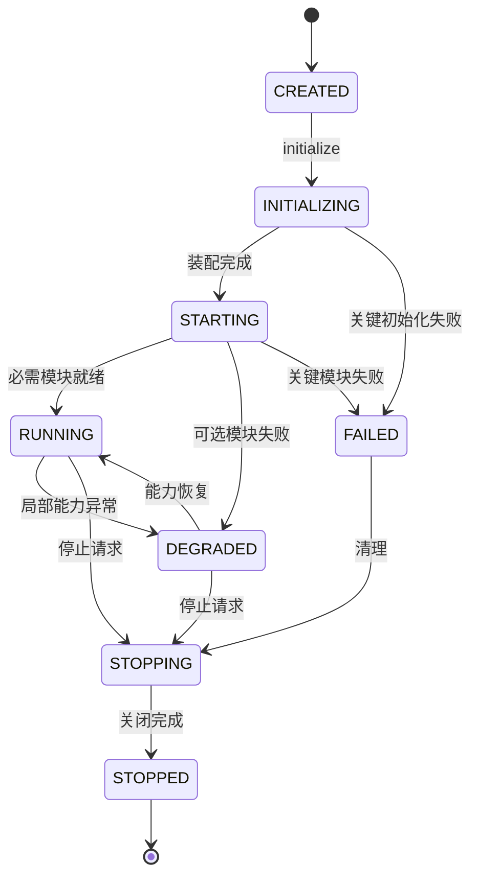
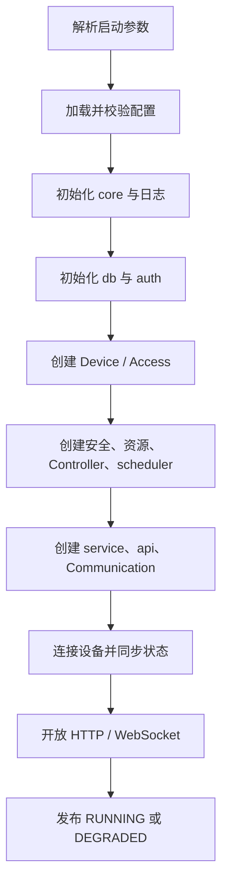
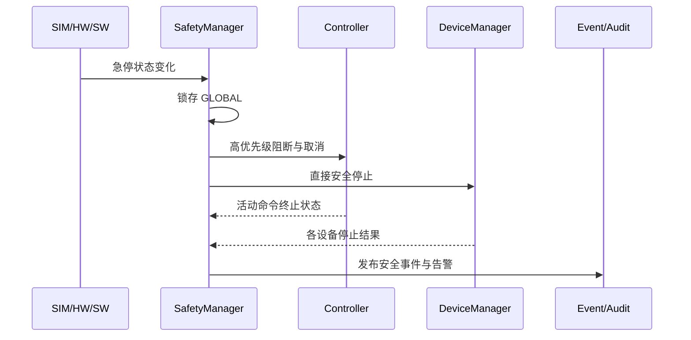

# 第4章 Backend 设计

## 4.1 概述

Backend 是 MRSS 一期的核心运行进程，负责连接 Web、PostgreSQL 与各类设备，并统一组织认证授权、业务服务、任务调度、设备控制、安全联锁、数据存储、实时推送、日志、告警和审计。

本章描述 Backend 作为完整应用的总体设计，重点说明应用装配、模块协作、运行上下文、请求链路、并发模型、生命周期、故障隔离和可观测性。Communication、Controller、Device、Access、db、auth、service、api 和 core 的内部实现分别在后续章节展开。

一期 Backend 采用 C++17 单进程、模块化架构。系统不引入 IOC，设备状态汇聚、资源仲裁、协同控制与软件安全联锁均在 Backend 内完成；真实设备与仿真设备通过统一接口接入。

## 4.2 设计目标

Backend 设计目标如下：

1. 为 Web 提供稳定、统一的 HTTP 与 WebSocket 接口。
2. 为两台瑞尔曼机械臂、两类海康相机和辐射传感器提供统一管理入口。
3. 支持仿真、真实和混合设备配置，上层业务不感知适配器差异。
4. 支持 Manual、Auto 模式及 OWNER、资源锁和控制冲突仲裁。
5. 支持点动、单点、连续轨迹和协同轨迹四类运动命令。
6. 支持双机械臂协同以及机械臂到位后相机拍照等跨设备流程。
7. 统一处理 SIM、HW、SW 三类急停源和 GLOBAL 急停锁存。
8. 区分请求受理与命令完成，支持进度、取消、超时和结果追踪。
9. 隔离单设备、单任务和单连接故障，避免无关模块被连带停止。
10. 对关键操作和状态变化提供日志、指标、告警和审计追踪。
11. 形成清晰的模块依赖和可测试边界，支持后续增加设备与外部系统。

## 4.3 设计原则

### 4.3.1 单一职责

各模块仅承担自身职责。api 不执行业务流程，service 不解析厂商协议，Controller 不处理用户登录，Device 不访问 Web 会话，Access 不决定业务权限，core 不包含业务逻辑。

### 4.3.2 显式依赖

模块依赖由应用装配层显式构造和注入，不通过可变全局对象隐式获取。模块仅依赖公开接口，不依赖其他模块内部实现。

### 4.3.3 控制与查询分离

查询请求可以同步返回当前快照或历史数据；运动、协同和耗时设备命令采用异步执行，接口先返回受理结果，再通过查询或 WebSocket 返回进度和最终结果。

### 4.3.4 安全优先

急停和安全状态检查优先于普通控制流程。所有危险动作必须通过身份、权限、模式、设备状态、能力、资源和安全校验。

### 4.3.5 故障隔离

局部故障限制在最小影响范围。设备离线只影响依赖该设备的命令和任务；只有 GLOBAL 急停或核心状态不可信时才阻断全部危险动作。

### 4.3.6 可追踪

请求、命令、任务、设备事件、告警和审计记录使用统一关联标识，能够从用户请求追踪到设备执行结果。

## 4.4 Backend 职责与边界

### 4.4.1 Backend 负责的内容

| 类别 | 主要职责 |
| --- | --- |
| 应用装配 | 创建模块、注入依赖、控制启动和停止顺序 |
| 接口服务 | 接收 HTTP/WebSocket 请求并返回统一结果 |
| 身份与权限 | JWT、用户上下文、RBAC、关键操作授权 |
| 业务编排 | 用户、设备、任务、告警、历史和审计用例 |
| 控制执行 | 单设备控制、协同控制、停止、取消、超时 |
| 资源仲裁 | Manual/Auto、OWNER、资源锁、租约和抢占 |
| 安全联锁 | 三源急停汇聚、GLOBAL 锁存、命令阻断与复位 |
| 设备管理 | 设备注册、连接、状态缓存、能力和适配器生命周期 |
| 数据管理 | PostgreSQL 访问、事务、历史和配置数据 |
| 实时事件 | 状态、进度、传感器和告警的事件分发与推送 |
| 运维能力 | 配置、日志、指标、健康检查和优雅关闭 |

### 4.4.2 Backend 不负责的内容

1. 不替代机械臂控制器、相机固件或传感器自身保护逻辑。
2. 不替代硬件急停、安全回路和驱动器硬件保护。
3. 不直接提供视频编解码能力，视频流由相机或流媒体组件提供。
4. 一期不承担 IOC 的运行和维护。
5. 一期不实现跨站点分布式调度和 Backend 集群一致性。
6. 不在 api、service 或 Controller 中直接调用厂商 SDK。

## 4.5 架构位置与模块协作



`BackendApplication` 只负责装配和生命周期，不直接实现业务用例。业务调用遵循 api → service → Controller/Device/db 的主要方向；设备协议调用遵循 Device → Access → Communication 的方向；core 为所有模块提供无业务含义的基础能力。

## 4.6 Backend 工程结构

```text
backend/
├── app/
│   ├── backend_application.h
│   ├── backend_application.cpp
│   ├── application_context.h
│   ├── module_registry.h
│   ├── startup_coordinator.h
│   ├── shutdown_coordinator.h
│   └── health_manager.h
├── api/
├── service/
├── controller/
├── scheduler/
├── device/
├── access/
├── communication/
├── db/
├── auth/
├── core/
├── config/
├── tests/
├── lib/
└── main.cpp
```

`app` 是应用装配层，只允许依赖各模块公开接口。其他模块不得反向依赖 `app`。`main.cpp` 仅完成参数处理、信号注册、`BackendApplication` 创建、启动、等待和退出码返回。

## 4.7 核心类关系



## 4.8 BackendApplication 详细设计

### 4.8.1 类职责

`BackendApplication` 是 Backend 进程的根对象，负责：

- 保存应用状态；
- 创建应用上下文和模块注册表；
- 驱动初始化、启动、运行和停止；
- 接收操作系统退出信号；
- 防止重复启动和重复关闭；
- 返回统一进程退出码。

它不得承载用户、设备、任务或告警业务逻辑。

### 4.8.2 主要成员变量

| 成员 | 类型 | 说明 |
| --- | --- | --- |
| `state_` | `std::atomic<ApplicationState>` | 当前应用状态 |
| `context_` | `std::unique_ptr<ApplicationContext>` | 应用共享上下文 |
| `modules_` | `std::unique_ptr<ModuleRegistry>` | 模块注册与生命周期管理 |
| `startup_` | `std::unique_ptr<StartupCoordinator>` | 启动流程协调器 |
| `shutdown_` | `std::unique_ptr<ShutdownCoordinator>` | 关闭流程协调器 |
| `stop_source_` | `StopSource` | 全局协作停止信号 |
| `wait_mutex_` | `std::mutex` | 运行等待互斥量 |
| `wait_cv_` | `std::condition_variable` | 停止唤醒条件变量 |
| `exit_code_` | `std::atomic<int>` | 进程退出码 |
| `stop_reason_` | `std::string` | 首次停止原因 |

### 4.8.3 主要成员函数

| 函数 | 说明 | 失败处理 |
| --- | --- | --- |
| `initialize(options)` | 加载配置、创建上下文、装配模块 | 进入 `FAILED`，返回错误 |
| `start()` | 按依赖顺序初始化并启动模块 | 回滚已启动模块 |
| `run()` | 等待停止信号并返回退出码 | 不执行阻塞业务 |
| `requestStop(reason)` | 幂等地发出停止请求 | 保留首次停止原因 |
| `shutdown()` | 按逆序安全停止模块 | 记录异常并继续清理 |
| `state()` | 返回应用状态快照 | 无 |

### 4.8.4 接口示例

```cpp
class BackendApplication final {
public:
    Result<void> initialize(const AppOptions& options);
    Result<void> start();
    int run();
    void requestStop(std::string reason);
    void shutdown() noexcept;
    ApplicationState state() const noexcept;

private:
    std::atomic<ApplicationState> state_{ApplicationState::CREATED};
    std::unique_ptr<ApplicationContext> context_;
    std::unique_ptr<ModuleRegistry> modules_;
    StopSource stop_source_;
};
```

## 4.9 ApplicationContext 详细设计

### 4.9.1 类职责

`ApplicationContext` 保存应用运行期需要共享的稳定对象引用，包括配置快照、时钟、标识生成器、事件总线、健康管理器和各模块公开服务接口。

上下文不是任意对象存储区，不允许通过字符串名称获取未声明类型，也不允许模块在运行期随意替换核心依赖。

### 4.9.2 上下文内容

| 内容 | 生命周期 | 访问方式 |
| --- | --- | --- |
| `ConfigSnapshot` | 整个应用或配置版本周期 | 只读共享 |
| `Clock` | 整个应用 | 接口引用 |
| `IdGenerator` | 整个应用 | 线程安全接口 |
| `EventBus` | 整个应用 | 发布/订阅接口 |
| `HealthManager` | 整个应用 | 线程安全接口 |
| `ServiceContainer` | 模块启动后 | 强类型接口 |
| `StopToken` | 整个应用 | 只读协作停止令牌 |

### 4.9.3 约束

1. 配置默认以不可变快照形式提供。
2. 不保存请求级临时数据。
3. 不暴露模块实现类给无关模块。
4. 不允许业务代码直接修改应用状态。
5. 上下文销毁必须晚于依赖它的模块。

## 4.10 ModuleRegistry 详细设计

### 4.10.1 模块接口

所有需要参与应用生命周期的模块实现统一接口：

```cpp
class IApplicationModule {
public:
    virtual ~IApplicationModule() = default;
    virtual std::string_view name() const noexcept = 0;
    virtual ModuleCriticality criticality() const noexcept = 0;
    virtual Result<void> initialize(ApplicationContext& context) = 0;
    virtual Result<void> start() = 0;
    virtual void stop(StopMode mode) noexcept = 0;
    virtual HealthStatus health() const = 0;
};
```

### 4.10.2 模块分级

| 级别 | 示例 | 启动失败处理 |
| --- | --- | --- |
| CRITICAL | core、配置、安全管理、Controller 基础能力 | Backend 启动失败 |
| REQUIRED | db、auth、api、HTTP 服务 | 默认启动失败，可按明确配置降级 |
| OPTIONAL | 单个设备适配器、部分采集器、非关键推送 | 标记 DEGRADED，继续启动 |

单个真实设备连接失败不等同于 Device 模块初始化失败。Device 模块可以正常启动，同时将对应设备标记为 OFFLINE。

### 4.10.3 启停规则

1. 注册时声明模块名称、依赖项和关键级别。
2. 注册表执行依赖拓扑检查，拒绝循环依赖和缺失依赖。
3. 初始化与启动按拓扑顺序执行。
4. 关闭按实际成功启动顺序的逆序执行。
5. 启动中途失败时，仅回滚已经成功启动的模块。
6. `stop()` 必须幂等且不得向外抛出异常。

## 4.11 运行上下文设计

### 4.11.1 RequestContext

每个外部请求建立 `RequestContext`：

| 字段 | 说明 |
| --- | --- |
| `request_id` | 请求唯一标识 |
| `trace_id` | 跨模块追踪标识 |
| `user_id` | 已认证用户标识 |
| `roles` / `permissions` | 当前授权快照 |
| `client_ip` | 客户端地址 |
| `session_id` | 会话或连接标识 |
| `received_at` | Backend 接收时间 |
| `deadline` | 请求截止时间 |
| `locale` | 可选语言和区域信息 |

`RequestContext` 在 api 创建，经 service 传递，但不得传入厂商 SDK。日志和审计从该对象提取关联字段。

### 4.11.2 CommandContext

控制命令建立独立的 `CommandContext`：

| 字段 | 说明 |
| --- | --- |
| `command_id` | 命令唯一标识 |
| `request_id` | 来源请求标识 |
| `task_id` | 所属任务，可为空 |
| `owner` | 控制所有者 |
| `mode` | Manual 或 Auto |
| `resource_ids` | 需要占用的资源集合 |
| `priority` | 命令优先级 |
| `created_at` | 创建时间 |
| `deadline` | 执行截止时间 |
| `cancel_token` | 取消令牌 |
| `safety_version` | 提交时安全状态版本 |

请求结束后，异步命令仍可持有其自身的 `CommandContext`，但不持有 HTTP 请求对象或 WebSocket 连接对象。

### 4.11.3 EventContext

设备、任务、告警和系统事件至少携带 `event_id`、`event_type`、`source`、`timestamp`、`sequence` 和可选关联标识。事件负载使用稳定的数据传输对象，不发布模块内部可变对象。

## 4.12 请求处理总体流程



处理要求如下：

1. Communication 只执行网络收发、连接管理和轻量消息分发。
2. api 完成路由、格式和基础参数校验。
3. auth 生成可信用户上下文并执行权限判断。
4. service 负责业务规则和事务边界。
5. Controller、Device 或 db 返回统一结果，不直接生成 HTTP 状态码。
6. api 将业务错误映射为统一响应。
7. 所有阶段记录同一 `request_id` 和 `trace_id`。

## 4.13 控制命令受理与执行

### 4.13.1 两阶段结果

Backend 将控制结果分为两个阶段：

| 阶段 | 含义 | 典型状态 |
| --- | --- | --- |
| 受理阶段 | 校验请求并决定是否进入执行系统 | REJECTED、ACCEPTED |
| 执行阶段 | 命令在设备或协同流程中的最终结果 | RUNNING、SUCCEEDED、FAILED、TIMEOUT、CANCELED、ESTOPPED |

`ACCEPTED` 只表示已进入执行系统，不表示设备已经动作成功。

### 4.13.2 控制链路



### 4.13.3 幂等与重复请求

对可能因网络重试而重复提交的控制接口，客户端提供 `idempotency_key`。Backend 在规定时间窗内将用户、接口和幂等键映射到同一受理结果，避免重复创建危险动作。

点动类命令使用控制会话和序列号，不采用普通请求重试语义。控制会话失联、租约过期或序列长时间不更新时必须停止点动。

## 4.14 实时事件与状态快照

### 4.14.1 事件类型

| 类型 | 示例 |
| --- | --- |
| 设备事件 | 上线、离线、状态、位置、故障 |
| 命令事件 | 受理、开始、进度、完成、失败 |
| 任务事件 | 排队、运行、步骤变化、暂停、结束 |
| 安全事件 | 急停触发、急停解除、复位成功或失败 |
| 资源事件 | OWNER 获取、续租、释放、抢占 |
| 传感器事件 | 辐射采样值、质量状态、阈值变化 |
| 告警事件 | 产生、更新、确认、恢复 |
| 系统事件 | 启动、降级、配置更新、停止 |

### 4.14.2 状态快照

Backend 在内存中维护可读状态快照，至少包括系统状态、设备状态、模式、资源占用、急停状态、活动任务、活动命令和当前告警。

快照采用读多写少设计。更新由对应状态所有者完成，读取方获得不可变版本。每次更新增加版本号并记录时间戳，防止旧事件覆盖新状态。

### 4.14.3 WebSocket 重连

WebSocket 客户端重连后执行：

1. 重新认证连接；
2. 获取当前完整状态快照及版本号；
3. 建立事件订阅；
4. 接收版本号之后的增量事件；
5. 发现版本断档时重新请求完整快照。

## 4.15 线程与并发模型

### 4.15.1 执行域

| 执行域 | 职责 | 禁止事项 |
| --- | --- | --- |
| I/O 线程 | HTTP/WebSocket/TCP/UDP 收发 | 阻塞设备和数据库调用 |
| 业务线程池 | service 用例和轻量计算 | 长时间占用模块锁 |
| 设备执行器 | 每台设备命令串行化 | 直接操作 Web 会话 |
| 调度执行器 | 任务和协同步骤推进 | 执行厂商阻塞调用 |
| 数据库线程/连接池 | SQL 和事务 | 持有设备互斥量 |
| 定时器线程 | 超时、心跳、重连和租约检查 | 执行耗时业务 |
| 急停通道 | 高优先级停止与阻断 | 排队等待普通任务完成 |

### 4.15.2 并发约束

1. 同一设备的普通控制命令在设备执行器内串行执行。
2. 多设备协同由 Controller 统一推进，不由多个独立回调隐式同步。
3. 多资源锁按稳定资源编号顺序申请，避免死锁。
4. 不持有数据库事务等待设备动作完成。
5. 不持有模块互斥量执行网络、SDK 和数据库阻塞调用。
6. 回调进入 Backend 后先复制必要数据，再切换到目标执行域。
7. 关闭阶段禁止创建新的后台任务。

### 4.15.3 背压策略

队列必须设置容量和溢出策略：

- 控制命令队列满时拒绝新命令，不静默丢弃；
- 高频状态允许合并旧值，只保留最新快照；
- 告警、安全和最终结果事件不得被普通状态事件挤出；
- WebSocket 慢客户端超过缓存限制后断开，并要求重新获取快照；
- 传感器历史写入可批量提交，但必须记录丢样和延迟指标。

## 4.16 应用状态机



### 4.16.1 状态定义

| 状态 | 含义 |
| --- | --- |
| CREATED | 根对象已创建，尚未初始化 |
| INITIALIZING | 正在加载配置和装配模块 |
| STARTING | 模块正在按依赖顺序启动 |
| RUNNING | 必需能力就绪，可正常服务 |
| DEGRADED | 进程运行，但部分非关键能力不可用 |
| FAILED | 关键能力失败，不能进入服务状态 |
| STOPPING | 正在停止接入并释放资源 |
| STOPPED | 所有可关闭资源已经处理 |

设备自身的 OFFLINE、IDLE、RUNNING 等状态不得与应用状态混用。

## 4.17 启动流程设计



### 4.17.1 启动检查

启动前至少检查：

1. 配置语法、必填项、端口和路径是否合法。
2. 敏感配置是否来自允许的安全来源。
3. 数据库是否可连接，Schema 版本是否兼容。
4. JWT 密钥、令牌有效期和密码策略是否有效。
5. 设备标识、资源标识和网络地址是否重复。
6. 仿真、真实和 disabled 适配器类型是否可用。
7. 急停输入配置是否完整，初始状态是否可信。
8. HTTP/WebSocket 监听地址是否可绑定。

### 4.17.2 就绪条件

Backend 只有在下列条件满足后才对外报告 ready：

- core 和配置正常；
- 数据库及必要 Schema 可用；
- auth 可完成令牌校验；
- 安全管理组件已获得可信初始状态；
- Controller 和资源管理组件已启动；
- api 路由已注册；
- HTTP 服务已监听。

设备可以部分离线，此时 Backend 根据影响范围进入 RUNNING 或 DEGRADED，并在设备状态中明确报告离线原因。

## 4.18 关闭流程设计

### 4.18.1 关闭触发

关闭可由 SIGTERM、SIGINT、systemd 停止、不可恢复核心故障或授权的系统维护操作触发。多次触发只执行一次关闭流程。

### 4.18.2 关闭顺序

1. 将应用状态设置为 STOPPING。
2. readiness 立即返回不可接收新业务。
3. 停止接收新的控制命令和自动任务。
4. 向活动命令和任务发出取消或安全停止请求。
5. 等待限定的安全停止时间。
6. 强制停止仍在运行的危险动作并释放资源锁。
7. 停止采样、重连、租约和普通定时任务。
8. 断开 WebSocket，停止 HTTP/TCP/UDP 接入。
9. 关闭设备适配器和外部连接。
10. 刷新审计、关键事件、数据库批次和日志。
11. 逆序停止其余模块并释放 core。

### 4.18.3 超时处理

每个关闭阶段设置最大等待时间。非关键清理超时记录错误后继续；设备安全停止超时必须记录严重告警，并依赖硬件安全回路保持最终安全。关闭流程不得无限等待单个线程或设备。

## 4.19 健康检查与降级

### 4.19.1 健康状态

| 状态 | 含义 |
| --- | --- |
| HEALTHY | 组件正常，功能可用 |
| DEGRADED | 组件可运行但能力受限 |
| UNHEALTHY | 组件不可用或结果不可信 |
| UNKNOWN | 尚未取得可信状态 |

### 4.19.2 健康接口

- `live`：进程主循环和核心线程仍在运行；
- `ready`：Backend 可以接收新的正常业务；
- `detail`：返回授权范围内的模块、数据库、队列和设备健康摘要。

公开健康接口不得返回数据库密码、设备凭据、JWT 密钥、完整异常堆栈或内部网络敏感信息。

### 4.19.3 降级策略

| 故障 | 降级行为 |
| --- | --- |
| 单台设备离线 | 禁止该设备新命令，其他设备继续运行 |
| 相机抓拍失败 | 影响依赖抓拍的步骤，不停止无关机械臂任务 |
| 传感器离线 | 停止该传感器采集并产生告警 |
| WebSocket 推送异常 | HTTP 和内部控制保持运行，客户端可重连 |
| 数据库短时不可用 | 阻止必须持久化的写业务，保持安全停止能力 |
| 审计不可持久化 | 阻止配置、授权和高风险控制操作 |
| 安全状态不可信 | 阻断全部新危险动作 |

## 4.20 配置设计

### 4.20.1 配置分组

```yaml
app: {}
communication: {}
database: {}
auth: {}
devices: []
controller: {}
scheduler: {}
safety: {}
alarm: {}
logging: {}
simulation: {}
```

### 4.20.2 配置加载顺序

1. 编译期安全默认值；
2. 主 YAML 配置；
3. 独立受保护的敏感配置或环境变量；
4. 命令行允许覆盖的非敏感启动参数；
5. 类型、范围、引用关系和冲突校验；
6. 生成带版本号的不可变 `ConfigSnapshot`。

### 4.20.3 热更新

一期只允许对明确标记为动态的参数热更新，例如普通采样周期、部分告警阈值和日志级别。监听端口、数据库连接、JWT 核心密钥、设备类型、资源拓扑和急停源变更默认需要重启。

热更新采用“解析新配置—完整校验—构造新快照—通知相关模块—记录审计”的方式，不在原配置对象上逐字段修改。更新失败时继续使用旧版本。

## 4.21 统一错误设计

### 4.21.1 错误结构

统一错误至少包含：

```cpp
struct Error {
    ErrorCode code;
    ErrorCategory category;
    ErrorSeverity severity;
    std::string module;
    std::string message;
    bool retryable{false};
    std::string request_id;
    std::string command_id;
    std::string task_id;
    std::string device_id;
    timestamp_t timestamp{0};
};
```

### 4.21.2 错误类别

| 类别 | 示例 | 默认处理 |
| --- | --- | --- |
| VALIDATION | 参数越界、字段缺失 | 拒绝请求 |
| AUTHENTICATION | 令牌无效、会话过期 | 返回未认证 |
| AUTHORIZATION | 权限不足 | 返回禁止操作并审计 |
| CONFLICT | 模式或资源冲突 | 返回当前 OWNER 和可重试信息 |
| SAFETY | 急停、状态不可信 | 阻断命令并记录安全事件 |
| DEVICE | 离线、协议错误、设备拒绝 | 影响对应设备和命令 |
| TIMEOUT | 请求、命令或步骤超时 | 停止并进入失败策略 |
| DATABASE | 连接或事务失败 | 回滚并按业务等级降级 |
| INTERNAL | 未分类内部错误 | 隐藏内部细节并产生告警 |

### 4.21.3 异常边界

第三方库和厂商 SDK 异常必须在 Access、db、Communication 或 auth 边界转换为统一错误。异常不得穿过线程入口、C 回调或 `noexcept` 关闭函数。api 对外只返回稳定错误码和必要说明，内部堆栈写入受保护日志。

## 4.22 数据一致性与事务边界

1. 数据库事务由 service 或专用业务单元定义，不跨越设备动作持续时间。
2. 创建任务时，任务定义、实例和初始步骤在同一事务内保存。
3. 控制命令受理记录成功后再进入执行队列；无法持久化且该命令要求审计时不得执行。
4. 设备实际结果通过 `command_id` 幂等更新，重复回调不得生成多个最终状态。
5. 历史采样允许批量写入，告警和安全事件优先持久化。
6. Backend 重启后，将遗留的 RUNNING 命令和任务标记为 INTERRUPTED 或待人工确认，不直接自动续跑。
7. 数据库记录不作为实时安全状态的唯一来源；安全判断使用可信的运行时状态。

## 4.23 认证与安全协作

控制请求进入 Controller 前依次完成：

1. JWT 和用户状态校验；
2. RBAC 权限校验；
3. 请求参数与设备能力校验；
4. Manual/Auto 模式校验；
5. 设备状态和维护状态校验；
6. GLOBAL 及相关急停源校验；
7. OWNER 与资源锁校验；
8. 命令时效与幂等校验。

校验通过只代表允许提交。Controller 在实际下发设备动作前再次检查安全状态版本和资源所有权，避免受理后到执行前状态发生变化。

## 4.24 急停处理协作



急停触发后不等待数据库、WebSocket 或普通任务队列。状态持久化和前端推送在停止动作发出后异步完成。解除某个急停输入不自动解除 GLOBAL；授权用户发起复位后，Backend 必须确认全部急停源已解除、设备状态可信且不存在危险动作，才能清除锁存。

## 4.25 设备故障隔离

### 4.25.1 故障域

Backend 将故障划分为以下范围：

- 连接故障域：单个 HTTP、WebSocket 或设备连接；
- 设备故障域：单台机械臂、相机或传感器；
- 资源组故障域：参与同一协同动作的设备集合；
- 任务故障域：单个任务实例及其步骤；
- 模块故障域：db、auth、Communication 等模块；
- 系统安全故障域：GLOBAL 急停或核心安全状态不可信。

### 4.25.2 隔离规则

1. 单设备故障不改变无关设备的 Manual/Auto 模式。
2. 单设备故障仅释放该设备及相关协同资源。
3. 协同任务失败时停止所有参与当前协同步骤的资源。
4. 相机或传感器故障不得自动触发机械臂全局急停，除非配置为安全联锁条件。
5. 数据库故障不得阻止急停和本地安全停止。
6. 恢复后的设备先重新同步状态，再由授权流程恢复可控制状态。

## 4.26 日志、指标、告警与审计

### 4.26.1 结构化日志字段

日志至少包含 `timestamp`、`level`、`module`、`thread`、`message`，并按场景附加 `request_id`、`trace_id`、`command_id`、`task_id`、`device_id` 和 `user_id`。

### 4.26.2 核心指标

| 类别 | 指标示例 |
| --- | --- |
| 接口 | 请求量、错误率、P95 延迟、活动连接数 |
| 队列 | 长度、等待时间、拒绝数、丢弃数 |
| 设备 | 在线率、命令成功率、响应延迟、重连次数 |
| 任务 | 排队数、运行数、完成率、步骤耗时 |
| 数据库 | 连接使用率、查询延迟、事务回滚数 |
| 安全 | 急停次数、复位失败数、安全阻断数 |
| 系统 | CPU、内存、磁盘、线程数、文件描述符 |

### 4.26.3 审计范围

登录、退出、权限变更、设备配置、模式切换、资源抢占、手动控制、任务操作、告警确认、急停、复位和系统配置更新必须审计。审计记录包含操作者、目标、动作、结果、时间和关联标识，不记录密码、令牌和设备明文凭据。

## 4.27 扩展设计

### 4.27.1 新增设备类型

新增设备时应：

1. 在 Device 定义或扩展类型接口和能力模型；
2. 在 Access 实现真实协议适配器；
3. 提供对应仿真适配器；
4. 在 AdapterFactory 注册构造逻辑；
5. 增加配置 Schema、状态转换、错误映射和测试；
6. 仅在确有新业务用例时扩展 service 和 api。

不得在 BackendApplication 中增加厂商型号分支。

### 4.27.2 新增业务模块

新增模块通过 `IApplicationModule` 注册依赖和关键级别，通过公开接口注入使用方。若形成反向依赖，应通过事件或抽象接口解耦，而不是访问 `ApplicationContext` 中的实现对象。

### 4.27.3 EPICS 后续接入

后续 EPICS 接入位于 Access 层，通过适配器将 PV 读写、订阅和连接状态转换为统一设备或外部系统接口。service、Controller、api 和 Web 不直接使用 `caget`、`caput` 或 PV 名称。

### 4.27.4 分布式演进

一期的事件总线、资源锁和状态快照均为进程内实现。后续拆分服务时，需要引入跨进程消息、分布式资源租约、幂等消费和一致性机制，但应保持现有命令、事件和错误模型的语义稳定。

## 4.28 测试设计要点

### 4.28.1 单元测试

- `BackendApplication` 状态转换和幂等关闭；
- 模块依赖拓扑、循环依赖和启动回滚；
- 请求、命令和事件上下文传播；
- 错误映射和退出码；
- 配置校验和热更新回滚；
- 健康状态聚合和降级判断。

### 4.28.2 集成测试

- HTTP 请求到 service、db 的完整查询链路；
- 控制请求受理、异步执行和 WebSocket 最终结果；
- 仿真设备正常、超时、离线和故障恢复；
- 单设备失败时其他设备继续运行；
- 数据库短时中断和恢复；
- WebSocket 慢客户端与重连快照；
- SIGTERM 下的安全停止和优雅关闭。

### 4.28.3 安全测试

- 无权限用户无法调用控制接口；
- Manual/Auto 冲突被拒绝；
- OWNER 租约失效后点动自动停止；
- 急停触发优先于普通命令；
- 急停解除后不会自动恢复任务；
- 安全状态不可信时阻断危险动作；
- 重复控制请求不会创建重复动作。

## 4.29 设计约束与检查项

Backend 设计和代码评审至少检查：

1. `main.cpp` 和 `BackendApplication` 是否仅承担装配与生命周期职责。
2. 是否存在模块绕过 service 或 Controller 直接执行业务控制。
3. 是否存在 api 直接调用 SOCI、PostgreSQL 或厂商 SDK。
4. 是否通过显式接口注入依赖，避免可变全局对象。
5. 是否区分请求受理和命令最终结果。
6. 是否所有危险动作都执行两次关键安全校验。
7. 是否为点动、资源锁和会话设置租约与超时。
8. 是否避免持有锁执行阻塞 I/O 和数据库事务。
9. 是否为各队列设置容量、优先级和溢出策略。
10. 是否保证急停通道独立且高于普通任务优先级。
11. 是否能将单设备和单任务故障限制在最小范围。
12. 是否在重启后禁止直接恢复遗留 RUNNING 动作。
13. 是否为关键流程携带统一关联标识。
14. 是否在关闭过程中停止创建新任务并设置超时。
15. 是否保证敏感信息不进入日志、响应和健康接口。
16. 是否保持一期不引入 IOC 的实现边界。

## 4.30 本章小结

本章完成了 MRSS 一期 Backend 的应用级详细设计，明确了 Backend 的职责边界、工程结构、核心类、模块注册、运行上下文、请求链路、异步控制、实时事件、线程模型、应用状态机、启动关闭、健康降级、配置、错误、数据一致性、安全协作、故障隔离、可观测性和扩展方式。

Backend 以 `BackendApplication` 为装配和生命周期入口，以 service 和 Controller 组织业务与控制，以 Device 和 Access 隔离设备差异，以 db、auth、Communication 和 core 提供数据、安全、通信与基础能力。后续章节将在本章约束下分别展开各模块内部设计。
