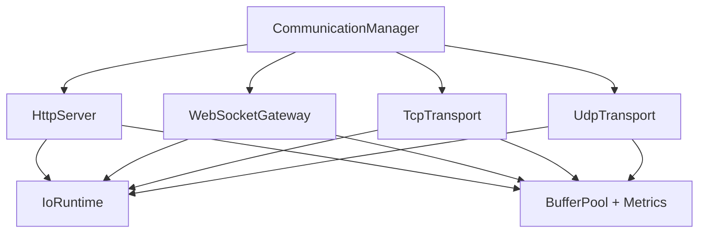
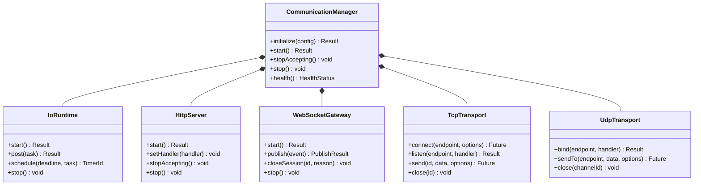
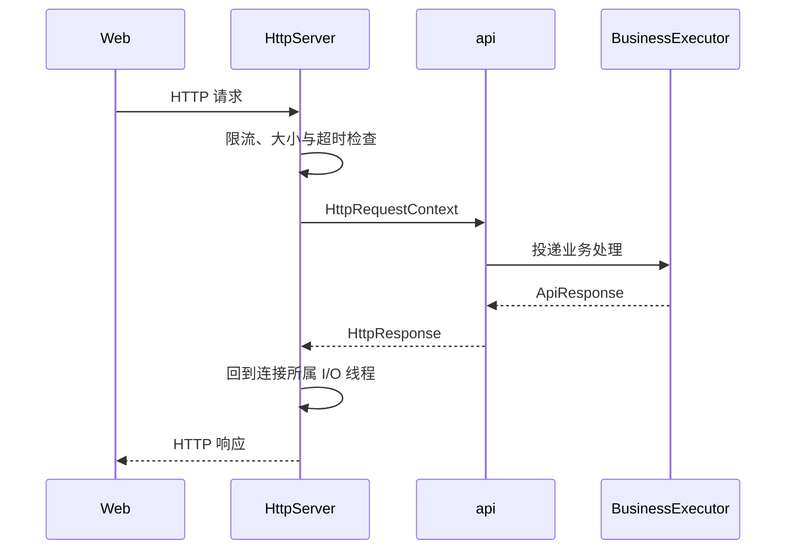
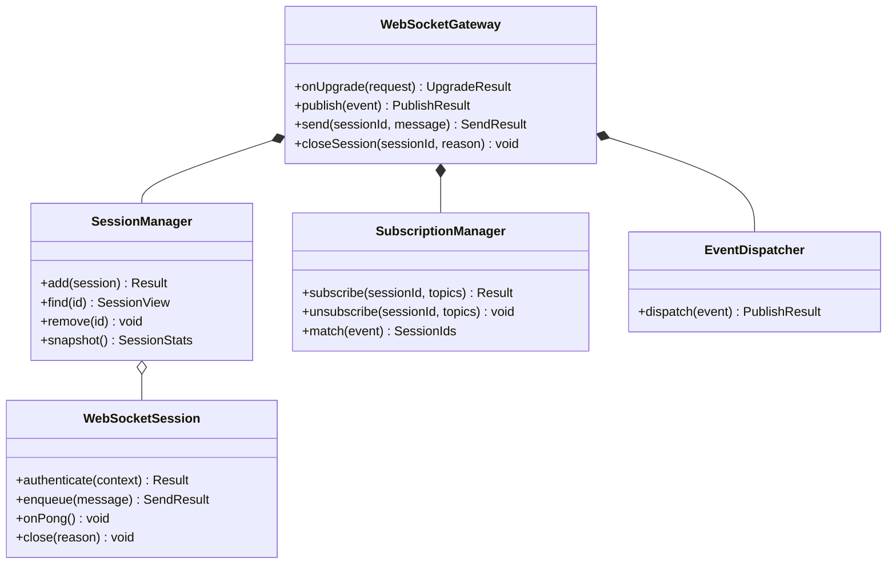
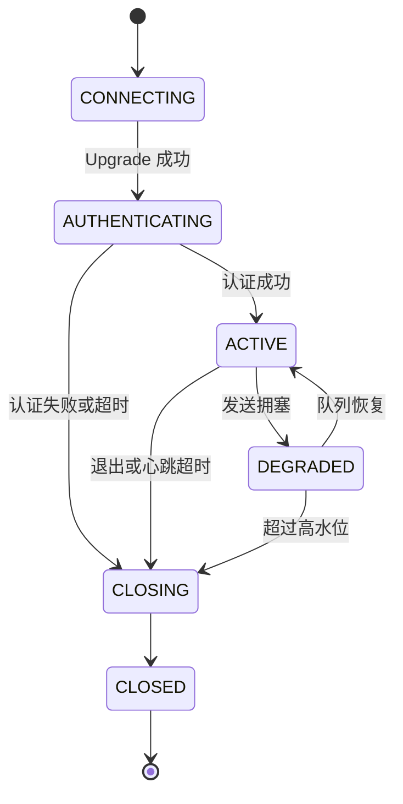
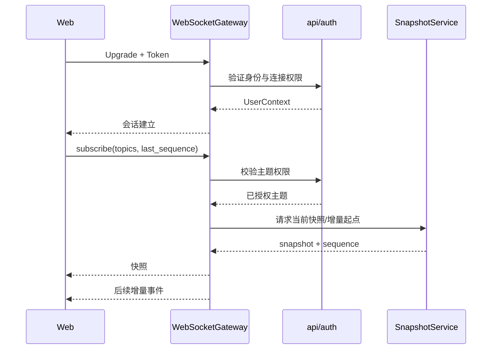
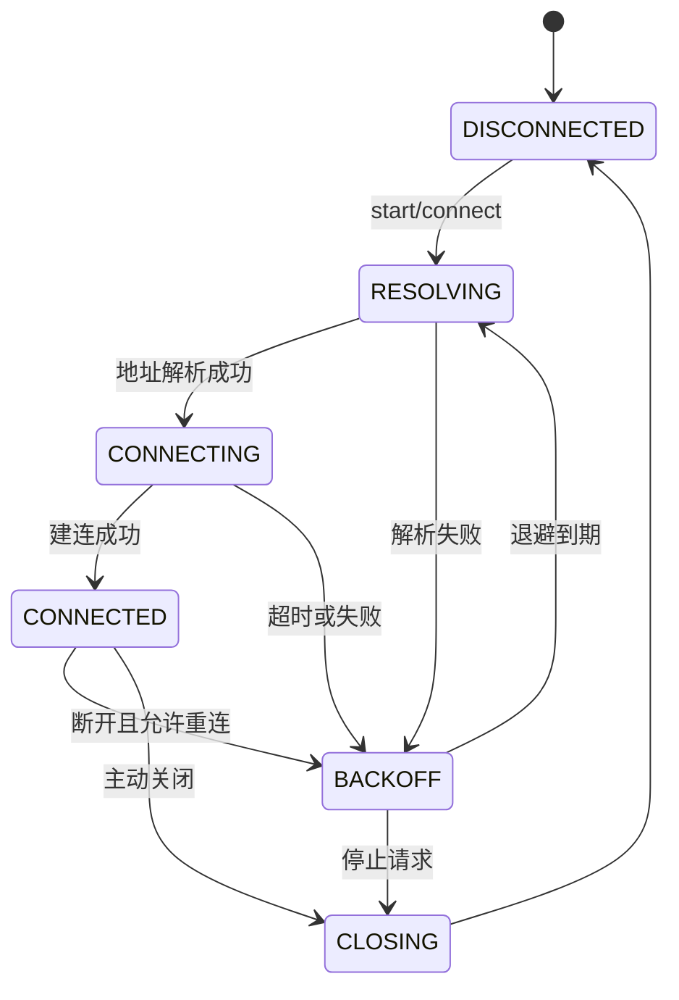
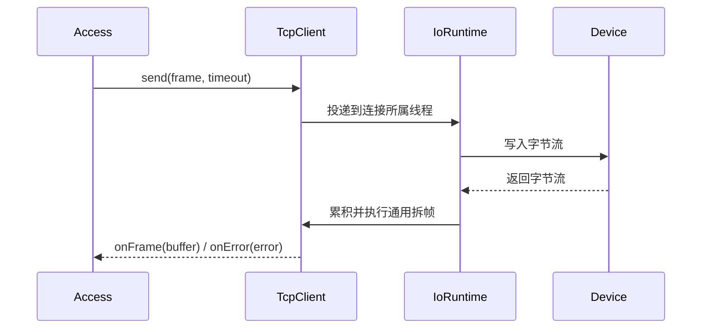
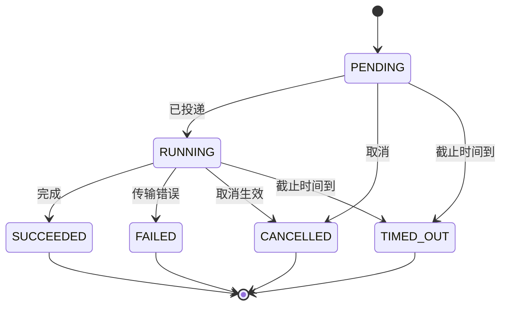
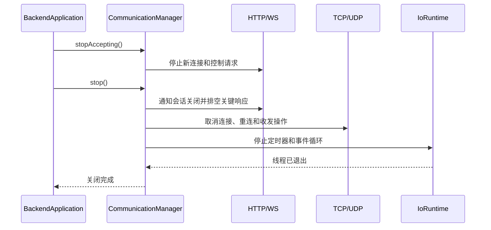

# 第5章 Communication 设计

## 5.1 概述

Communication 模块是 MRSS Backend 的通用通信能力层，统一封装 HTTP、WebSocket、TCP 和 UDP 的网络传输、连接管理、消息收发、超时、心跳、重连、限流、背压与运行指标。

Communication 不实现用户、设备、任务、告警等业务逻辑，也不解释瑞尔曼、海康、辐射传感器等厂商协议。面向 Web 的业务请求由 api 处理，身份与权限由 auth 处理；面向设备的厂商报文编码、解码和语义转换由 Access 处理。Communication 只保证数据按明确的传输规则安全、可控、可追踪地到达模块边界。

一期 HTTP 与 WebSocket 沿用 uWebSockets 技术路线。TCP、UDP 通过独立传输接口封装非阻塞 Socket 实现，具体底层库不得暴露给 Device、Access、service 和 Controller。系统不引入 IOC，Backend 通过 Communication 与 Web 和设备网络直接通信。

## 5.2 设计目标

Communication 设计目标如下：

1. 统一 HTTP、WebSocket、TCP、UDP 的配置、生命周期和错误模型。
2. 为 api 提供稳定的 HTTP 请求入口和 WebSocket 会话能力。
3. 为 Access 提供与厂商协议无关的字节流、数据报和连接接口。
4. 保证 I/O 线程只进行网络收发和轻量处理，耗时业务不得阻塞事件循环。
5. 支持连接超时、读写超时、心跳检测、自动重连和优雅关闭。
6. 支持消息大小限制、发送队列上限、流量控制和慢连接隔离。
7. 为持续点动、急停等控制链路提供明确的超时和高优先级发送能力。
8. 支持客户端断线重连后的状态快照与增量事件恢复。
9. 支持仿真、真实和混合设备部署，不改变上层接口。
10. 提供连接、吞吐、延迟、错误、重连和丢包等可观测数据。
11. 形成可替换、可模拟、可单元测试的传输接口。

## 5.3 职责与边界

### 5.3.1 Communication 负责的内容

| 类别 | 主要职责 |
| --- | --- |
| HTTP | 监听、连接、请求接收、响应发送、大小与超时限制 |
| WebSocket | 升级、会话、心跳、订阅、推送、断线和背压处理 |
| TCP | 客户端/服务端连接、字节流收发、重连和连接状态 |
| UDP | 数据报收发、端点管理、数据报校验和可选组播 |
| 通用能力 | 缓冲区、连接标识、执行器、超时、取消、统计和健康状态 |
| 生命周期 | 初始化、启动、停止接收、排空发送队列和资源释放 |
| 安全约束 | 连接数、报文大小、速率、来源和 TLS 边界配置 |

### 5.3.2 Communication 不负责的内容

1. 不决定 HTTP 路由对应的业务用例。
2. 不校验角色是否有权执行设备控制。
3. 不实现 Manual/Auto、OWNER、资源锁和任务调度。
4. 不解析厂商字段、命令码、校验语义和设备状态。
5. 不直接访问 PostgreSQL。
6. 不生成设备告警和业务审计结论。
7. 不替代硬件急停、安全回路和设备自身保护。
8. 不依赖具体机械臂、相机或传感器实现。

### 5.3.3 模块协作边界

| 调用关系 | 允许传递的内容 | 禁止内容 |
| --- | --- | --- |
| Communication → api | HTTP 元数据、请求体、连接上下文 | 业务服务实现、SQL、厂商 SDK 对象 |
| api → Communication | HTTP 响应、WebSocket 会话命令 | 设备原始句柄 |
| Access → Communication | 目标端点、字节流、数据报、超时和回调 | 用户权限、任务业务规则 |
| Communication → Access | 原始字节、来源端点、连接事件、传输错误 | 厂商协议结论 |
| core → Communication | 日志、线程、定时器、错误、配置基础能力 | 业务状态 |

## 5.4 设计原则

### 5.4.1 传输与语义分离

Communication 只识别 HTTP、WebSocket、TCP、UDP 的通用传输规则。TCP 粘包、拆包可通过通用帧解码接口处理，但帧内的厂商字段、命令码和业务含义由 Access 解释。

### 5.4.2 非阻塞 I/O

网络连接采用非阻塞 I/O。I/O 回调中不得执行数据库操作、设备阻塞调用、复杂 JSON 处理或业务编排；这些工作必须投递到指定执行器。

### 5.4.3 有界资源

连接数、请求体、帧长度、WebSocket 消息、发送队列和待处理回调均设定上限。系统不得依赖无限队列吸收过载。

### 5.4.4 连接与业务生命周期解耦

异步命令不持有 HTTP 请求对象或 WebSocket Socket 裸指针。业务命令通过 `request_id`、`command_id` 和 `session_id` 关联；客户端断线不破坏命令对象的内存安全。

### 5.4.5 故障隔离

单连接解析错误、超时或发送拥塞只关闭或降级对应连接。单设备通信故障不得停止其他设备通道，单个慢 WebSocket 客户端不得拖慢广播。

### 5.4.6 幂等启停

所有通信组件的 `start()`、`stopAccepting()` 和 `stop()` 必须具有明确状态检查，重复停止不得崩溃或重复释放资源。

## 5.5 总体架构



`CommunicationManager` 是模块入口，负责装配、启动和停止通信组件。`HttpServer` 与 `WebSocketGateway` 面向 Web；`TcpTransport` 与 `UdpTransport` 面向 Access。`IoRuntime` 统一管理事件循环、I/O 线程和跨线程投递；缓冲池、指标、错误和标识等公共能力由内部组件与 core 共同提供。

## 5.6 工程结构

```text
backend/communication/
├── communication_manager.h
├── communication_manager.cpp
├── common/
│   ├── endpoint.h
│   ├── connection_id.h
│   ├── transport_error.h
│   ├── buffer.h
│   ├── buffer_pool.h
│   ├── io_runtime.h
│   ├── deadline.h
│   └── communication_metrics.h
├── http/
│   ├── http_server.h
│   ├── http_request.h
│   ├── http_response.h
│   ├── request_dispatcher.h
│   └── http_limits.h
├── websocket/
│   ├── websocket_gateway.h
│   ├── websocket_session.h
│   ├── session_manager.h
│   ├── subscription_manager.h
│   ├── event_dispatcher.h
│   └── websocket_message.h
├── tcp/
│   ├── tcp_client.h
│   ├── tcp_server.h
│   ├── tcp_connection.h
│   ├── stream_framer.h
│   └── reconnect_policy.h
├── udp/
│   ├── udp_channel.h
│   ├── udp_datagram.h
│   └── datagram_filter.h
└── tests/
```

厂商相关 Codec 不放入 `communication/`，而放入 `access/<vendor>/`。若某种设备需要通用长度帧、分隔符帧或固定长度帧，只在 Communication 中放置无业务含义的通用 `IStreamFramer` 实现。

## 5.7 核心数据结构

### 5.7.1 Endpoint

```cpp
struct Endpoint {
    std::string host;
    uint16_t port{0};
    TransportProtocol protocol{TransportProtocol::TCP};
    std::string interface_name;
};
```

`Endpoint` 表示本地或远端网络端点。配置加载阶段必须校验地址、端口和协议；运行期不得使用未解析的任意字符串代替端点对象。

### 5.7.2 ConnectionContext

| 字段 | 说明 |
| --- | --- |
| `connection_id` | Backend 内唯一连接标识 |
| `protocol` | HTTP、WebSocket、TCP 或 UDP |
| `local_endpoint` | 本地端点 |
| `remote_endpoint` | 对端端点 |
| `opened_at` | 建立时间 |
| `last_rx_at` | 最近接收时间 |
| `last_tx_at` | 最近发送时间 |
| `state` | 当前连接状态 |
| `metadata` | 受控的键值元数据，不保存业务对象 |

### 5.7.3 Buffer

`Buffer` 是有所有权的只读或可写字节区，跨线程传递时使用移动语义或只读共享所有权。回调不得保存指向 uWebSockets 临时请求体、WebSocket 消息或栈内存的裸指针。

### 5.7.4 OperationOptions

```cpp
struct OperationOptions {
    std::chrono::milliseconds timeout{3000};
    Priority priority{Priority::NORMAL};
    StopToken stop_token;
    std::string trace_id;
};
```

所有可能阻塞等待的连接、发送和接收操作均应支持截止时间或取消令牌。

## 5.8 核心类关系



## 5.9 CommunicationManager 详细设计

### 5.9.1 类职责

`CommunicationManager` 负责：

- 保存通信配置快照；
- 创建 `IoRuntime`、HTTP、WebSocket、TCP、UDP 组件；
- 注入 api 请求处理器和 Access 传输回调；
- 驱动组件按依赖顺序启动和逆序停止；
- 汇总通信健康状态与运行指标；
- 防止部分组件重复启动或重复关闭。

### 5.9.2 主要成员变量

| 成员 | 类型 | 说明 |
| --- | --- | --- |
| `state_` | `std::atomic<ModuleState>` | 模块状态 |
| `config_` | `CommunicationConfig` | 不可变配置快照 |
| `io_runtime_` | `std::unique_ptr<IoRuntime>` | I/O 运行环境 |
| `http_server_` | `std::unique_ptr<HttpServer>` | HTTP 服务 |
| `ws_gateway_` | `std::unique_ptr<WebSocketGateway>` | WebSocket 网关 |
| `tcp_transport_` | `std::unique_ptr<TcpTransport>` | TCP 传输服务 |
| `udp_transport_` | `std::unique_ptr<UdpTransport>` | UDP 传输服务 |
| `metrics_` | `CommunicationMetrics` | 指标聚合器 |
| `stop_source_` | `StopSource` | 模块协作停止信号 |

### 5.9.3 主要成员函数

| 函数 | 说明 | 失败处理 |
| --- | --- | --- |
| `initialize(config)` | 校验配置并创建组件 | 返回配置或资源错误 |
| `start()` | 启动事件循环、传输通道和监听服务 | 回滚已启动组件 |
| `stopAccepting()` | 停止新 HTTP、WS 和 TCP 接入 | 已有连接进入排空阶段 |
| `stop()` | 取消操作、关闭连接和线程 | 幂等，不向外抛异常 |
| `health()` | 汇总监听、线程和队列状态 | 返回 OK/DEGRADED/FAILED |
| `metrics()` | 返回通信指标快照 | 不阻塞 I/O 线程 |

## 5.10 IoRuntime 与线程模型

### 5.10.1 职责

`IoRuntime` 封装 uWebSockets/uSockets 或底层非阻塞 Socket 的事件循环，统一提供线程启动、任务投递、定时回调和安全停止能力。上层不得直接持有底层事件循环指针。

### 5.10.2 线程划分

| 线程/执行器 | 主要任务 | 禁止任务 |
| --- | --- | --- |
| HTTP/WS I/O 线程 | 接受连接、读写、轻量头部解析 | 数据库、厂商 SDK、业务编排 |
| 设备 I/O 线程 | TCP/UDP 读写、连接状态、定时器 | 长时间协议处理、同步等待 |
| 业务工作池 | api/service 业务调用、JSON 业务转换 | 直接操作 Socket 裸句柄 |
| 设备执行器 | Access 协议处理和设备调用 | 阻塞 HTTP/WS 事件循环 |
| 高优先级安全执行器 | 急停、停止、点动看门狗 | 普通历史查询和批量推送 |

一期可根据设备数量配置一个或多个设备 I/O 线程。每个连接固定归属一个事件循环；跨线程发送必须通过 `post()` 回到连接所属线程。

### 5.10.3 跨线程规则

1. Socket 对象只在所属 I/O 线程访问。
2. 回调传递稳定值对象或受控共享对象。
3. 业务线程向连接发送消息时，只提交不可变消息和连接标识。
4. 关闭流程通过停止令牌和事件循环投递完成，不在任意线程直接释放 Socket。
5. 不持有互斥锁执行网络写入或用户回调。

## 5.11 缓冲区与内存管理

### 5.11.1 BufferPool

`BufferPool` 为常见报文大小提供分级缓冲区，减少高频状态推送和设备采样造成的内存分配。超大报文不进入常驻池，使用独立受限分配并记录指标。

### 5.11.2 管理规则

1. 配置 HTTP 请求体、WebSocket 消息、TCP 帧和 UDP 数据报最大长度。
2. 接收前先校验声明长度，拒绝超过上限的分配。
3. 敏感信息缓冲区释放前按需清理。
4. 发送队列持有消息所有权，发送完成或失败后统一释放。
5. 统计池命中、临时分配、内存高水位和拒绝次数。
6. 不允许将底层库短生命周期视图跨回调保存。

## 5.12 HTTP Server 设计

### 5.12.1 类职责

`HttpServer` 负责监听 HTTP 端口、接收请求、构造 `HttpRequestContext`、执行通用限制、调用 `IHttpRequestHandler` 并发送响应。具体路由注册、DTO 转换、权限校验和业务错误映射由 api 完成。

### 5.12.2 主要成员变量

| 成员 | 类型 | 说明 |
| --- | --- | --- |
| `listen_endpoint_` | `Endpoint` | HTTP 监听端点 |
| `limits_` | `HttpLimits` | 连接、头部、请求体与速率限制 |
| `handler_` | `std::shared_ptr<IHttpRequestHandler>` | api 请求入口 |
| `active_requests_` | `RequestRegistry` | 活动请求与截止时间 |
| `connection_limiter_` | `ConnectionLimiter` | 连接数限制 |
| `rate_limiter_` | `RateLimiter` | 来源和路由级限流 |
| `metrics_` | `HttpMetrics` | 请求与延迟指标 |

### 5.12.3 主要成员函数

| 函数 | 说明 |
| --- | --- |
| `start()` | 创建监听并注册 HTTP 回调 |
| `setHandler(handler)` | 注入 api 请求处理器 |
| `onRequest(meta)` | 接收请求行和头部 |
| `onBody(chunk, final)` | 有界收集或流式交付请求体 |
| `sendResponse(token, response)` | 回到所属 I/O 线程发送响应 |
| `abortRequest(id, error)` | 终止超时、断开或非法请求 |
| `stopAccepting()` | 停止接收新连接和请求 |

### 5.12.4 HttpRequestContext

| 字段 | 说明 |
| --- | --- |
| `request_id` / `trace_id` | 请求与追踪标识 |
| `method` | HTTP 方法 |
| `path` / `query` | 标准化路径和查询参数 |
| `headers` | 受限且规范化的请求头集合 |
| `body` | 有所有权的请求体 |
| `remote_endpoint` | 客户端端点 |
| `received_at` / `deadline` | 接收时间和截止时间 |
| `response_token` | 与底层响应对象隔离的发送令牌 |

### 5.12.5 HTTP 请求流程



### 5.12.6 HTTP 约束

1. 默认使用 Nginx 作为统一入口并限制直接访问 Backend 监听端口。
2. 必须设置请求头、请求体、URL 和并发请求上限。
3. 客户端断开后取消尚未进入不可取消阶段的请求。
4. 对耗时控制命令只返回受理结果，不长期占用 HTTP 连接等待设备完成。
5. 不在 Communication 中写入业务 HTTP 状态码映射；传输错误除外。
6. 健康检查路由可由 app/api 提供，Communication 仅暴露自身健康快照。

## 5.13 WebSocket Gateway 设计

### 5.13.1 组件关系



### 5.13.2 WebSocketGateway 职责

- 处理 HTTP Upgrade；
- 建立会话标识和连接上下文；
- 将认证材料交给 auth/api 验证；
- 维护会话、订阅和发送队列；
- 接收客户端控制消息并转交 api；
- 将状态、任务、传感器和告警事件推送到匹配会话；
- 处理心跳、超时、断开、背压和优雅关闭。

### 5.13.3 会话状态



未完成认证的会话不得订阅业务主题或发送控制消息。会话认证超时后主动关闭。

### 5.13.4 消息信封

WebSocket 应用消息使用统一信封：

```json
{
  "type": "device.state.changed",
  "message_id": "msg-...",
  "request_id": "req-...",
  "sequence": 1024,
  "timestamp": 1785744000000,
  "data": {}
}
```

| 字段 | 说明 |
| --- | --- |
| `type` | 稳定的消息类型 |
| `message_id` | 消息唯一标识 |
| `request_id` | 请求关联标识，可为空 |
| `sequence` | 主题或会话增量序号 |
| `timestamp` | 服务端生成时间 |
| `data` | 由 api/service 定义的业务负载 |

Communication 只处理信封的路由字段、大小和序号，不解释 `data` 的业务含义。

### 5.13.5 订阅模型

建议主题至少包括：

- `system.state`；
- `device.state.<device_id>`；
- `task.progress.<task_id>`；
- `sensor.data.<device_id>`；
- `alarm.active`；
- `command.result.<command_id>`。

订阅前由 api/auth 判断用户权限和可见资源，Communication 仅保存已授权的订阅结果。禁止客户端使用未受控的通配符订阅全部数据。

### 5.13.6 建连与订阅流程



### 5.13.7 断线恢复

1. 客户端重连后必须重新认证。
2. 客户端携带最近确认的 `sequence`。
3. 若服务端仍保留连续增量，可从下一序号补发。
4. 若增量已过期、序号不连续或状态版本变化，服务端返回 `resync_required`。
5. 客户端重新获取完整快照，再开始接收增量。
6. Communication 不承诺永久保存事件，历史查询由 HTTP/service/db 提供。

### 5.13.8 心跳与会话超时

服务端周期发送 Ping，收到 Pong 后更新 `last_seen`。连续超过配置次数未响应则关闭会话。业务层心跳不得代替协议级 Ping/Pong；持续点动还必须使用独立控制租约和看门狗。

### 5.13.9 点动控制安全

WebSocket 断开、认证失效、点动续租超时或客户端切换页面时，Communication 立即发布会话失效事件。Controller 根据该事件终止与会话绑定的持续点动。停止动作不得依赖普通发送队列中的后续消息。

## 5.14 TCP Transport 设计

### 5.14.1 使用范围

TCP 用于需要可靠有序字节流的设备或外部组件连接。Communication 支持 TCP Client 和 TCP Server 两种模式；一期设备通常由 Backend 主动连接，因此以 Client 为主，Server 按配置启用。

### 5.14.2 TcpClient 主要成员

| 成员 | 类型 | 说明 |
| --- | --- | --- |
| `endpoint_` | `Endpoint` | 远端设备地址 |
| `state_` | `std::atomic<ConnectionState>` | 连接状态 |
| `connection_id_` | `ConnectionId` | 当前连接标识 |
| `framer_` | `std::shared_ptr<IStreamFramer>` | 可选通用拆帧器 |
| `reconnect_policy_` | `ReconnectPolicy` | 退避和抖动配置 |
| `send_queue_` | `BoundedSendQueue` | 有界发送队列 |
| `handlers_` | `TransportHandlers` | 数据和状态回调 |
| `generation_` | `uint64_t` | 连接代次，防止旧回调污染新连接 |

### 5.14.3 TcpClient 主要函数

| 函数 | 说明 |
| --- | --- |
| `start()` | 启动解析、连接和接收流程 |
| `connect(options)` | 执行带超时的异步连接 |
| `send(buffer, options)` | 按队列顺序异步发送 |
| `setFramer(framer)` | 配置通用流拆帧策略 |
| `close(reason)` | 关闭当前代次连接 |
| `reconnect()` | 根据策略安排下一次连接 |
| `state()` | 返回线程安全连接快照 |

### 5.14.4 TCP 连接状态机



### 5.14.5 TCP 收发流程



### 5.14.6 流拆帧

`IStreamFramer` 只处理字节边界，支持以下通用策略：

- 固定长度帧；
- 长度字段帧；
- 分隔符帧；
- 由 Access 提供的自定义帧边界实现。

拆帧器必须设置最大帧长度、最小头长度和无效数据恢复策略。CRC、命令码、设备地址和字段语义由 Access 校验。

### 5.14.7 自动重连

自动重连采用指数退避并加入随机抖动：

```text
delay = min(max_delay, initial_delay × multiplier^attempt) + jitter
```

成功稳定连接达到配置时间后重置失败次数。认证失败、配置错误、明确禁止重试的协议错误不得无限重连；停止阶段取消所有重连定时器。

## 5.15 UDP Transport 设计

### 5.15.1 类职责

`UdpChannel` 负责绑定本地端点、接收数据报、按目标端点发送数据报、记录来源和统计丢弃。它不提供 TCP 式的连接、可靠送达和顺序保证。

### 5.15.2 主要成员变量与函数

| 成员/函数 | 说明 |
| --- | --- |
| `local_endpoint_` | 本地绑定地址和端口 |
| `remote_filter_` | 允许的来源端点集合 |
| `max_datagram_size_` | 最大数据报长度 |
| `receive_handler_` | 数据报回调 |
| `bind()` | 创建 Socket 并开始接收 |
| `sendTo()` | 向明确端点发送单个数据报 |
| `joinMulticast()` | 按配置加入组播，可选 |
| `leaveMulticast()` | 退出组播 |
| `close()` | 停止收发并释放端口 |

### 5.15.3 UDP 处理规则

1. 每个接收结果必须携带来源端点和接收时间。
2. 拒绝超过上限、来源不允许或截断的数据报。
3. Communication 不自动拼接多个 UDP 数据报。
4. 需要确认、重传、顺序或去重时，由 Access 的协议层实现。
5. 对具有序号的报文，Communication 可透传序号，但不判断业务有效性。
6. UDP 接收回调必须快速返回，复杂解析投递到 Access 执行器。
7. 广播和组播默认关闭，仅按显式配置启用。

## 5.16 通用传输接口

### 5.16.1 IByteStream

```cpp
class IByteStream {
public:
    virtual ~IByteStream() = default;
    virtual Future<Result<void>> connect(
        const Endpoint&, const OperationOptions&) = 0;
    virtual Future<Result<size_t>> send(
        Buffer, const OperationOptions&) = 0;
    virtual void setReceiveHandler(ReceiveHandler) = 0;
    virtual void setStateHandler(StateHandler) = 0;
    virtual void close(CloseReason) noexcept = 0;
};
```

### 5.16.2 IDatagramChannel

```cpp
class IDatagramChannel {
public:
    virtual ~IDatagramChannel() = default;
    virtual Result<void> bind(const Endpoint&) = 0;
    virtual Future<Result<size_t>> sendTo(
        const Endpoint&, Buffer, const OperationOptions&) = 0;
    virtual void setReceiveHandler(DatagramHandler) = 0;
    virtual void close() noexcept = 0;
};
```

Access 仅依赖上述接口或其受控扩展，因此单元测试可以注入内存传输、故障传输和录制回放传输。

## 5.17 连接生命周期管理

### 5.17.1 通用连接状态

| 状态 | 说明 |
| --- | --- |
| CREATED | 对象已创建，尚未启动 |
| STARTING | 正在监听、解析或连接 |
| ACTIVE | 可正常收发 |
| DEGRADED | 可用但心跳、队列或错误率异常 |
| CLOSING | 停止新操作并排空/取消现有操作 |
| CLOSED | 已释放网络资源 |
| FAILED | 出现不可自动恢复错误 |

### 5.17.2 连接代次

每次重新连接递增 `generation`。异步 DNS、连接、定时器和接收回调执行前必须核对代次；旧连接的迟到回调不得修改新连接状态或完成新连接的 Promise。

### 5.17.3 会话与连接区别

连接表示网络链路；会话表示经过认证并具有订阅和业务上下文的 WebSocket 交互。TCP 设备连接通常没有用户会话，不得套用 Web 用户身份模型。

## 5.18 异步操作模型

每个异步操作必须有唯一 `operation_id`、所属连接、创建时间、截止时间、取消状态和完成回调。完成回调只能执行一次，所有路径包括成功、错误、超时、取消和关闭都必须结束操作。



超时与成功可能并发发生时，使用原子完成状态决定唯一结果；失败完成后取消对应定时器。

## 5.19 超时、取消与重试

### 5.19.1 超时分类

| 超时类型 | 作用范围 |
| --- | --- |
| accept/upgrade 超时 | HTTP/WS 接入 |
| request 超时 | HTTP 请求受理与处理 |
| connect 超时 | TCP 建连 |
| read idle 超时 | 长时间未接收数据 |
| write 超时 | 单次或队列写入 |
| heartbeat 超时 | WS/TCP 应用连接健康 |
| shutdown drain 超时 | 优雅关闭排空阶段 |

### 5.19.2 重试原则

1. HTTP 服务端不自动重放业务请求。
2. WebSocket 推送仅在当前会话内按策略重试，断线后走增量恢复或快照。
3. TCP 允许重连，但不默认重发已经部分写入或结果未知的业务命令。
4. UDP 不由 Communication 自动重发。
5. 只有 Access 确认命令幂等且配置允许时，才可请求安全重试。
6. 急停和停止命令的发送策略由安全设计明确，不与普通业务重试混用。

## 5.20 发送队列与背压

### 5.20.1 队列水位

每个连接维护有界发送队列：

| 水位 | 行为 |
| --- | --- |
| 低水位以下 | 正常发送 |
| 高水位以下 | 记录排队延迟 |
| 达到高水位 | 降低低优先级状态推送或合并最新值 |
| 达到硬上限 | 拒绝新低优先级消息或关闭慢连接 |

### 5.20.2 消息策略

| 消息类型 | 拥塞策略 |
| --- | --- |
| 急停/停止结果 | 最高优先级，不允许被普通消息挤出 |
| 命令最终结果 | 保留并优先发送 |
| 告警变化 | 保留关键状态转换，可合并重复提醒 |
| 任务进度 | 保留最新阶段，允许合并中间百分比 |
| 设备实时状态 | 同设备同类型保留最新值 |
| 高频传感器数据 | 可采样、批量或丢弃旧数据 |

Communication 依据 api/service 提供的消息优先级和可合并键执行通用队列策略，不自行判断告警级别或业务重要性。

## 5.21 心跳与健康检查

### 5.21.1 健康指标

通信健康快照至少包括：

- HTTP/WS 是否监听；
- I/O 线程是否运行；
- 活动连接和会话数量；
- TCP 设备连接状态与最近收发时间；
- UDP 端口绑定状态；
- 发送队列当前值和高水位；
- 心跳超时、重连和传输错误计数；
- 最近一次不可恢复错误。

### 5.21.2 健康状态判定

| 状态 | 条件示例 |
| --- | --- |
| OK | 监听正常、线程正常、队列和错误率正常 |
| DEGRADED | 部分可选通道断开、队列持续偏高、重连中 |
| FAILED | 必需监听失败、I/O 线程退出、核心队列不可用 |

单个设备 TCP 连接失败通常使该连接和对应设备降级，不直接判定整个 Communication 模块失败。

## 5.22 事件与回调分发

Communication 向上层发布以下通用事件：

- `connection.opened`；
- `connection.closed`；
- `connection.error`；
- `transport.data.received`；
- `transport.send.completed`；
- `session.authenticated`；
- `session.expired`；
- `queue.high_watermark`；
- `heartbeat.timeout`。

事件携带连接标识、端点、协议、时间、序号和错误信息，不携带 Socket 裸指针。设备原始报文默认不进入全局事件总线，避免大流量复制；由注册回调直接交给对应 Access 实例。

## 5.23 错误模型与异常处理

### 5.23.1 TransportError

```cpp
struct TransportError {
    TransportErrorCode code;
    TransportProtocol protocol;
    std::string component;
    std::optional<ConnectionId> connection_id;
    std::optional<Endpoint> endpoint;
    bool retryable{false};
    int native_code{0};
    std::string message;
};
```

### 5.23.2 错误分类

| 类别 | 示例 | 默认处理 |
| --- | --- | --- |
| CONFIG | 地址非法、端口冲突、上限无效 | 初始化失败 |
| RESOLVE | DNS 或主机解析失败 | 按策略重连 |
| CONNECT | 拒绝、无路由、连接超时 | 标记离线并退避 |
| READ | 对端关闭、读取失败、空闲超时 | 关闭当前连接 |
| WRITE | 队列满、写超时、连接失效 | 完成失败并按类型处置 |
| PROTOCOL | HTTP/WS 帧非法、通用帧超长 | 拒绝消息或关闭连接 |
| RESOURCE | 内存、句柄、线程资源不足 | 限流并提升健康等级 |
| CANCELLED | 主动取消或系统关闭 | 正常结束，不生成故障告警 |

### 5.23.3 异常边界

1. 第三方库异常在 Communication 边界转换为 `TransportError`。
2. I/O 回调不得向事件循环抛出异常。
3. 用户回调异常被捕获、记录并隔离，不能终止 I/O 线程。
4. 错误日志不得打印完整 JWT、密码或敏感报文。
5. 相同连接的重复错误执行抑制或聚合，避免日志风暴。

## 5.24 安全控制通信

### 5.24.1 优先级

安全相关消息使用独立高优先级投递路径或专用优先级队列。普通状态广播、历史数据和大批量传感器推送不得阻塞急停、停止和会话失效事件。

### 5.24.2 急停原则

1. 硬件急停由独立安全回路完成，Communication 只上报其软件可见状态。
2. 软件急停请求经 HTTP/WS 接收后，必须快速转交 api/auth 和安全管理组件。
3. Communication 不自行判定急停授权或锁存 GLOBAL 状态。
4. 向设备发送停止命令失败时立即报告，不把“已排队”当作“已停止”。
5. 急停链路不得等待普通任务队列排空。
6. 客户端断线不能解除已经触发的急停或自动恢复动作。

## 5.25 安全设计

### 5.25.1 网络安全

1. 生产环境由 Nginx 终止 HTTPS/WSS，Backend 监听受限内网或回环地址。
2. 若 Backend 跨不可信网络直连，必须启用对应 TLS 能力。
3. 设备网络与用户访问网络按部署设计隔离。
4. 配置来源白名单、连接数、速率和报文大小限制。
5. HTTP 仅信任来自明确反向代理的转发头。
6. WebSocket Upgrade 校验 Origin、Token 和允许的子协议。
7. TCP/UDP 来源端点按设备配置校验，不能仅凭报文内容识别设备。

### 5.25.2 输入安全

- 拒绝非法 UTF-8、异常头部、超长路径和畸形 WebSocket 帧；
- JSON 结构和业务字段由 api 校验；
- 厂商协议字段、CRC 和量程由 Access 校验；
- 日志输出前对控制字符和敏感字段脱敏；
- 禁止将远端输入直接作为文件路径、格式字符串或线程名称。

## 5.26 配置设计

### 5.26.1 配置示例

```yaml
communication:
  http:
    host: 127.0.0.1
    port: 9800
    max_connections: 1024
    max_header_bytes: 16384
    max_body_bytes: 4194304
    request_timeout_ms: 10000
  websocket:
    path: /ws
    max_sessions: 256
    max_message_bytes: 1048576
    ping_interval_ms: 15000
    pong_timeout_ms: 10000
    send_queue_bytes: 4194304
  tcp:
    connect_timeout_ms: 3000
    write_timeout_ms: 3000
    reconnect_initial_ms: 500
    reconnect_max_ms: 30000
    max_frame_bytes: 1048576
  udp:
    max_datagram_bytes: 65507
    allow_broadcast: false
  io:
    web_threads: 1
    device_threads: 2
```

### 5.26.2 配置规则

1. 端口、地址、线程数、超时和上限在启动前完成范围校验。
2. 多个监听端点不得冲突。
3. 发送队列硬上限不得小于单消息上限。
4. 心跳周期必须小于会话失效时间。
5. 可热更新项仅包括限流、心跳、部分超时和日志级别等明确字段。
6. 监听地址、端口和线程数变更默认需要重启。
7. 配置热更新采用版本化快照，不原地修改 I/O 回调正在读取的对象。

## 5.27 日志、指标与追踪

### 5.27.1 日志字段

通信日志至少包含：

- `timestamp`、`level`、`component`；
- `protocol`、`connection_id`、`session_id`；
- `local_endpoint`、脱敏后的 `remote_endpoint`；
- `request_id`、`trace_id`；
- `operation`、`duration_ms`、`bytes`；
- `error_code`、`native_code`、`retryable`。

高频收发默认记录统计而非逐包 INFO 日志，逐报文日志只在受控调试模式启用。

### 5.27.2 关键指标

| 指标 | 说明 |
| --- | --- |
| `connections_active` | 各协议活动连接数 |
| `connections_total` | 建立连接累计数 |
| `requests_total` | HTTP 请求量及结果分类 |
| `request_duration_ms` | HTTP 延迟分布 |
| `ws_sessions_active` | 活动 WebSocket 会话 |
| `bytes_rx/bytes_tx` | 各协议收发字节 |
| `messages_dropped` | 因限流、过载或非法输入丢弃数 |
| `send_queue_bytes` | 当前队列和高水位 |
| `reconnect_attempts` | TCP 重连次数 |
| `heartbeat_timeouts` | 心跳超时次数 |
| `transport_errors` | 错误码分类计数 |

## 5.28 性能与容量设计

1. I/O 线程数量由 CPU、连接数量和消息频率配置，不与业务线程池混用。
2. WebSocket 广播先筛选订阅者，再序列化共享负载，避免每会话重复构造相同数据。
3. 高频传感器数据支持批量、采样和最新值合并。
4. TCP 连接默认保持发送顺序，同一设备命令不得并行写乱序。
5. UDP 接收采用预分配缓冲区，避免逐包大对象分配。
6. 所有队列记录当前值和高水位，并在压测中验证硬上限。
7. 性能优化不得绕过权限、安全、消息上限和错误处理。

## 5.29 启动与关闭流程

### 5.29.1 启动顺序

1. 加载并校验 Communication 配置。
2. 创建指标、缓冲池和 `IoRuntime`。
3. 启动 I/O 线程和定时器能力。
4. 创建 TCP/UDP 传输服务，但不必等待所有设备在线。
5. 注入 api HTTP/WS 处理器。
6. 启动 HTTP 和 WebSocket 监听。
7. 通知 Access 启动所需设备连接。
8. 发布模块健康状态。

### 5.29.2 关闭顺序



关闭阶段设定最大排空时间。超过时间后取消剩余普通消息，但应优先完成已发出的停止命令结果上报和必要日志刷新。

## 5.30 测试设计

### 5.30.1 单元测试

- Endpoint 和配置校验；
- Buffer 所有权、池复用和上限；
- TCP 固定长度、长度字段和分隔符拆帧；
- 连接代次与迟到回调隔离；
- 超时、取消和唯一完成语义；
- 指数退避与抖动范围；
- 发送队列水位、合并和拒绝策略；
- WebSocket 订阅匹配和序号处理；
- 错误映射和敏感信息脱敏。

### 5.30.2 集成测试

- HTTP 正常、超时、断开、超大请求和并发请求；
- WebSocket Upgrade、认证失败、订阅、心跳和断线恢复；
- TCP 服务端延迟启动、主动断开、半包、粘包和重连；
- UDP 丢包、乱序、重复、非法来源和超长数据报；
- Nginx 反向代理下的 HTTPS/WSS 和真实客户端地址；
- 仿真 Access 与 Communication 的收发闭环；
- Backend 启动和关闭过程中连接资源释放。

### 5.30.3 故障注入测试

1. DNS 失败、连接拒绝、路由不可达和端口占用。
2. 对端发送半帧后停止。
3. 对端持续发送超过速率限制的数据。
4. WebSocket 客户端停止读取，制造发送背压。
5. I/O 回调和上层回调主动抛出异常。
6. 系统关闭时仍存在重连定时器和未完成写操作。
7. WebSocket 点动过程中直接断网，验证 Controller 收到会话失效事件并停止。
8. 普通推送拥塞时触发软件急停，验证高优先级链路不被阻塞。

### 5.30.4 验收指标

验收时至少确认：

- 不存在因慢客户端导致的全局 I/O 阻塞；
- 所有消息和队列上限有效；
- TCP 断线后按配置重连且不产生重连风暴；
- 客户端重连可通过快照恢复一致状态；
- 停止阶段无悬挂线程、重复回调和 Socket 泄漏；
- 关键通信错误能够定位到协议、端点和连接标识；
- 点动断线和急停链路满足安全时限要求。

## 5.31 可测试性与测试替身

Communication 提供以下测试替身：

| 替身 | 用途 |
| --- | --- |
| `InMemoryByteStream` | 不使用真实网络测试 Access |
| `LoopbackDatagramChannel` | 测试 UDP 数据报处理 |
| `FaultInjectingTransport` | 注入超时、断开、半写和乱序回调 |
| `RecordingTransport` | 记录收发数据用于断言和回放 |
| `ManualIoRuntime` | 手动推进异步任务和定时器 |
| `FakeClock` | 确定性验证超时、心跳和退避 |

测试替身遵守与真实实现相同的异步完成和取消规则，避免测试通过但真实运行出现生命周期问题。

## 5.32 扩展设计

### 5.32.1 新传输协议

后续增加串口、TLS 直连、MQTT 或消息总线时，应实现新的传输接口或适配层，不修改 api、service、Controller 的业务接口。

### 5.32.2 多 Backend 与消息总线

若后续演进为多 Backend，WebSocket 事件分发可接入外部消息总线。当前 `EventDispatcher` 和订阅模型应保留稳定接口，避免业务代码直接依赖单进程会话容器。

### 5.32.3 EPICS 接入

EPICS 后续作为 Access 适配对象接入。Channel Access 或 PVAccess 的协议和 PV 语义不并入 Communication 通用 HTTP/TCP 实现，Communication 只可复用线程、超时、事件和指标等基础能力。

### 5.32.4 视频流

海康视频流不通过普通 WebSocket 消息转发。后续视频能力通过独立流媒体组件或相机标准协议接入，Communication 只承载控制、状态和抓拍结果元数据。

## 5.33 设计约束与检查项

设计和代码评审至少检查：

1. 是否存在 Communication 直接调用 service 具体实现或数据库。
2. 是否存在 Access 之外的厂商协议解析代码。
3. 是否在 I/O 线程执行阻塞操作或复杂业务逻辑。
4. 是否保存了底层库临时内存或 Socket 裸指针。
5. 是否所有队列、消息和连接数量都有明确上限。
6. 是否所有异步操作只有一次完成结果。
7. 是否使用连接代次隔离旧回调。
8. 是否区分 TCP 重连与业务命令重试。
9. 是否正确处理 WebSocket 慢客户端和断线恢复。
10. 是否将点动停止绑定到会话失效和控制租约。
11. 是否保证急停和停止消息不被普通队列阻塞。
12. 是否对来源、Origin、转发头和消息大小进行校验。
13. 是否能够对连接、延迟、队列、重连和错误进行观测。
14. 是否能在关闭时取消定时器、操作并回收所有 I/O 线程。
15. 是否保持 HTTP/WS 业务语义在 api，设备协议语义在 Access。

## 5.34 本章小结

本章完成了 MRSS Communication 模块的详细设计，统一定义了 HTTP、WebSocket、TCP 和 UDP 的职责边界、类关系、数据结构、线程模型、连接状态、异步操作、超时取消、心跳重连、发送背压、安全控制、配置、可观测性、测试和扩展方式。

Communication 作为纯通信能力层，不承载业务逻辑和厂商协议语义。HTTP/WebSocket 面向 api，TCP/UDP 面向 Access，所有通信都通过有界资源、非阻塞 I/O、统一错误和明确生命周期实现。该设计为后续 Controller、Device 和 Access 的控制与设备接入提供稳定基础。
