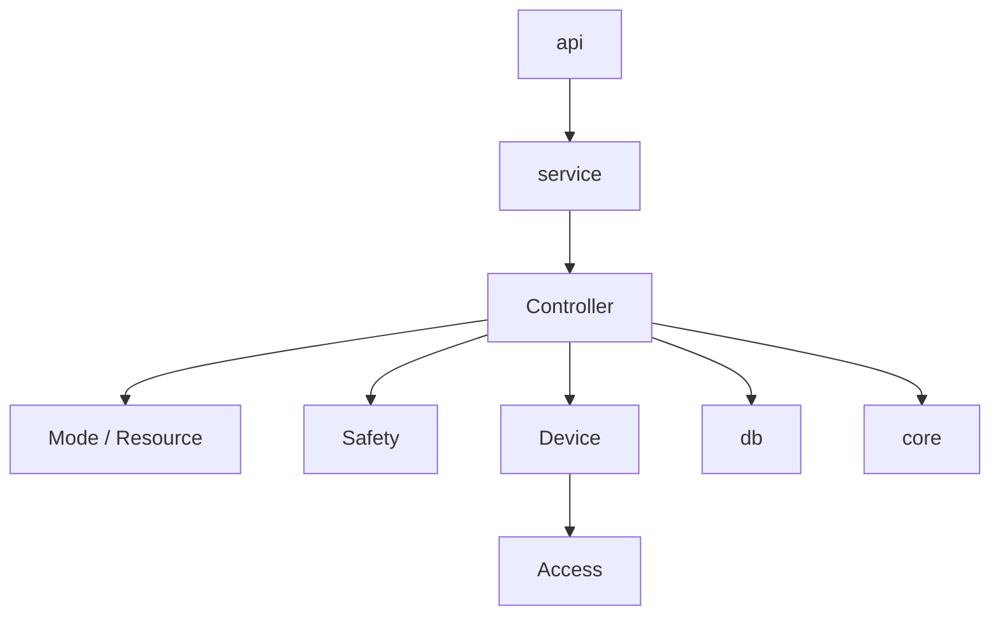
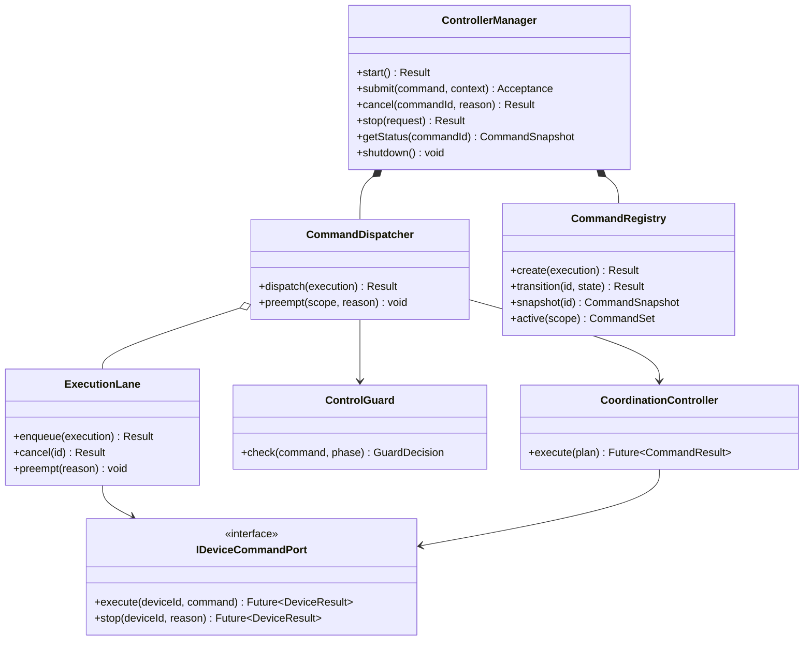
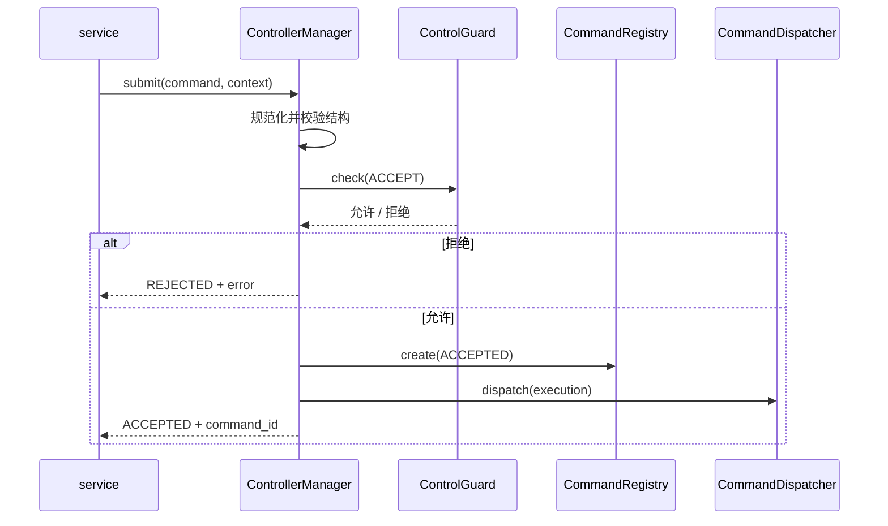
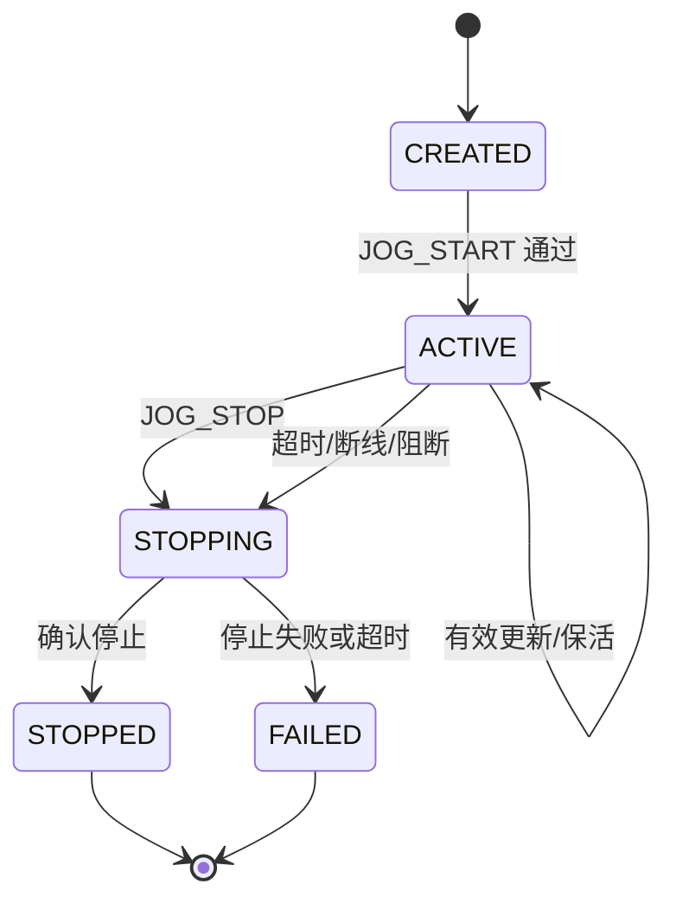
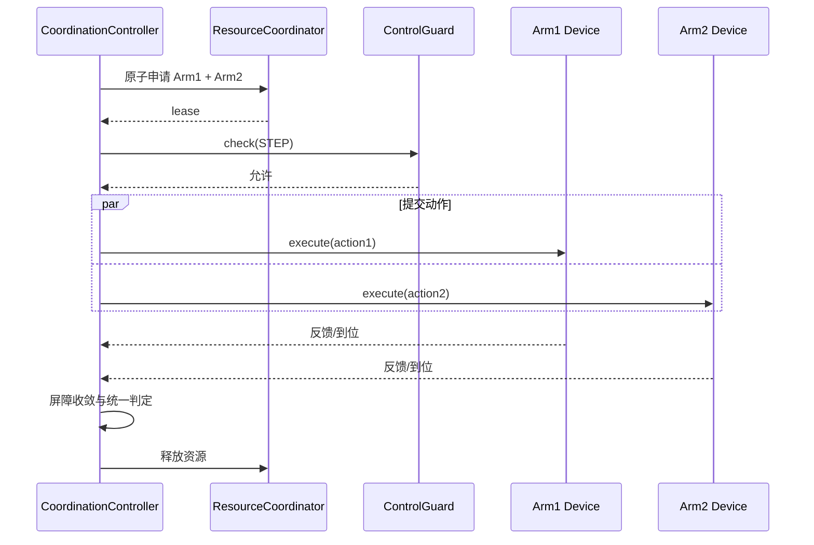
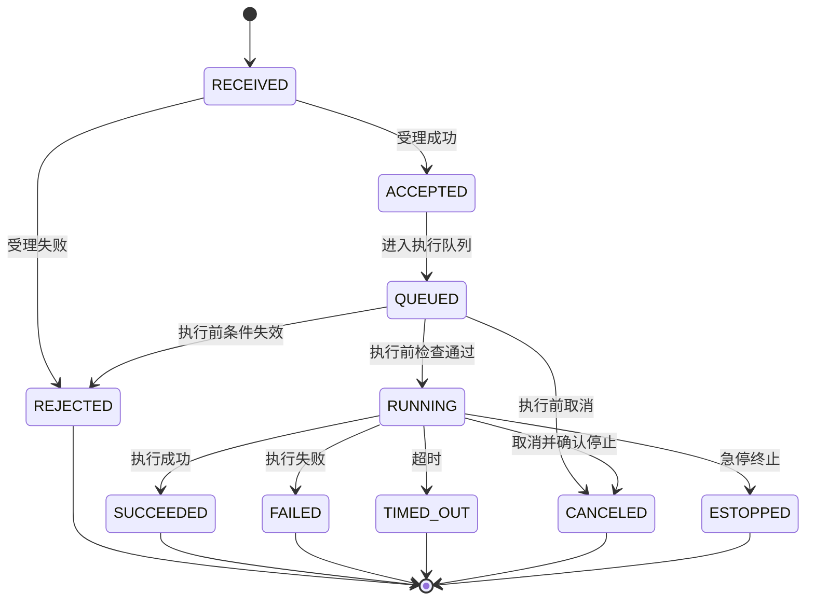
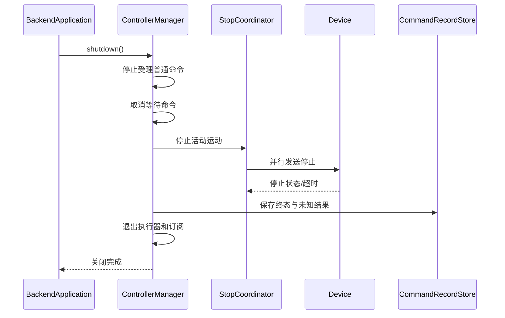

# 第6章 Controller 设计

## 6.1 概述

Controller 是 MRSS Backend 内部的控制执行层，位于 service 与 Device 之间，负责把已经通过业务校验的控制意图转换为可追踪、可仲裁、可取消的设备命令和协同执行流程。

Controller 中的“控制器”表示设备控制、运动执行和协同编排逻辑，不表示 HTTP API Handler。外部请求由 api 接收，业务用例由 service 组织，Controller 不解析 HTTP、WebSocket、JSON、JWT 或厂商协议。

一期 Controller 支持两台瑞尔曼机械臂、两类海康相机和一个辐射传感器，重点完成以下闭环：

- 两台机械臂独立控制；
- 点动、单点、连续轨迹和协同轨迹四类运动命令；
- 双机械臂协同控制；
- 机械臂到位后相机拍照；
- Manual、Auto 模式与 OWNER、资源锁仲裁；
- SIM、HW、SW 三源急停和 GLOBAL 急停锁存下的命令阻断；
- 仿真、真实和混合设备使用相同的上层控制流程。

一期不引入 IOC。Controller 通过 Device 统一接口执行动作，不直接依赖瑞尔曼、海康、辐射设备 SDK，也不依赖 EPICS PV。

## 6.2 设计目标

Controller 的设计目标如下：

1. 为 service 提供统一、稳定的异步控制接口。
2. 将命令受理、排队、执行、反馈和最终结果完整分离并可追踪。
3. 保证同一设备的普通命令串行执行，不同设备在资源不冲突时并行执行。
4. 支持四类运动命令，并使用统一命令生命周期和结果模型。
5. 支持双臂及机械臂与相机的跨设备协同流程。
6. 在执行前和关键阶段重复检查模式、OWNER、资源、安全与设备状态。
7. 使停止和急停拥有独立的高优先级路径，不受普通队列阻塞。
8. 在局部设备失败时限制影响范围，避免停止无关设备和任务。
9. 对超时、取消、断线、迟到回调和结果未知进行确定性处理。
10. 为仿真测试、故障注入和后续增加控制类型提供清晰扩展点。

## 6.3 设计原则

### 6.3.1 命令驱动

所有可能改变设备状态的操作必须表示为显式命令。命令包含唯一标识、来源、目标、参数、资源、优先级、截止时间和安全上下文，不允许业务代码通过共享变量隐式触发设备动作。

### 6.3.2 安全优先

权限校验不替代执行期安全检查。即使 service 已经完成业务校验，Controller 在命令入队前、出队后和关键协同步骤前仍必须核验安全状态与资源有效性。

### 6.3.3 单设备有序、跨设备并行

每个可执行设备拥有独立 `ExecutionLane`。普通命令在同一执行通道内串行，不同执行通道可以并行。协同命令先统一获取全部资源，再由协调器控制多个通道，避免交叉抢占和死锁。

### 6.3.4 停止独立

`STOP`、急停和关闭阶段的安全停止不能排在普通运动命令之后。它们使用独立高优先级投递路径，并能够取消队列、抢占正在执行的普通命令。

### 6.3.5 结果可信

网络发送成功不等于设备执行成功，命令回执成功也不一定等于已经到位。Controller 必须结合设备确认、状态回读、到位条件和超时规则判定最终结果。

### 6.3.6 不自动执行危险补偿

协同流程部分失败后，默认停止相关参与设备并进入可诊断状态，不自动反向运动或恢复到未知姿态。需要运动补偿时必须由显式、经过安全评审的恢复流程实现。

## 6.4 职责与边界

### 6.4.1 Controller 负责的内容

| 类别 | 主要职责 |
| --- | --- |
| 命令受理 | 规范化命令、生成标识、基础语义校验 |
| 执行校验 | 模式、OWNER、资源、安全、设备状态与能力检查 |
| 命令调度 | 优先级、设备执行通道、排队、抢占和取消 |
| 运动控制 | 点动、单点、连续轨迹和协同轨迹执行 |
| 协同编排 | 双臂同步、阶段屏障、臂到位后拍照 |
| 状态跟踪 | 命令生命周期、进度、阶段和最终结果 |
| 结果判定 | 回执、状态回读、到位、稳定时间和超时判定 |
| 故障处置 | 局部停止、错误归一化、影响范围隔离 |
| 事件输出 | 命令、协同、停止和故障事件发布 |
| 可观测性 | 日志、指标、追踪和审计所需控制事实 |

### 6.4.2 Controller 不负责的内容

1. 不处理 HTTP 路由、WebSocket 会话和响应状态码。
2. 不解析 JWT，不维护用户和角色数据库。
3. 不决定业务级任务是否应创建、暂停或删除。
4. 不直接连接设备，不解析厂商协议或操作 SDK 句柄。
5. 不直接访问 PostgreSQL 表；持久化通过公开存储接口完成。
6. 不替代硬件急停回路、设备驱动器保护和机械限位。
7. 不在一期实现通用机器人轨迹规划、碰撞规划或实时总线控制。
8. 不把查询传感器数据包装成运动命令；只读查询优先由 Device/service 完成。

## 6.5 架构位置与依赖关系



Controller 只依赖其他模块的公开接口：

- 通过 `IDeviceCommandPort` 向 Device 下发统一设备命令；
- 通过 `IResourceCoordinator` 申请、续租和释放资源；
- 通过 `ISafetyStateProvider` 获取安全快照并订阅急停事件；
- 通过 `ICommandRecordStore` 保存命令事实与最终结果；
- 通过 `IEventPublisher` 发布状态变化；
- 通过 `IClock`、`ITimerService` 和 `IExecutor` 使用 core 基础能力。

## 6.6 工程目录

```text
backend/controller/
├── controller_manager.h
├── controller_manager.cpp
├── command_dispatcher.h
├── command_dispatcher.cpp
├── command_registry.h
├── execution_lane.h
├── execution_lane.cpp
├── command/
│   ├── control_command.h
│   ├── command_context.h
│   ├── command_result.h
│   └── command_error.h
├── motion/
│   ├── jog_controller.h
│   ├── point_motion_controller.h
│   ├── trajectory_controller.h
│   └── arrival_monitor.h
├── coordination/
│   ├── coordination_controller.h
│   ├── barrier_coordinator.h
│   ├── dual_arm_executor.h
│   └── arm_camera_executor.h
├── safety/
│   ├── control_guard.h
│   └── stop_coordinator.h
├── port/
│   ├── device_command_port.h
│   ├── resource_coordinator.h
│   ├── safety_state_provider.h
│   └── command_record_store.h
└── tests/
```

`controller/safety` 只实现 Controller 侧的执行门禁和停止协调，不取代第17章定义的全局安全管理模块。

## 6.7 子模块组成

| 子模块 | 职责 |
| --- | --- |
| `ControllerManager` | 模块入口、控制器注册、启动关闭和统一查询 |
| `CommandDispatcher` | 命令分类、执行通道路由、优先级和投递 |
| `CommandRegistry` | 保存活动命令状态、取消入口和结果快照 |
| `ExecutionLane` | 单设备串行执行、队列上限和抢占控制 |
| `ControlGuard` | 执行期模式、资源、安全、能力和状态检查 |
| `StopCoordinator` | 普通停止、急停和关闭停止的高优先级协调 |
| `JogController` | 点动会话、持续刷新、租约和失联停止 |
| `PointMotionController` | 单目标运动与到位判定 |
| `TrajectoryController` | 连续轨迹校验、提交、进度和结果处理 |
| `CoordinationController` | 多设备资源获取、阶段编排和统一收敛 |
| `ArrivalMonitor` | 基于反馈序列、误差与稳定时间判定到位 |

## 6.8 核心类关系



## 6.9 控制命令模型

### 6.9.1 ControlCommand

```cpp
struct ControlCommand {
    CommandId command_id;
    CommandType type;
    std::vector<DeviceId> targets;
    CommandPayload payload;
    CommandPriority priority{CommandPriority::NORMAL};
    std::chrono::milliseconds timeout{30000};
    std::optional<std::string> idempotency_key;
};
```

`CommandPayload` 使用有类型的 `std::variant`，不使用无约束 JSON 在 Controller 内部传递。

### 6.9.2 命令类型

| 类型 | 说明 | 典型目标 |
| --- | --- | --- |
| `JOG` | 按关节或笛卡尔方向持续点动 | 单机械臂 |
| `POINT_MOVE` | 运动到单个关节或位姿目标 | 单机械臂 |
| `TRAJECTORY` | 执行有序轨迹点集合 | 单机械臂 |
| `COORDINATED` | 多设备按阶段或屏障执行 | 双臂、臂与相机 |
| `DEVICE_ACTION` | 拍照、变焦等非运动动作 | 相机等设备 |
| `STOP` | 停止指定设备或控制范围 | 一个或多个执行设备 |
| `RESET` | 经安全流程允许后的故障复位 | 指定设备 |

前四类为一期明确要求的四类运动命令。`DEVICE_ACTION` 用于协同中的相机动作，不计入运动命令类型。

### 6.9.3 CommandContext

| 字段 | 说明 |
| --- | --- |
| `request_id` / `trace_id` | 外部请求及追踪关联标识 |
| `task_id` | 所属任务，可为空 |
| `user_id` | 触发者标识，系统任务使用系统主体 |
| `owner` | 当前控制所有者 |
| `mode` | `MANUAL` 或 `AUTO` |
| `resource_ids` | 执行所需资源集合 |
| `lease_id` | 已获取的资源租约标识 |
| `deadline` | 绝对截止时间 |
| `cancel_token` | 协作取消令牌 |
| `safety_version` | 提交时的安全状态版本 |
| `source` | Web、任务调度、硬件或系统内部来源 |

Controller 不信任调用方传入的 `lease_id` 和 `safety_version`，必须通过对应公开接口重新核验。

## 6.10 命令受理结果与执行结果

```cpp
struct CommandAcceptance {
    CommandId command_id;
    AcceptanceState state; // ACCEPTED / REJECTED
    std::optional<CommandError> error;
    Timestamp accepted_at;
};

struct CommandResult {
    CommandId command_id;
    CommandState state;
    Timestamp started_at;
    Timestamp finished_at;
    std::optional<CommandError> error;
    std::vector<DeviceExecutionResult> device_results;
};
```

`ACCEPTED` 仅表示命令已经进入 Controller，不表示设备已开始或已完成。最终状态必须通过命令查询、事件或 WebSocket 推送返回。

## 6.11 ControllerManager 详细设计

### 6.11.1 类职责

`ControllerManager` 是 Controller 模块的唯一外部入口，负责装配各控制器、受理命令、查询状态、发起取消和停止，以及控制模块生命周期。它不在调用线程中执行耗时设备操作。

### 6.11.2 主要成员变量

| 成员 | 类型 | 说明 |
| --- | --- | --- |
| `state_` | `std::atomic<ControllerState>` | 模块状态 |
| `dispatcher_` | `std::unique_ptr<CommandDispatcher>` | 命令分发器 |
| `registry_` | `std::unique_ptr<CommandRegistry>` | 命令注册表 |
| `guard_` | `std::shared_ptr<ControlGuard>` | 控制门禁 |
| `stop_coordinator_` | `std::unique_ptr<StopCoordinator>` | 高优先级停止协调器 |
| `controllers_` | `ControllerMap` | 命令类型到执行器映射 |
| `accepting_` | `std::atomic<bool>` | 是否接受普通命令 |

### 6.11.3 主要成员函数

| 函数 | 说明 |
| --- | --- |
| `initialize()` | 校验依赖并创建执行通道和控制器 |
| `start()` | 启动工作线程、事件订阅与安全监听 |
| `submit()` | 规范化、受理并异步投递普通命令 |
| `cancel()` | 请求取消未完成命令 |
| `stop()` | 通过安全停止通道停止指定范围 |
| `getStatus()` | 返回命令不可变状态快照 |
| `listActive()` | 按设备、任务或 OWNER 查询活动命令 |
| `shutdown()` | 停止受理、停止动作、收敛线程并释放资源 |

## 6.12 命令受理流程



受理检查至少包括：命令类型、目标数量、参数范围、目标能力、Controller 状态、队列容量、模式、OWNER、资源租约和安全快照。排队后的命令在真正执行前必须再次检查。

## 6.13 CommandDispatcher 与 ExecutionLane

### 6.13.1 路由规则

1. 单设备普通命令进入目标设备的 `ExecutionLane`。
2. 多设备协同命令进入 `CoordinationController`，不分别作为普通命令独立排队。
3. `STOP` 和急停进入 `StopCoordinator`，绕过普通队列。
4. 查询类操作不进入命令执行通道。
5. 未注册命令类型或设备通道时直接拒绝。

### 6.13.2 ExecutionLane 状态

每个通道维护一个正在执行命令和一个有界等待队列：

| 状态 | 说明 |
| --- | --- |
| `IDLE` | 无执行命令，可立即取队首 |
| `RUNNING` | 正在执行普通命令 |
| `PREEMPTING` | 正在停止当前命令 |
| `BLOCKED` | 因急停、故障或模式变化阻断 |
| `STOPPING` | 模块关闭，不再接受命令 |

同一设备默认只允许一个会改变运动状态的命令运行。相机抓拍等动作是否可并发由 Device 能力模型明确声明，Controller 不自行假定设备支持并发。

## 6.14 ControlGuard 执行门禁

### 6.14.1 检查阶段

| 阶段 | 检查时机 |
| --- | --- |
| `ACCEPT` | 命令进入 Controller 前 |
| `START` | 命令从队列取出后、设备调用前 |
| `STEP` | 协同流程进入下一危险步骤前 |
| `RESUME` | 暂停或降级后准备恢复前 |

### 6.14.2 检查项目

1. GLOBAL 急停是否锁存，相关急停源是否激活。
2. 系统和目标设备模式是否允许该命令来源。
3. OWNER 是否匹配，资源租约是否有效且未过期。
4. 目标设备是否在线、启用、无阻断故障且状态可信。
5. 设备是否声明支持当前命令能力。
6. 参数是否仍满足软限位、速度和配置约束。
7. 命令截止时间是否已到。
8. 协同参与设备的状态版本是否符合当前步骤预期。

普通控制失败时返回明确拒绝原因；安全状态不可信时按禁止危险动作处理。

## 6.15 点动控制设计

点动具有持续动作属性，不能按普通单次 HTTP 重试处理。`JogController` 使用控制会话和租约：

1. `JOG_START` 创建点动会话，绑定用户、OWNER、设备、方向、速度和序列号。
2. 客户端按规定周期发送 `JOG_UPDATE` 或保活更新。
3. Controller 仅接受序列号递增且会话匹配的更新。
4. `JOG_STOP`、租约过期、会话断开、模式变化、安全阻断或设备故障均触发停止。
5. 新方向不能通过覆盖旧状态静默切换，应先停止旧动作或使用设备明确支持的原子更新。
6. 点动速度同时受角色配置、设备能力和系统安全上限约束。
7. 点动完成以设备停止状态回读为准，不能只以停止报文发送成功为准。



## 6.16 单点运动设计

`PointMotionController` 支持关节目标与笛卡尔位姿目标。执行步骤如下：

1. 校验目标表示、单位、关节数量、坐标系、速度、加速度和软限位。
2. 获取并确认目标机械臂资源租约。
3. 记录执行前设备状态和反馈序号。
4. 通过 Device 下发统一点位命令。
5. 等待设备受理回执；回执失败立即结束。
6. 订阅新一代状态反馈并监控运动状态。
7. 目标误差连续满足阈值达到稳定时间后判定 `ARRIVED`。
8. 若故障、急停、取消或超时发生，则进入相应停止与收敛流程。

到位判定必须忽略命令提交前的旧 `ARRIVED` 或旧位置快照，至少依据反馈序号、命令关联标识或设备运动状态变化进行区分。

## 6.17 连续轨迹设计

`TrajectoryController` 接收有序轨迹点集合，每个点包含目标、速度约束和可选停留时间。控制规则如下：

1. 轨迹点数量、总大小和总时长必须有上限。
2. 所有点在执行前完成结构、范围、连续性和设备能力校验。
3. 若设备支持原生轨迹缓存，Controller 通过 Device 一次或分段提交，并跟踪缓存确认。
4. 若设备不支持所需轨迹语义，一期拒绝执行，不在非实时 Backend 中模拟严格实时插补。
5. 分段提交时必须定义段号、确认水位和取消行为，不能无限预装。
6. 轨迹中途失败后停止目标设备，并保存最后确认点、最后反馈和结果未知标志。
7. 不自动从断点继续；恢复需要重新生成并提交明确轨迹。

## 6.18 协同控制总体设计

`CoordinationController` 将协同命令编译为显式 `CoordinationPlan`：

```cpp
struct CoordinationStep {
    StepId id;
    std::vector<DeviceAction> actions;
    StartPolicy start_policy;
    CompletionPolicy completion_policy;
    std::chrono::milliseconds timeout;
};

struct CoordinationPlan {
    CommandId command_id;
    std::vector<ResourceId> resources;
    std::vector<CoordinationStep> steps;
    FailurePolicy failure_policy;
};
```

一期支持“同时开始后分别到位”和“前一步完成后执行下一步”两类协同。对需要硬实时同步的控制不由 Backend 保证，必须由设备控制器或后续专用实时控制系统实现。

## 6.19 双机械臂协同流程



双臂协同要求：

1. 按规范顺序一次性申请全部资源，任一资源不可用则不开始动作。
2. 所有参与设备执行前状态必须可信。
3. “同时开始”表示 Backend 在允许时间窗内并行发起，不承诺微秒级同步。
4. 任一机械臂失败、急停或状态丢失时，停止本协同涉及的其他运动设备。
5. 与协同无关且资源不冲突的设备不受影响。
6. 部分成功必须记录每台设备的独立结果，不得用单一成功码覆盖。

## 6.20 机械臂到位后相机拍照

该协同采用顺序步骤，不把“命令已发送”当作“机械臂已到位”：

1. 原子申请机械臂和目标相机资源。
2. 检查机械臂、相机、安全状态和拍照参数。
3. 下发机械臂单点运动。
4. 等待机械臂到位并持续满足稳定时间。
5. 再次检查急停、资源租约和相机在线状态。
6. 下发相机抓拍命令。
7. 等待抓拍结果及文件或对象标识。
8. 发布关联机械臂位姿、拍照时间和图片标识的结果事件。
9. 释放资源并完成命令。

拍照失败不自动移动机械臂；系统返回“运动成功、拍照失败”的分设备结果，由上层决定重拍或结束。

## 6.21 命令优先级与抢占

| 优先级 | 典型命令 | 行为 |
| --- | --- | --- |
| `EMERGENCY` | 硬件/软件急停处置 | 最高，立即阻断并抢占相关动作 |
| `STOP` | 设备停止、点动失联停止 | 绕过普通队列，抢占目标范围 |
| `CRITICAL` | 经批准的故障处置动作 | 高于普通任务，不绕过安全门禁 |
| `HIGH` | 人工高优先级控制 | 仅按明确策略抢占可取消命令 |
| `NORMAL` | 一般手动和自动任务 | 正常排队 |

`STOP` 不受 OWNER 冲突阻断，任何有效安全来源均可触发；软件来源的身份与权限由 api/auth 和安全模块校验。普通高优先级命令不能伪装为 `STOP` 绕过模式和资源规则。

## 6.22 命令生命周期状态机



状态只能按允许的边转换，每次转换使用原子版本号并发布一次事件。迟到回调只能补充诊断信息，不能把终态改回运行态或覆盖已确定结果。

## 6.23 反馈与到位判定

`ArrivalMonitor` 使用以下输入综合判定：

- 设备命令回执及命令关联标识；
- 最新反馈序号和采集时间；
- 机械臂运行状态、关节角和末端位姿；
- 关节或位姿误差阈值；
- 连续稳定时间；
- 设备故障、停止、离线和急停状态。

状态反馈超过最大陈旧时间后标记为不可信。若设备返回成功但一直没有新状态反馈，命令不能判定成功；达到截止时间后返回 `TIMEOUT` 或 `RESULT_UNKNOWN`，并按动作类型执行安全停止。

## 6.24 取消、停止与急停

### 6.24.1 语义区别

| 操作 | 含义 | 是否要求设备停止确认 |
| --- | --- | --- |
| `cancel` | 请求取消尚未完成的命令 | 运行中命令需要 |
| `stop` | 立即停止指定设备或范围 | 是 |
| `estop` | 触发或响应全局安全急停 | 是，并由安全模块锁存 |
| `shutdown stop` | Backend 关闭前停止受控动作 | 是，受关闭时限约束 |

### 6.24.2 StopCoordinator

`StopCoordinator` 执行以下动作：

1. 原子标记目标范围为 `PREEMPTING/BLOCKED`。
2. 取消尚未运行的相关普通命令。
3. 向正在运行命令发出取消信号。
4. 通过独立设备端口并行发送停止命令。
5. 等待各设备停止回读或停止超时。
6. 记录逐设备停止结果并通知安全模块。
7. 急停锁存未复位前保持执行通道阻断。

停止发送失败或停止状态未知必须升级告警，不能把“停止请求已排队”报告为“设备已停止”。

## 6.25 Manual、Auto 与 OWNER

1. `MANUAL` 命令必须使用有效人工控制 OWNER 和资源租约。
2. `AUTO` 命令必须绑定自动任务主体及任务资源租约。
3. 模式切换期间停止接受与目标模式冲突的新命令。
4. 模式变更不能静默转移正在执行命令的 OWNER。
5. OWNER 租约到期时，未开始命令取消；持续点动立即停止；其他运动按配置执行停止策略。
6. 资源以规范顺序申请，跨设备命令必须原子获得全部所需资源。
7. GLOBAL 急停、硬件急停和安全停止不因 OWNER 不匹配而被拒绝。
8. 急停解除只表示急停输入恢复，不自动恢复原 OWNER、任务或运动。

完整模式切换和资源租约规则见第16章，本章只保证每个危险执行点调用统一仲裁接口。

## 6.26 并发与线程模型

Controller 使用有界工作执行器，不在 Communication I/O 线程和 Device 回调线程中执行复杂控制逻辑。

| 执行域 | 用途 |
| --- | --- |
| 受理执行器 | 轻量规范化、注册和投递 |
| 设备执行通道 | 每设备串行推进普通命令状态 |
| 协同执行器 | 多设备阶段编排和屏障收敛 |
| 安全停止通道 | 高优先级停止与急停处理 |
| 定时器服务 | 截止时间、租约和稳定时间监控 |

并发规则如下：

1. 命令状态由 `CommandRegistry` 统一拥有，外部只读取快照。
2. Device 异步回调携带 `command_id`、设备代次和操作代次。
3. 回调通过目标执行通道串行化后再修改命令状态。
4. 旧连接、旧设备实例和已终结命令的迟到回调不得推进状态。
5. 不在持有资源管理器锁时调用 Device 或用户回调。
6. 所有队列有硬上限，队列满时明确拒绝而不是无限等待。

## 6.27 超时、重试与幂等

### 6.27.1 超时

命令至少区分排队截止时间、设备受理超时、执行超时、到位稳定超时、停止确认超时和协同步骤超时。整体截止时间到达后，不得因进入下一步骤而被重新延长。

### 6.27.2 重试

1. 运动命令在结果未知时默认不自动重试。
2. 仅查询、明确幂等的配置读取或 Device 声明可安全重试的动作可以按策略重试。
3. TCP 重连不等于业务命令重发。
4. 拍照是否可重试由相机能力和业务幂等键共同决定，并保留每次尝试结果。
5. 停止命令可按安全策略重复发送，但每次发送和最终确认都必须记录。

### 6.27.3 幂等

相同用户、接口和 `idempotency_key` 在有效时间窗内映射到同一命令受理结果。参数不一致却复用相同键时拒绝。点动更新使用会话序列号，不使用普通幂等键。

## 6.28 故障隔离

| 故障范围 | 默认影响 |
| --- | --- |
| 单命令参数或执行失败 | 当前命令 |
| 单设备离线或故障 | 该设备及依赖它的协同命令 |
| 协同参与设备失败 | 当前协同涉及的运动设备 |
| 单执行通道异常 | 阻断对应设备通道 |
| 命令存储暂时失败 | 控制按关键级别降级或拒绝，不能丢失安全事实 |
| 安全状态不可信 | 阻断全部危险命令 |
| GLOBAL 急停 | 停止并阻断全部受控运动设备 |

辐射传感器离线不应自动停止无关机械臂，除非当前任务或安全策略明确把该传感器列为动作许可条件。

## 6.29 错误模型与异常处理

```cpp
struct CommandError {
    CommandErrorCode code;
    ErrorCategory category;
    std::string component;
    std::optional<DeviceId> device_id;
    std::optional<StepId> step_id;
    bool retryable{false};
    bool result_unknown{false};
    std::string message;
};
```

| 类别 | 示例 | 默认处理 |
| --- | --- | --- |
| `VALIDATION` | 参数、目标、轨迹非法 | 拒绝受理 |
| `AUTHORIZATION` | OWNER 或模式不匹配 | 拒绝并审计 |
| `RESOURCE` | 资源忙、租约失效、队列满 | 拒绝或结束排队命令 |
| `SAFETY` | 急停、许可失效、状态不可信 | 阻断或急停终止 |
| `DEVICE` | 离线、故障、能力不支持 | 当前设备命令失败 |
| `TIMEOUT` | 受理、执行、到位或停止超时 | 停止并返回超时 |
| `CANCELLED` | 用户、任务或关闭取消 | 执行停止收敛 |
| `INTERNAL` | 状态转换非法、执行器异常 | 隔离通道并告警 |

第三方异常必须在 Device/Access 边界转换，Controller 公共接口不抛出厂商异常。控制线程顶层捕获未处理异常，当前命令标记失败，对应通道阻断并触发健康告警。

## 6.30 事件、日志与审计

### 6.30.1 事件类型

- `command.accepted`、`command.rejected`；
- `command.queued`、`command.started`、`command.progress`；
- `command.succeeded`、`command.failed`、`command.timed_out`；
- `command.cancel_requested`、`command.canceled`；
- `command.estopped`；
- `coordination.step.started`、`coordination.step.completed`；
- `device.stop.requested`、`device.stop.confirmed`、`device.stop.unknown`。

事件至少携带 `event_id`、`command_id`、`trace_id`、`task_id`、目标设备、OWNER、状态版本和时间戳。高频位置反馈不作为逐条全局命令事件保存，只记录进度摘要和关键状态转换。

### 6.30.2 审计事实

危险控制至少记录：触发主体、来源、命令参数摘要、模式、OWNER、资源租约、受理结果、执行结果、设备独立结果、取消或停止原因、急停源和关联告警。敏感令牌、密码和完整图片内容不得进入日志或审计正文。

## 6.31 配置设计

```yaml
controller:
  command_queue_per_device: 64
  acceptance_timeout_ms: 1000
  default_motion_timeout_ms: 30000
  stop_confirm_timeout_ms: 3000
  state_stale_timeout_ms: 1000
  arrival:
    joint_tolerance_deg: 0.2
    position_tolerance_mm: 2.0
    orientation_tolerance_deg: 0.5
    stable_duration_ms: 300
  jog:
    update_interval_ms: 100
    lease_timeout_ms: 500
    max_speed_ratio: 0.2
  coordination:
    start_window_ms: 100
    max_devices: 4
    default_step_timeout_ms: 30000
```

配置要求：

1. 安全相关默认值缺失或非法时禁止启动危险控制能力。
2. 到位阈值不得超过设备能力和项目安全上限。
3. 点动租约必须大于正常更新周期，并保留合理网络抖动余量。
4. 队列、轨迹点数、协同设备数和超时时间必须有硬上限。
5. 运行期修改安全阈值默认需要停止相关控制通道并重新验证。
6. 配置使用版本化不可变快照，活动命令记录其使用的配置版本。

## 6.32 启动与关闭流程

### 6.32.1 启动

1. 校验 Controller 配置和公开依赖。
2. 创建 `CommandRegistry`、设备执行通道和有界执行器。
3. 注册四类运动控制器、设备动作和停止控制器。
4. 订阅 Device 状态、模式资源和安全事件。
5. 恢复上次异常退出留下的未终结命令，并统一标记为结果未知或中断。
6. 检查 GLOBAL 急停和设备状态快照。
7. 启动安全停止通道。
8. 条件满足后开放普通命令受理。

### 6.32.2 关闭



关闭超时后仍需记录未确认停止的设备和命令，不得静默丢弃。硬件安全回路独立于 Backend 关闭流程持续生效。

## 6.33 健康状态与指标

Controller 健康快照至少包含：

- 是否接受普通命令；
- 活动、排队、失败和结果未知命令数；
- 每设备执行通道状态和队列水位；
- 安全停止通道是否可用；
- 最近一次非法状态转换；
- 命令受理、排队、执行和停止延迟；
- OWNER/资源拒绝次数；
- 急停抢占次数和停止确认失败次数；
- 迟到回调、超时和队列溢出计数。

安全停止通道不可用、命令状态存储无法保证关键事实或核心执行器退出时，Controller 状态必须为 `FAILED`；单设备通道故障通常为局部 `DEGRADED`。

## 6.34 测试设计

### 6.34.1 单元测试

- 命令结构、类型、参数和能力校验；
- 合法与非法状态转换；
- 同设备串行、跨设备并行；
- 队列上限、优先级和抢占；
- 模式、OWNER、租约和安全版本失效；
- 点动序列、断线和租约超时停止；
- 到位误差、稳定时间、旧反馈和陈旧状态；
- 轨迹上限、分段确认和结果未知；
- 多资源规范排序和原子申请；
- 取消、停止、急停和唯一终态；
- 迟到回调、重复回调和设备代次隔离。

### 6.34.2 集成测试

1. Web → api → service → Controller → 仿真 Device 完整闭环。
2. R1、R2 分别执行单点运动，验证并行和故障互不影响。
3. 同一机械臂连续提交多个命令，验证严格串行。
4. 双臂协同正常完成、单臂失败和单臂离线。
5. 机械臂到位后拍照、未到位不拍照、拍照失败保留机械臂结果。
6. Manual/Auto 切换、OWNER 冲突、租约过期和资源抢占。
7. SIM、HW、SW 急停触发以及 GLOBAL 锁存阻断。
8. 急停解除后不自动恢复命令、任务或 OWNER。
9. Device 重连后旧回调不能完成新命令。
10. Backend 关闭时活动运动能够停止并记录结果。

### 6.34.3 故障注入测试

- 设备接受命令后断线；
- 设备返回成功但状态不更新；
- 到位反馈在阈值边缘抖动；
- 两台机械臂仅一台收到命令；
- 普通队列满时触发 STOP；
- 停止报文发送失败或停止回读超时；
- 资源租约在协同步骤间过期；
- 安全状态版本在执行前变化；
- 命令记录存储短暂不可用；
- 回调线程抛出异常或重复完成。

### 6.34.4 一期验收项

验收时至少确认：

1. 四类运动命令均可在仿真环境完成受理、执行、反馈和最终结果闭环。
2. 同设备命令无并发写入和状态覆盖，不同设备可按预期并行。
3. 双臂协同和臂到位后拍照流程满足阶段和资源约束。
4. 任一协同参与设备失败时，相关设备安全停止，无关设备不受影响。
5. STOP 和急停不被普通队列、OWNER 或资源冲突阻塞。
6. 点动断线、租约过期和模式变化均能触发停止。
7. 急停解除后必须显式复位并重新获取控制权，系统不自动续跑。
8. 所有命令均可通过 `command_id` 追踪到逐设备结果和审计事实。

## 6.35 测试替身

| 替身 | 用途 |
| --- | --- |
| `FakeDeviceCommandPort` | 返回可编排的设备回执和状态反馈 |
| `ManualExecutionLane` | 手动推进单设备队列 |
| `FakeResourceCoordinator` | 模拟资源忙、租约过期和抢占 |
| `FakeSafetyStateProvider` | 模拟三源急停和安全版本变化 |
| `FakeClock` | 确定性测试超时、租约和稳定时间 |
| `RecordingEventPublisher` | 断言事件顺序和唯一性 |
| `FaultInjectingControllerPort` | 注入迟到、重复、断线和异常回调 |

仿真设备必须遵守真实 Device 接口和状态机，不得通过 Controller 内部测试开关绕过模式、资源和安全校验。

## 6.36 扩展设计

### 6.36.1 新设备动作

新增设备动作时实现新的有类型 Payload 和 `ICommandController`，并在能力注册表中声明目标设备要求。不得在 `ControllerManager` 中堆叠厂商名称判断。

### 6.36.2 新协同模板

后续可增加机械臂与传感器采样、双臂顺序作业和相机多角度拍摄模板。模板必须编译为显式步骤、资源集合、完成条件和失败策略，不能以任意脚本绕过安全门禁。

### 6.36.3 EPICS 接入

后续若接入 EPICS，EPICS 作为 Access 适配实现或外部控制源接入。Controller 的命令、资源和安全模型保持不变，不在 Controller 中直接使用 `caget/caput` 或 PV 名称。

### 6.36.4 实时协同

需要确定性周期、硬实时同步或碰撞约束时，应引入专用实时控制器或设备侧轨迹能力。Backend Controller 继续负责计划受理、资源、安全、启动和结果追踪，不承担硬实时插补。

## 6.37 设计检查项

代码和设计评审至少检查：

1. 是否把 Controller 错误用作 API Handler。
2. 是否存在 Controller 直接调用厂商 SDK、Socket 或数据库表。
3. 是否所有危险动作都表示为显式命令并经过执行期门禁。
4. 是否保证同设备普通命令串行、不同设备在资源允许时并行。
5. 是否为 STOP 和急停提供独立高优先级路径。
6. 是否错误地使用 OWNER 阻断安全停止。
7. 是否区分受理成功、设备回执和最终到位。
8. 是否防止旧反馈、迟到回调和旧设备代次改变命令终态。
9. 是否所有队列、轨迹、协同参与数和超时都有硬上限。
10. 是否对点动断线、租约过期和模式变化执行停止。
11. 是否原子申请协同所需全部资源并避免死锁。
12. 是否在协同步骤间重新核验安全和资源状态。
13. 是否在部分失败后停止相关设备且不自动执行危险补偿。
14. 是否保持无关设备和无关任务的故障隔离。
15. 是否记录逐设备结果、停止确认和结果未知状态。
16. 是否能够通过仿真和故障注入覆盖关键状态机。

## 6.38 本章小结

本章完成了 MRSS Controller 模块的详细设计，明确了 Controller 作为 Backend 内部控制执行层的职责边界，定义了命令模型、核心类、单设备执行通道、执行门禁、四类运动控制、双臂与臂相机协同、命令状态机、停止抢占、并发模型、异常隔离、配置、测试和扩展方式。

Controller 通过统一 Device 接口屏蔽仿真与真实设备差异，通过模式、OWNER、资源和安全接口保证危险动作受控，并以“同设备串行、跨设备并行、STOP 最高优先级、局部故障隔离”为核心执行约束，为后续 Device、Access、模式资源仲裁和安全急停章节提供稳定控制基础。
