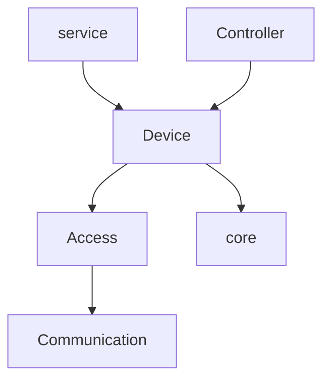
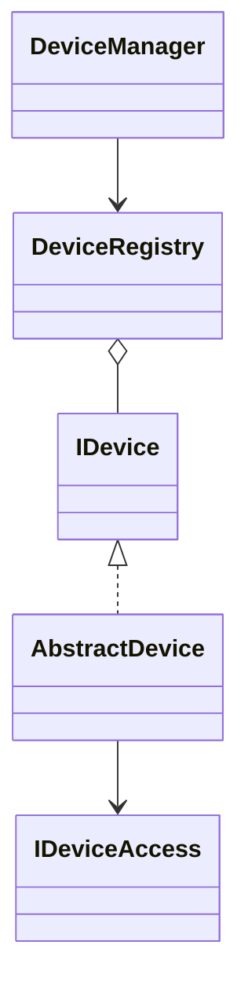
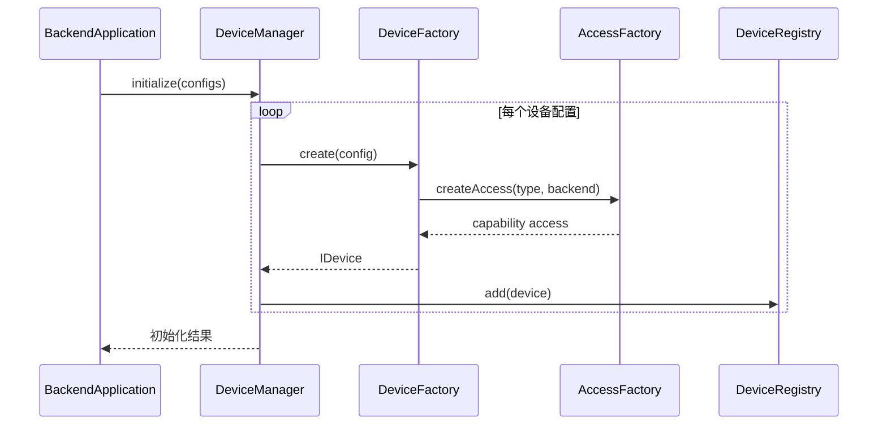
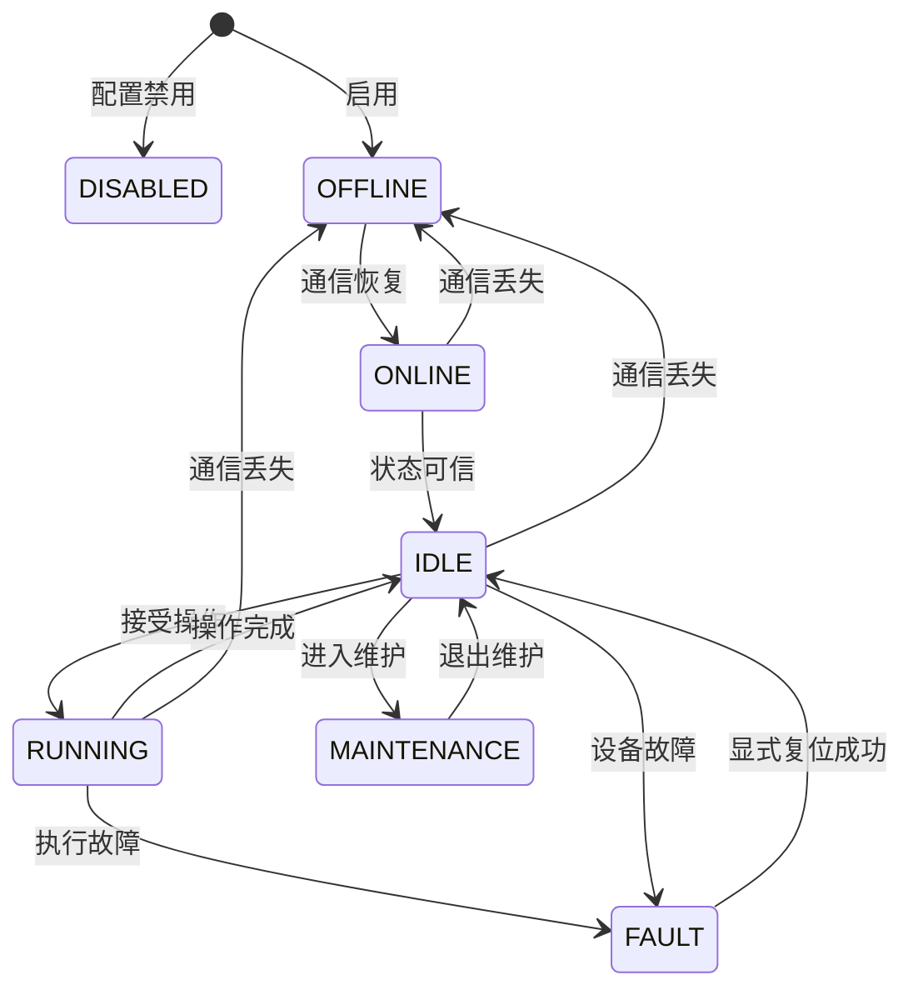
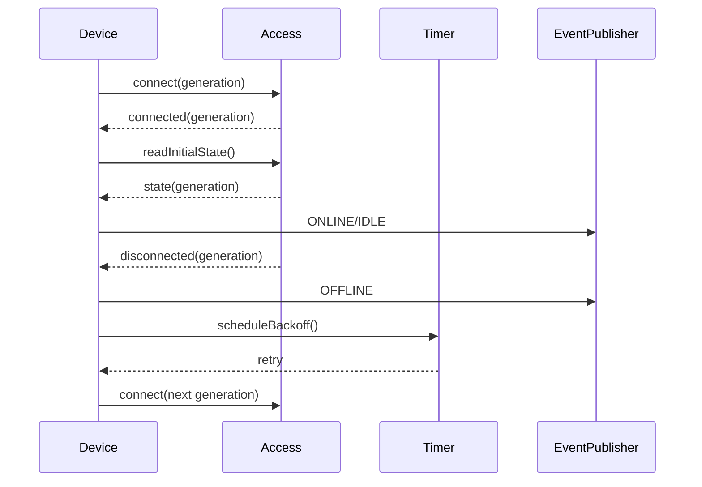
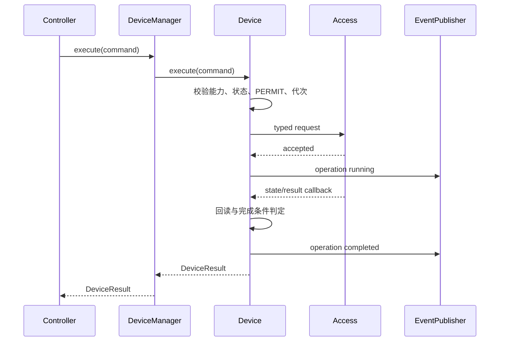

# 第7章 Device 设计

## 7.1 概述

Device 模块是 MRSS Backend 的统一设备语义与生命周期管理层，位于 Controller 与 Access 之间。它将机械臂、固定相机、PTZ 相机和辐射传感器抽象为稳定、可查询、可控制、可订阅的设备对象，并统一管理设备注册、初始化、启停、状态快照、能力、命令路由、超时、取消、重连代次和故障隔离。

Controller 面向 Device 的统一接口下发设备命令，不感知设备使用仿真实现还是真实实现；Device 通过 Access 的能力接口访问具体设备，不解析厂商协议、不直接操作 Socket 或 SDK。

一期 Device 管理以下五个逻辑设备实例：

| 设备标识 | 设备类型 | 一期主要能力 |
| --- | --- | --- |
| `R1` | 瑞尔曼机械臂 | 点动、单点运动、连续轨迹、停止、状态读取 |
| `R2` | 瑞尔曼机械臂 | 点动、单点运动、连续轨迹、停止、状态读取 |
| `HIK_FIX1` | 海康固定相机 | 在线状态、抓图、流地址查询 |
| `HIK_PTZ1` | 海康 PTZ 相机 | 云台、变倍、预置位、抓图、流地址查询 |
| `GAM1` | 辐射传感器 | 剂量率、计数率、质量状态、采样 |

一期不引入 IOC。仿真、真实和混合设备均由 Backend 通过 Device 与 Access 统一管理；后续如接入 EPICS，也只能作为新的 Access 实现接入，不改变 Device 对 Controller 和 service 暴露的接口。

## 7.2 设计目标

Device 模块的设计目标如下：

1. 为 Controller 和 service 提供与厂商、协议和部署模式无关的统一设备接口。
2. 统一表达设备生命周期、运行状态、控制模式、OWNER、PERMIT、能力和通信质量。
3. 保证同一逻辑设备在任意时刻只有一个有效运行实例和一个有效 Access 后端。
4. 支持仿真、真实和混合配置，上层 API、控制流程和数据库结构保持不变。
5. 将命令受理、设备回执、状态变化和最终结果明确分离。
6. 支持异步命令、取消、停止、超时、重连和迟到回调隔离。
7. 为机械臂、固定相机、PTZ 相机和辐射传感器定义强类型能力接口。
8. 使单设备断线、协议异常或状态陈旧只影响对应设备及其依赖流程。
9. 对危险动作执行最后一道设备侧软件门禁，但不重复实现业务权限和资源调度。
10. 为状态订阅、实时推送、告警、历史和审计提供标准事件。
11. 为故障注入、仿真测试和新增设备类型提供清晰扩展点。

## 7.3 设计原则

### 7.3.1 设备语义与厂商访问分离

Device 描述“机械臂移动到目标点”“相机抓图”“辐射传感器采样”等统一语义；Access 负责把统一语义转换为瑞尔曼、海康或辐射设备的具体协议调用。Device 中不得出现厂商命令码、HTTP 路径、Socket 句柄和 SDK 对象。

### 7.3.2 接口稳定

Controller、service 和 api 只依赖 Device 的公开接口和数据模型。更换设备型号、通信协议、仿真算法或 Access 实现时，不修改上层控制命令和业务流程。

### 7.3.3 状态分面

不使用单个枚举同时表达设备在线、控制模式、执行状态和安全许可。设备模型至少分离：

- 组件生命周期；
- 设备工作状态；
- 控制模式；
- 运行状态；
- OWNER 与资源信息；
- PERMIT 与安全代次；
- 能力集合；
- 通信状态与数据新鲜度。

### 7.3.4 单写者

每个设备实例拥有一个串行状态执行器。Access 回调、命令回执、轮询结果和定时器事件必须投递到该执行器后才能改变设备状态，避免多线程直接修改快照。

### 7.3.5 快照不可变

对外查询返回不可变快照或值对象，不暴露内部可变成员和厂商对象。快照使用单调递增的 `state_version`，便于 WebSocket 增量推送和调用方丢弃旧状态。

### 7.3.6 代次隔离

设备每次重建、切换后端或重新建立有效会话时递增 `driver_generation`。旧连接产生的迟到回调、旧命令完成通知和旧定时器不得修改新代次状态。

### 7.3.7 安全停止不阻塞

普通命令走有序命令通道，安全停止走独立高优先级接口。停止不得因为 OWNER 不匹配、普通队列已满或设备处于业务忙状态而被拒绝。

### 7.3.8 有界与可恢复

设备命令、待完成操作、状态事件和回调队列均有上限。超时、断线和关闭必须收敛为确定结果；无法确认设备最终状态时返回 `RESULT_UNKNOWN`，不得伪造成功。

## 7.4 职责与边界

### 7.4.1 Device 负责的内容

| 类别 | 主要职责 |
| --- | --- |
| 设备注册 | 按配置创建、注册、启停和移除逻辑设备 |
| 生命周期 | 初始化、启动、连接、停止接收、停止和释放 |
| 统一模型 | 标识、类型、状态、模式、OWNER、PERMIT、能力 |
| 状态管理 | 快照、版本、新鲜度、状态归一化和状态事件 |
| 命令路由 | 将统一命令路由到目标设备和能力接口 |
| 命令跟踪 | 接收、执行、回执、超时、取消和最终结果 |
| 安全门禁 | 校验设备可用性、能力、PERMIT 和安全代次 |
| 停止入口 | 为 Controller 提供独立、高优先级停止接口 |
| 后端管理 | 绑定仿真或真实 Access，管理连接代次 |
| 故障隔离 | 限制单设备故障影响范围并输出标准错误 |
| 事件输出 | 状态、连接、采样、命令结果和故障事件 |
| 可测试性 | 假设备、确定性时钟、故障注入和事件记录 |

### 7.4.2 Device 不负责的内容

1. 不处理 HTTP、WebSocket、JSON 和 JWT。
2. 不判断用户角色是否有权控制设备。
3. 不创建业务任务，不编排双臂或臂相机协同流程。
4. 不负责 Manual、Auto 模式切换和 OWNER、资源租约的业务仲裁。
5. 不直接实现厂商协议、ISAPI、SDK、TCP、UDP 或串口报文。
6. 不直接访问 PostgreSQL 表，不保存用户、任务和审计记录。
7. 不承担通用轨迹规划、碰撞规划或硬实时插补。
8. 不替代硬件急停、安全回路、机械限位和设备控制器保护。
9. 不转发视频帧、录像文件或图片二进制；只管理抓图结果标识、文件引用和流地址等元数据。
10. 不在一期运行 IOC，不直接读写 EPICS PV。

### 7.4.3 与相邻模块的协作边界

| 调用关系 | 允许内容 | 禁止内容 |
| --- | --- | --- |
| Controller → Device | 统一命令、停止、取消、状态查询、安全上下文 | 厂商报文、Socket、SDK 句柄 |
| service → Device | 设备列表、快照、能力、只读查询 | 绕过 Controller 的危险控制 |
| Device → Access | 强类型设备请求、连接控制、状态读取 | 用户权限、任务编排、数据库事务 |
| Access → Device | 连接事件、统一回执、原始测量值、厂商错误映射输入 | Web 会话、业务任务对象 |
| Device → core | 日志、事件、时钟、定时器、执行器和配置基础能力 | 业务权限与设备协议 |

## 7.5 架构位置与依赖关系



主要依赖方向为：

- service 通过 `IDeviceQueryService` 查询设备列表、状态和能力；
- Controller 通过 `IDeviceCommandPort` 执行命令、取消和停止；
- Device 通过 `IAccessFactory` 和各类能力 Access 接口访问设备；
- Device 通过 `IEventPublisher` 发布标准事件；
- Device 使用 core 的执行器、定时器、时钟、日志、错误和配置能力。

Device 不反向依赖 Controller、service、api、auth 或 db 的具体实现。

## 7.6 工程目录

```text
backend/device/
├── device_manager.h
├── device_manager.cpp
├── device_registry.h
├── device_registry.cpp
├── device_factory.h
├── device_factory.cpp
├── model/
│   ├── device_id.h
│   ├── device_type.h
│   ├── device_state.h
│   ├── device_snapshot.h
│   ├── device_capability.h
│   ├── device_command.h
│   ├── device_result.h
│   └── device_error.h
├── base/
│   ├── device.h
│   ├── abstract_device.h
│   ├── device_state_store.h
│   ├── device_operation_tracker.h
│   └── device_event_emitter.h
├── manipulator/
│   ├── manipulator_device.h
│   ├── manipulator_device.cpp
│   └── manipulator_model.h
├── camera/
│   ├── fixed_camera_device.h
│   ├── fixed_camera_device.cpp
│   ├── ptz_camera_device.h
│   ├── ptz_camera_device.cpp
│   └── camera_model.h
├── radiation/
│   ├── radiation_device.h
│   ├── radiation_device.cpp
│   └── radiation_model.h
├── port/
│   ├── device_command_port.h
│   ├── device_query_service.h
│   ├── device_event_sink.h
│   ├── access_factory.h
│   ├── manipulator_access.h
│   ├── camera_access.h
│   └── radiation_access.h
└── tests/
```

`device/manipulator`、`device/camera` 和 `device/radiation` 只实现通用设备语义。瑞尔曼、海康和具体辐射协议代码统一放入 `backend/access/`，在第8章详细说明。

## 7.7 子模块组成

| 子模块 | 职责 |
| --- | --- |
| `DeviceManager` | Device 模块入口、批量启停、统一查询与命令路由 |
| `DeviceRegistry` | 设备标识唯一性、注册、查找和枚举 |
| `DeviceFactory` | 根据类型与配置创建统一设备对象并绑定 Access |
| `AbstractDevice` | 生命周期、串行执行器、状态、代次和公共门禁 |
| `DeviceStateStore` | 不可变快照、版本、新鲜度和差异发布 |
| `DeviceOperationTracker` | 活动操作、超时、取消、幂等和最终结果 |
| `ManipulatorDevice` | 机械臂能力、运动状态、到位与停止语义 |
| `FixedCameraDevice` | 抓图、流信息和相机状态 |
| `PtzCameraDevice` | PTZ、变倍、预置位、抓图和流信息 |
| `RadiationDevice` | 剂量率、计数率、采样质量和采样控制 |
| `DeviceEventEmitter` | 标准设备事件发布和重复事件抑制 |

## 7.8 一期设备清单与逻辑标识

### 7.8.1 标识规则

设备标识在配置、命令、事件、历史和审计中保持一致，一期固定使用 `R1`、`R2`、`HIK_FIX1`、`HIK_PTZ1` 和 `GAM1`。标识一经参与历史记录不得复用给其他物理设备。

```cpp
using DeviceId = std::string;

enum class DeviceType {
    MANIPULATOR,
    FIXED_CAMERA,
    PTZ_CAMERA,
    RADIATION_SENSOR
};

enum class DeviceBackend {
    SIM,
    REAL
};
```

混合模式不是第三种设备后端。它表示不同设备分别配置为 `SIM` 或 `REAL`。同一个逻辑设备在同一时刻只能绑定一个后端。

### 7.8.2 一期固定映射

| DeviceId | DeviceType | 默认资源 | 可配置后端 |
| --- | --- | --- | --- |
| `R1` | `MANIPULATOR` | `ARM_R1` | SIM / REAL |
| `R2` | `MANIPULATOR` | `ARM_R2` | SIM / REAL |
| `HIK_FIX1` | `FIXED_CAMERA` | `CAM_FIX1` | SIM / REAL |
| `HIK_PTZ1` | `PTZ_CAMERA` | `CAM_PTZ1` | SIM / REAL |
| `GAM1` | `RADIATION_SENSOR` | `SENSOR_GAM1` | SIM / REAL |

一期 `GAM1` 只表示辐射传感器，不包含温度、湿度或气体传感器。

## 7.9 统一设备状态模型

### 7.9.1 组件生命周期

组件生命周期描述 Backend 内设备对象自身所处阶段，不等同于物理设备运行状态。

```cpp
enum class DeviceLifecycle {
    CREATED,
    INITIALIZED,
    STARTING,
    STARTED,
    STOPPING,
    STOPPED,
    FAILED
};
```

### 7.9.2 设备工作状态

```cpp
enum class DeviceState {
    OFFLINE,
    ONLINE,
    IDLE,
    RUNNING,
    FAULT,
    MAINTENANCE,
    DISABLED
};

enum class ControlMode {
    MANUAL,
    AUTO
};

enum class RunState {
    UNKNOWN,
    IDLE,
    EXECUTING,
    PAUSED,
    STOPPING,
    STOPPED,
    COMPLETED,
    ERROR
};
```

状态使用规则如下：

1. `OFFLINE` 表示没有可信通信或设备不存在有效会话。
2. `ONLINE` 表示通信正常，但尚未确认设备已满足空闲条件。
3. `IDLE` 表示设备在线、无活动操作且可接受适用命令。
4. `RUNNING` 表示设备正在执行动作或主动采样。
5. `FAULT` 表示设备或 Access 报告需人工或显式流程处理的故障。
6. `MAINTENANCE` 表示设备被置于维护状态，不参与自动任务。
7. `DISABLED` 表示配置禁用，Device 不建立真实连接、不接受普通命令。
8. `ControlMode` 只表达 Manual 或 Auto，不把维护、在线和故障混入模式。
9. `RunState` 描述当前操作执行阶段，不替代 `DeviceState`。

### 7.9.3 OWNER、PERMIT 与通信状态

```cpp
struct DeviceControlState {
    ControlMode mode{ControlMode::MANUAL};
    std::string owner;
    std::string resource_id;
    bool resource_locked{false};
    bool permit{false};
    uint64_t safety_epoch{0};
};

struct DeviceCommunicationState {
    bool comm_ok{false};
    uint64_t driver_generation{0};
    uint64_t consecutive_failures{0};
    std::chrono::milliseconds last_latency{0};
    timestamp_t last_rx_at{0};
    timestamp_t last_success_at{0};
};
```

Device 保存 OWNER 和资源状态是为了形成完整快照和执行最后门禁，不承担 OWNER 分配策略。OWNER 获取、续租、抢占和释放由第16章的资源仲裁模块负责。

## 7.10 能力模型

### 7.10.1 能力定义

```cpp
enum class DeviceCapability {
    STATUS_READ,
    STOP,
    JOG,
    MOVE_POINT,
    MOVE_TRAJECTORY,
    POSITION_READ,
    CAPTURE,
    STREAM_INFO,
    PTZ_MOVE,
    ZOOM,
    PRESET,
    RADIATION_READ,
    RADIATION_SAMPLE
};

struct CapabilityDescriptor {
    DeviceCapability capability;
    bool enabled{true};
    bool dangerous{false};
    bool requires_permit{false};
    std::map<std::string, double> numeric_limits;
};
```

### 7.10.2 一期能力矩阵

| 能力 | R1/R2 | HIK_FIX1 | HIK_PTZ1 | GAM1 |
| --- | --- | --- | --- | --- |
| 状态读取 | 支持 | 支持 | 支持 | 支持 |
| 高优先级停止 | 支持 | 不适用 | 支持 PTZ 停止 | 停止主动采样 |
| 点动 | 支持 | 不支持 | 支持 PTZ 点动 | 不支持 |
| 单点运动 | 支持 | 不支持 | 支持绝对 PTZ | 不支持 |
| 连续轨迹 | 支持 | 不支持 | 不支持 | 不支持 |
| 抓图 | 不支持 | 支持 | 支持 | 不支持 |
| 流地址 | 不支持 | 支持 | 支持 | 不支持 |
| 预置位 | 不支持 | 不支持 | 支持 | 不支持 |
| 辐射读取 | 不支持 | 不支持 | 不支持 | 支持 |
| 主动采样 | 不支持 | 不支持 | 不支持 | 支持 |

命令执行前必须查询能力描述。设备类型相同但型号能力不同的情况通过能力集合表达，不在上层使用型号字符串分支。

## 7.11 设备快照

```cpp
struct DeviceSnapshot {
    DeviceId device_id;
    DeviceType device_type;
    DeviceBackend backend;
    DeviceLifecycle lifecycle{DeviceLifecycle::CREATED};
    DeviceState state{DeviceState::OFFLINE};
    ControlMode mode{ControlMode::MANUAL};
    RunState run_state{RunState::UNKNOWN};
    std::string owner;
    std::string resource_id;
    bool resource_locked{false};
    bool permit{false};
    bool comm_ok{false};
    bool data_fresh{false};
    uint64_t safety_epoch{0};
    uint64_t driver_generation{0};
    uint64_t state_version{0};
    std::string active_operation_id;
    std::string fault_code;
    std::string last_error;
    timestamp_t observed_at{0};
    timestamp_t updated_at{0};
    std::vector<CapabilityDescriptor> capabilities;
};
```

快照约束如下：

1. `observed_at` 表示设备数据实际观测时间，`updated_at` 表示快照更新时间。
2. 每次有效字段变化时 `state_version` 单调递增。
3. 相同值的重复轮询不得持续发布无意义事件。
4. `data_fresh=false` 时上层不得把旧值当作当前状态。
5. `last_error` 用于诊断，不作为程序分支依据；程序使用结构化 `fault_code`。
6. 快照不包含密码、Token、设备口令和厂商会话信息。

## 7.12 设备类型扩展数据

### 7.12.1 机械臂状态

```cpp
struct JointState {
    std::vector<double> position_rad;
    std::vector<double> velocity_rad_s;
    std::vector<double> effort;
};

struct CartesianPose {
    double x_m{0.0};
    double y_m{0.0};
    double z_m{0.0};
    double rx_rad{0.0};
    double ry_rad{0.0};
    double rz_rad{0.0};
};

struct ManipulatorSnapshot {
    DeviceSnapshot common;
    JointState joints;
    CartesianPose tcp_pose;
    bool servo_enabled{false};
    bool moving{false};
    bool arrived{false};
    double progress{0.0};
};
```

内部统一使用 SI 单位：位置使用米、角度使用弧度、时间使用秒或显式 `chrono` 类型。Access 负责与厂商单位互换。

### 7.12.2 相机状态

```cpp
struct CameraSnapshot {
    DeviceSnapshot common;
    bool stream_available{false};
    std::string stream_url;
    std::string last_image_id;
    std::string last_image_path;
    timestamp_t last_capture_at{0};
};

struct PtzSnapshot {
    CameraSnapshot camera;
    double pan_deg{0.0};
    double tilt_deg{0.0};
    double zoom_ratio{1.0};
    int preset_id{0};
    bool ptz_moving{false};
};
```

Device 只保存流地址和抓图结果引用。鉴权口令不写入 `stream_url`，视频帧、录像和图片二进制不进入设备快照和 WebSocket 状态事件。

### 7.12.3 辐射状态

```cpp
enum class SampleQuality {
    GOOD,
    UNCERTAIN,
    BAD,
    STALE
};

struct RadiationSnapshot {
    DeviceSnapshot common;
    double dose_rate_usv_h{0.0};
    double count_rate_cps{0.0};
    SampleQuality quality{SampleQuality::STALE};
    uint64_t sample_sequence{0};
    timestamp_t sampled_at{0};
};
```

Device 负责量纲统一、数据质量和新鲜度，不负责根据业务阈值生成最终报警等级。告警判定由 service/告警模块完成。

## 7.13 统一命令与结果模型

### 7.13.1 命令请求

```cpp
struct DeviceCommandContext {
    std::string command_id;
    std::string request_id;
    std::string task_id;
    std::string source;
    std::string owner;
    uint64_t safety_epoch{0};
    timestamp_t issued_at{0};
    timestamp_t deadline{0};
};

using DevicePayload = std::variant<
    StopPayload,
    JogPayload,
    MovePointPayload,
    MoveTrajectoryPayload,
    CapturePayload,
    PtzPayload,
    ZoomPayload,
    PresetPayload,
    RadiationSamplePayload>;

struct DeviceCommand {
    DeviceCommandContext context;
    DeviceId device_id;
    DeviceCapability capability;
    DevicePayload payload;
};
```

### 7.13.2 命令结果

```cpp
enum class DeviceOperationStatus {
    ACCEPTED,
    RUNNING,
    SUCCEEDED,
    FAILED,
    CANCELLED,
    TIMED_OUT,
    RESULT_UNKNOWN
};

struct DeviceResult {
    std::string command_id;
    DeviceId device_id;
    DeviceOperationStatus status;
    std::string error_code;
    std::string message;
    uint64_t driver_generation{0};
    timestamp_t accepted_at{0};
    timestamp_t completed_at{0};
    std::map<std::string, std::string> outputs;
};
```

发送成功、设备接受和动作最终完成是不同事实。机械臂到位、相机生成有效图片引用、辐射采样产生新序号后，才能分别判定对应操作成功。

## 7.14 核心接口

```cpp
class IDeviceCommandPort {
public:
    virtual ~IDeviceCommandPort() = default;

    virtual std::future<DeviceResult>
    execute(const DeviceCommand &command,
            const CancellationToken &token) = 0;

    virtual std::future<DeviceResult>
    cancel(const DeviceId &device_id,
           const std::string &command_id) = 0;

    virtual std::future<DeviceResult>
    stop(const DeviceId &device_id,
         StopReason reason,
         uint64_t safety_epoch) = 0;
};

class IDeviceQueryService {
public:
    virtual ~IDeviceQueryService() = default;

    virtual std::optional<DeviceSnapshot>
    getSnapshot(const DeviceId &device_id) const = 0;

    virtual std::vector<DeviceSnapshot> listSnapshots() const = 0;

    virtual std::vector<CapabilityDescriptor>
    getCapabilities(const DeviceId &device_id) const = 0;
};

class IDevice {
public:
    virtual ~IDevice() = default;
    virtual const DeviceId &id() const noexcept = 0;
    virtual DeviceType type() const noexcept = 0;
    virtual void initialize() = 0;
    virtual void start() = 0;
    virtual void stopAccepting() = 0;
    virtual void stop() = 0;
    virtual std::future<DeviceResult> execute(
        const DeviceCommand &command,
        const CancellationToken &token) = 0;
    virtual std::future<DeviceResult> emergencyStop(
        StopReason reason,
        uint64_t safety_epoch) = 0;
    virtual DeviceSnapshot snapshot() const = 0;
};
```

`stop()` 表示组件生命周期停止，`emergencyStop()` 表示设备动作停止，两者不得混用。

## 7.15 核心类关系



具体的 `ManipulatorDevice`、`FixedCameraDevice`、`PtzCameraDevice` 和 `RadiationDevice` 继承 `AbstractDevice`，并组合对应的 Access 能力接口。

## 7.16 DeviceManager 设计

### 7.16.1 类职责

`DeviceManager` 是 Device 模块唯一对外入口，负责设备批量构造、生命周期编排、查询、命令路由、控制上下文更新和整体健康汇总。

```cpp
class DeviceManager final
    : public IDeviceCommandPort,
      public IDeviceQueryService {
public:
    DeviceManager(DeviceRegistry &registry,
                  DeviceFactory &factory,
                  IEventPublisher &events,
                  ILogger &logger);

    void initialize(const std::vector<DeviceConfig> &configs);
    void start();
    void stopAccepting();
    void stop();

    std::future<DeviceResult> execute(
        const DeviceCommand &command,
        const CancellationToken &token) override;

    std::future<DeviceResult> cancel(
        const DeviceId &device_id,
        const std::string &command_id) override;

    std::future<DeviceResult> stop(
        const DeviceId &device_id,
        StopReason reason,
        uint64_t safety_epoch) override;

    std::optional<DeviceSnapshot> getSnapshot(
        const DeviceId &device_id) const override;

    std::vector<DeviceSnapshot> listSnapshots() const override;
    void updateControlState(const DeviceId &device_id,
                            const DeviceControlState &state);

private:
    DeviceRegistry &registry_;
    DeviceFactory &factory_;
    IEventPublisher &events_;
    ILogger &logger_;
    std::atomic<bool> accepting_{false};
};
```

### 7.16.2 命令路由规则

1. 校验管理器处于 accepting 状态。
2. 按 `device_id` 查找设备，找不到返回 `DEVICE_NOT_FOUND`。
3. 校验命令的 `device_id`、能力和 Payload 类型匹配。
4. 普通命令投递到目标设备串行执行器。
5. 停止命令直接调用独立高优先级入口。
6. DeviceManager 不得在持有全局注册表写锁时等待设备 Future。
7. 命令 Future 的完成不得依赖 HTTP 或 WebSocket 连接存活。

## 7.17 DeviceRegistry 设计

```cpp
class DeviceRegistry final {
public:
    void add(std::shared_ptr<IDevice> device);
    std::shared_ptr<IDevice> get(const DeviceId &id) const;
    std::vector<std::shared_ptr<IDevice>> list() const;
    std::shared_ptr<IDevice> remove(const DeviceId &id);
    bool contains(const DeviceId &id) const;

private:
    mutable std::shared_mutex mutex_;
    std::unordered_map<DeviceId, std::shared_ptr<IDevice>> devices_;
};
```

注册表约束如下：

- `DeviceId` 在同一 Backend 实例内唯一；
- 空标识、重复标识和未知类型在启动阶段直接拒绝；
- `get()` 返回强引用，设备销毁不与正在执行的查询竞争；
- `remove()` 仅在设备停止接收且活动操作收敛后执行；
- 不允许用新设备静默覆盖旧设备；
- 注册表锁只保护映射，不保护设备内部状态。

## 7.18 DeviceFactory 与后端绑定

### 7.18.1 创建流程



### 7.18.2 创建规则

1. `type` 决定统一设备类，`backend` 决定 Access 实现。
2. `backend=SIM` 创建仿真 Access，`backend=REAL` 创建真实 Access。
3. DeviceFactory 不根据 IP 地址猜测设备类型。
4. 缺失必须配置、能力不匹配或重复端点时启动失败。
5. 单个非关键设备配置错误可按配置进入 `DISABLED` 并告警；R1/R2 等关键设备是否允许降级启动由部署策略决定。
6. 禁止在命令执行过程中热切换后端。

## 7.19 AbstractDevice 设计

```cpp
class AbstractDevice : public IDevice {
protected:
    AbstractDevice(DeviceConfig config,
                   std::unique_ptr<IDeviceAccess> access,
                   ISerialExecutor &executor,
                   ITimerService &timers,
                   IClock &clock,
                   IEventPublisher &events);

    bool validateCommon(const DeviceCommand &command,
                        DeviceResult &rejection) const;
    void applyState(DeviceState state, RunState run_state);
    void applyCommunication(bool ok,
                            const std::string &error = {});
    bool acceptGeneration(uint64_t generation) const;
    void completeOperation(const std::string &command_id,
                           DeviceResult result);
    void failActiveOperations(const DeviceError &error);

    DeviceConfig config_;
    std::unique_ptr<IDeviceAccess> access_;
    DeviceStateStore state_store_;
    DeviceOperationTracker operations_;
    ISerialExecutor &executor_;
    ITimerService &timers_;
    IClock &clock_;
    IEventPublisher &events_;
    std::atomic<DeviceLifecycle> lifecycle_;
    std::atomic<uint64_t> driver_generation_{0};
    std::atomic<bool> accepting_{false};
};
```

公共校验包括：

- 组件已启动且仍接收命令；
- 设备未禁用、未维护、非离线且通信可信；
- 目标能力存在且启用；
- Payload 类型和参数满足能力描述；
- 危险能力的 `permit=true`；
- 命令 `safety_epoch` 与当前有效代次一致；
- 截止时间未过期；
- 相同 `command_id` 不重复执行。

OWNER 和资源锁的完整仲裁由 Controller/资源模块完成。Device 只检查收到的控制上下文与当前快照是否一致，形成纵深防御。

## 7.20 设备操作跟踪

`DeviceOperationTracker` 保存有限数量的活动操作和短期幂等结果。

```cpp
struct ActiveDeviceOperation {
    DeviceCommand command;
    DeviceOperationStatus status{DeviceOperationStatus::ACCEPTED};
    uint64_t driver_generation{0};
    timestamp_t started_at{0};
    timestamp_t deadline{0};
    CancellationSource cancellation;
    std::promise<DeviceResult> completion;
};
```

处理规则如下：

1. `command_id` 已完成时返回缓存终态，不重新下发。
2. `command_id` 活动中时返回同一操作的观察结果，不创建第二个动作。
3. 超时先请求 Access 停止或取消，再根据回读确定 `TIMED_OUT` 或 `RESULT_UNKNOWN`。
4. 断线时，对依赖连接的活动操作执行失败收敛。
5. 旧代次回调只记录调试日志，不完成新代次操作。
6. 完成 Promise 只能设置一次，重复回调必须被抑制。
7. 幂等缓存有数量和时间上限，长期事实由 db/审计模块保存。

## 7.21 机械臂 Device 设计

### 7.21.1 职责

`ManipulatorDevice` 为 R1、R2 提供统一运动语义，负责：

- 机械臂状态、关节和末端位姿快照；
- 点动、单点和连续轨迹请求校验；
- 命令下发、回执、执行进度和到位判定；
- 普通停止、急停停止和关闭停止；
- 伺服状态、运动状态和故障归一化；
- 断线、超时和结果未知处理。

轨迹编排、双臂屏障和臂相机步骤属于 Controller，不在 `ManipulatorDevice` 内实现。

### 7.21.2 主要接口

```cpp
class ManipulatorDevice final : public AbstractDevice {
public:
    std::future<DeviceResult> execute(
        const DeviceCommand &command,
        const CancellationToken &token) override;

    std::future<DeviceResult> emergencyStop(
        StopReason reason,
        uint64_t safety_epoch) override;

    ManipulatorSnapshot manipulatorSnapshot() const;

private:
    DeviceResult validateJog(const JogPayload &payload) const;
    DeviceResult validatePoint(const MovePointPayload &payload) const;
    DeviceResult validateTrajectory(
        const MoveTrajectoryPayload &payload) const;
    void handleMotionAck(const MotionAck &ack, uint64_t generation);
    void handleMotionState(const MotionState &state,
                           uint64_t generation);
    bool isArrived(const MotionTarget &target,
                   const ManipulatorSnapshot &actual) const;

    IManipulatorAccess &manipulator_access_;
    ArrivalPolicy arrival_policy_;
};
```

### 7.21.3 到位判定

到位不得只依据一次厂商成功回执。判定至少满足：

1. Access 报告命令已接受；
2. 实际关节或末端位姿进入配置容差；
3. 速度低于停止阈值；
4. 条件连续满足稳定时间；
5. 状态观测时间晚于本次命令下发时间；
6. 回读属于当前 `driver_generation`。

### 7.21.4 机械臂停止

停止优先级为：

1. GLOBAL 急停触发的安全停止；
2. HW、SW 或 SIM 急停源触发的停止；
3. 关闭阶段停止；
4. Controller 显式 STOP；
5. 普通取消和超时停止。

Device 调用 Access 的最高可用停止能力并等待有限时间确认。停止失败时设备进入 `FAULT` 或 `OFFLINE`，活动命令标记为 `RESULT_UNKNOWN`，同时上报告警；不得因为软件返回失败就假设机械臂已经停止。

## 7.22 固定相机 Device 设计

### 7.22.1 职责

`FixedCameraDevice` 为 `HIK_FIX1` 提供在线状态、流信息和抓图能力。它不进行视频解码，也不把图片二进制保存在设备快照中。

```cpp
struct CapturePayload {
    std::string capture_id;
    std::string storage_namespace;
    std::map<std::string, std::string> metadata;
};

struct CaptureResult {
    std::string capture_id;
    std::string image_id;
    std::string image_path;
    timestamp_t captured_at{0};
};
```

抓图成功必须满足：

- 相机接受抓图请求；
- 返回非空 `image_id`；
- 保存组件确认得到可引用的 `image_path` 或等价对象引用；
- 捕获时间属于本次命令；
- 结果来自当前连接代次。

只有 HTTP 成功、SDK 返回零或触发信号发送成功时，不能直接判定抓图最终成功。

### 7.22.2 流地址处理

`stream_url` 作为受控元数据提供给上层。Device 不在日志、事件和快照中包含用户名、密码、Token 等凭据。真实播放鉴权由部署和媒体访问层负责。

## 7.23 PTZ 相机 Device 设计

`PtzCameraDevice` 为 `HIK_PTZ1` 提供固定相机能力，并增加：

- PAN/TILT 连续点动；
- PAN/TILT 绝对定位；
- ZOOM 连续或绝对控制；
- 预置位调用；
- PTZ 停止；
- PTZ 位置与移动状态回读。

```cpp
struct PtzPayload {
    PtzCommandType type;
    double pan{0.0};
    double tilt{0.0};
    double speed{0.0};
    std::chrono::milliseconds duration{0};
};

struct ZoomPayload {
    ZoomCommandType type;
    double value{0.0};
    double speed{0.0};
};
```

PTZ 点动必须有持续时间或租约，控制源停止刷新、客户端断线、命令取消或超时后必须发出 PTZ STOP。预置位完成应结合位置回读；设备不支持精确位置回读时，结果必须标注确认级别，不能伪装为精确到位。

## 7.24 辐射传感器 Device 设计

### 7.24.1 职责

`RadiationDevice` 为 `GAM1` 统一提供剂量率、计数率、采样序号、采样时间和数据质量。

```cpp
class RadiationDevice final : public AbstractDevice {
public:
    RadiationSnapshot radiationSnapshot() const;
    std::future<DeviceResult> execute(
        const DeviceCommand &command,
        const CancellationToken &token) override;

private:
    void handleSample(const RadiationSample &sample,
                      uint64_t generation);
    SampleQuality evaluateQuality(
        const RadiationSample &sample) const;
    void markStaleIfNeeded();

    IRadiationAccess &radiation_access_;
    std::chrono::milliseconds stale_after_;
};
```

### 7.24.2 数据处理规则

1. 剂量率统一为 `uSv/h`，计数率统一为 `CPS`。
2. Access 提供厂商原始时间时，同时记录接收时间和设备时间。
3. 非有限数、越界值、校验失败和时间倒退不得标记为 `GOOD`。
4. 超过 `stale_after` 未收到新样本时质量变为 `STALE`。
5. 重复样本可更新通信健康，但不得递增业务采样序号。
6. 设备断线后保留最后值用于诊断，但 `data_fresh=false`，上层不得当作实时值。
7. 阈值、报警等级和报警抑制由后续告警模块处理。

## 7.25 仿真设备设计

### 7.25.1 仿真边界

仿真实现位于 Access 的 SIM 实现中，Device 不包含 `if (sim)` 业务分支。仿真后端与真实后端实现相同能力接口，产生相同结构的连接事件、状态回读、命令回执和错误。

### 7.25.2 仿真要求

一期仿真至少支持：

- R1/R2 按速度和目标计算运动进度，并生成关节或位姿回读；
- 点动在租约结束后自动停止；
- 单点和轨迹运动的接受、运行、到位和失败状态；
- HIK_FIX1/HIK_PTZ1 生成可追踪的模拟图片引用；
- HIK_PTZ1 模拟 PAN、TILT、ZOOM 和预置位；
- GAM1 按配置生成剂量率和 CPS，并支持噪声和越界注入；
- 连接断开、延迟、超时、拒绝、迟到回调和状态冻结；
- 当前安全状态阻断危险动作；
- 使用可注入时钟实现确定性测试。

### 7.25.3 仿真一致性

仿真不得绕过：

- 设备能力校验；
- Manual/Auto 与 OWNER、资源锁流程；
- PERMIT 和安全代次校验；
- 命令状态机；
- 到位判定；
- 超时和取消；
- 事件、日志、审计和错误归一化。

## 7.26 真实设备设计

真实设备由 Access 封装协议和 SDK。Device 对真实后端提出以下契约：

1. 连接、断开和重连操作异步且可取消。
2. 每个回调携带 `driver_generation` 或等价会话标识。
3. 厂商错误必须保留原始码，同时映射为标准错误。
4. Access 不在自身线程直接修改 Device 状态。
5. 阻塞 SDK 调用必须在专用执行器执行，不阻塞网络 I/O 或设备状态执行器。
6. Access 明确区分“发送成功”“设备接受”和“最终完成”。
7. Access 关闭后不得继续回调已销毁对象。
8. 凭据只从受控配置注入，不进入普通日志。

## 7.27 混合模式设计

混合模式允许例如 R1 使用真实后端、R2 使用仿真后端、相机和 GAM1 分别选择真实或仿真。DeviceManager 仍只暴露五个逻辑设备，不增加“模拟设备副本”。

混合模式约束如下：

1. 设备 ID、能力、命令和事件结构与全仿真、全真实一致。
2. 协同参与设备允许跨 SIM/REAL，但必须明确标记环境，仅用于一期集成验证。
3. 涉及真实机械臂的协同必须执行完整安全门禁。
4. 仿真设备的快速完成不能跳过 Controller 阶段屏障。
5. 历史、审计和日志必须记录 `backend`，避免把仿真结果误认为实物结果。
6. 切换后端需要设备无活动命令、释放资源、停止旧实例、递增代次并重新初始化。

## 7.28 设备工作状态机



关键规则：

- `OFFLINE → IDLE` 必须先建立通信并获得可信状态；
- `FAULT → IDLE` 需要显式复位或确认设备已恢复，不得仅因下一次轮询成功自动清故障；
- `RUNNING → OFFLINE` 时活动操作不得判定成功；
- 急停解除后只更新安全状态，不自动从 `FAULT`、`STOPPED` 恢复旧动作；
- `MAINTENANCE` 和 `DISABLED` 不参与 Auto 任务。

## 7.29 启动与关闭流程

### 7.29.1 启动流程

1. 校验全部设备配置和 ID 唯一性。
2. 创建 Access 和 Device 对象。
3. 注册设备并发布初始快照。
4. 初始化设备对象和回调绑定。
5. 启动各设备连接或仿真后端。
6. 完成首次状态同步。
7. 达到最低就绪条件后允许 Controller 接收命令。

设备未连接不等于 Backend 必须启动失败。是否允许降级启动由设备关键级别和部署策略决定，并在健康检查中明确显示。

### 7.29.2 关闭流程

1. DeviceManager 停止接收普通命令。
2. Controller 取消未执行命令并触发相关运动停止。
3. Device 等待活动操作在限定时间内收敛。
4. 停止轮询、心跳和重连定时器。
5. 关闭 Access 连接并阻断新回调。
6. 发布最终状态并清理注册表。

关闭超时后不得无限等待。机械臂停止确认失败时记录 `RESULT_UNKNOWN` 和高等级告警，再由系统关闭策略决定是否继续退出。

## 7.30 连接、心跳与重连



重连规则如下：

1. 使用带抖动的指数退避，并设置最大间隔。
2. 人工停止、配置禁用和 Backend 关闭时不自动重连。
3. 重连成功后必须重新读取完整状态和能力，不沿用旧连接的运行判断。
4. 重连不会自动重放旧命令。
5. 旧活动命令保持失败或结果未知，不因设备重新上线改写终态。
6. 连续失败达到阈值时发布告警，但不停止其他设备重连。
7. `comm_ok` 与业务可执行状态分离，TCP 已连接不代表设备 `IDLE`。

## 7.31 命令执行时序



所有回调在进入设备串行执行器前只做轻量封装。回调携带的命令 ID、设备 ID 和连接代次必须与活动操作一致。

## 7.32 并发与线程模型

### 7.32.1 执行器划分

| 执行上下文 | 允许工作 | 禁止工作 |
| --- | --- | --- |
| Communication I/O 线程 | 收发字节、轻量回调投递 | 阻塞 SDK、状态聚合、数据库 |
| Access 执行器 | 协议编码、阻塞 SDK 调用、厂商回调转换 | 业务编排、Web 推送 |
| Device 串行执行器 | 状态变更、命令跟踪、完成判定 | 长时间阻塞调用 |
| Controller 执行器 | 命令编排、协同、阶段控制 | 厂商协议处理 |
| 事件执行器 | 事件分发和订阅隔离 | 回写设备内部可变状态 |

### 7.32.2 并发约束

1. 同一设备的状态更新由单写者串行执行。
2. 不同设备拥有独立执行器或独立串行队列，可并行运行。
3. 设备快照通过原子共享指针或短临界区读取。
4. Registry 锁与设备内部锁不得嵌套等待 Future。
5. 回调、Promise 和取消对象使用明确生命周期，不捕获裸 `this` 跨越销毁。
6. 设备停止后新回调只允许被安全丢弃。
7. 事件订阅者异常不得中断设备状态执行器。

## 7.33 模式、资源与安全协作

### 7.33.1 职责分工

| 检查 | 主要负责模块 | Device 侧行为 |
| --- | --- | --- |
| 用户权限 | auth/service | 不重复解析角色 |
| Manual/Auto 规则 | 模式管理/Controller | 保存有效模式快照并检查一致性 |
| OWNER 与资源租约 | 资源仲裁/Controller | 保存 OWNER/锁状态并作最后一致性检查 |
| 三源急停与 GLOBAL 锁存 | Safety/Controller | 接收有效 PERMIT 和安全代次 |
| 设备能力与本机状态 | Device | 强制检查 |
| 厂商控制器保护 | Access/物理设备 | 原样保留并上报 |

### 7.33.2 PERMIT 规则

机械臂运动等危险能力必须满足 `permit=true` 且命令安全代次等于当前 `safety_epoch`。任何急停源触发后：

1. Safety 递增安全代次并撤销 PERMIT；
2. Controller 使用高优先级路径请求相关设备停止；
3. Device 拒绝旧代次普通命令；
4. 已执行命令进入停止或结果未知处理；
5. 急停解除后不自动恢复命令、任务、OWNER 或资源锁；
6. 必须显式复位并重新获取控制权后才能执行新动作。

相机只读、视频状态和辐射采样可按安全策略继续运行；不得为了一个机械臂故障默认停止无关传感器和相机。

## 7.34 故障隔离

### 7.34.1 隔离原则

- R1 断线只阻断 R1 及依赖 R1 的协同流程；
- R2 在自身状态和安全条件正常时可继续独立工作；
- HIK_FIX1 抓图失败只影响依赖该抓图步骤的流程；
- HIK_PTZ1 故障不影响固定相机；
- GAM1 数据陈旧只影响依赖实时辐射数据的业务；
- 单设备事件队列拥塞不得阻塞其他设备；
- 只有 GLOBAL 急停或共享安全状态不可信时才阻断全部危险运动。

### 7.34.2 协同故障

Device 不自行判断跨设备影响范围。它向 Controller 返回准确的逐设备结果，由 Controller 根据协同步骤决定停止哪些参与设备。Device 必须保证停止目标设备时不依赖失败设备的普通队列。

## 7.35 错误模型

| 标准错误码 | 含义 | 可重试性 |
| --- | --- | --- |
| `DEVICE_NOT_FOUND` | 设备 ID 不存在 | 否 |
| `DEVICE_DISABLED` | 设备被禁用 | 配置变更后 |
| `DEVICE_OFFLINE` | 无可信连接 | 重连后 |
| `DEVICE_NOT_READY` | 在线但状态不满足 | 状态变化后 |
| `CAPABILITY_UNSUPPORTED` | 不支持目标能力 | 否 |
| `INVALID_DEVICE_ARGUMENT` | 参数或单位非法 | 修正参数后 |
| `DEVICE_BUSY` | 设备存在冲突操作 | 稍后 |
| `PERMIT_DENIED` | 安全许可无效 | 显式复位后 |
| `SAFETY_EPOCH_MISMATCH` | 命令安全代次过期 | 重新受理命令 |
| `DEVICE_REJECTED` | 设备拒绝命令 | 视原因为定 |
| `DEVICE_TIMEOUT` | 操作超过截止时间 | 确认状态后 |
| `DEVICE_CANCELLED` | 操作已取消 | 由业务决定 |
| `ACCESS_UNAVAILABLE` | Access 不可用 | 重连后 |
| `PROTOCOL_ERROR` | 协议或回执非法 | 排障后 |
| `STATE_STALE` | 状态数据陈旧 | 新数据到达后 |
| `RESULT_UNKNOWN` | 无法确认最终状态 | 人工确认后 |
| `DEVICE_INTERNAL_ERROR` | Device 内部异常 | 排障后 |

`DeviceError` 同时保存标准码、厂商原始码、设备 ID、命令 ID、连接代次、发生阶段和可重试标记。外部接口不得直接暴露敏感的原始报文。

## 7.36 超时、取消与迟到回调

### 7.36.1 超时

每个命令使用调用方截止时间和设备能力默认超时的较小值。超时发生时：

1. 标记操作进入超时处理中；
2. 请求取消或停止；
3. 等待有限停止确认；
4. 能确认未执行或已停止时返回 `TIMED_OUT`；
5. 无法确认物理状态时返回 `RESULT_UNKNOWN`；
6. 发布包含设备、命令和代次的事件。

### 7.36.2 取消

取消是尽力而为操作。未下发命令可直接取消；已下发运动需要执行停止；设备明确不可取消时，返回可诊断结果并继续跟踪原操作，不能直接销毁操作对象。

### 7.36.3 迟到回调

终态之后到达的回调不得改写结果。旧代次回调、未知命令回调和重复完成回调分别计数并记录受限日志，避免日志洪泛。

## 7.37 状态事件设计

```cpp
enum class DeviceEventType {
    REGISTERED,
    LIFECYCLE_CHANGED,
    CONNECTION_CHANGED,
    STATE_CHANGED,
    CAPABILITY_CHANGED,
    OPERATION_ACCEPTED,
    OPERATION_PROGRESS,
    OPERATION_COMPLETED,
    SAMPLE_UPDATED,
    FAULT_RAISED,
    FAULT_CLEARED
};

struct DeviceEvent {
    std::string event_id;
    DeviceEventType type;
    DeviceId device_id;
    DeviceType device_type;
    DeviceBackend backend;
    uint64_t state_version{0};
    uint64_t driver_generation{0};
    std::string command_id;
    std::string request_id;
    timestamp_t occurred_at{0};
    std::shared_ptr<const DeviceSnapshot> snapshot;
};
```

事件发布规则：

- 先完成内部状态提交，再发布事件；
- 同一设备事件保持状态版本顺序；
- 高频进度和传感器事件支持节流或合并；
- 终态、连接断开、FAULT 和急停相关事件不得被普通节流丢弃；
- 慢订阅者使用独立有界队列；
- 事件发布失败不回滚已经确认的物理设备状态。

## 7.38 配置设计

### 7.38.1 配置示例

```yaml
devices:
  - id: R1
    type: manipulator
    model: realman
    backend: sim
    enabled: true
    critical: true
    resource_id: ARM_R1
    access:
      endpoint: 192.168.1.18
      port: 8080
    polling:
      state_interval_ms: 100
      stale_after_ms: 1000
    motion:
      position_tolerance_m: 0.002
      angle_tolerance_rad: 0.01
      stable_time_ms: 200
      command_timeout_ms: 30000

  - id: R2
    type: manipulator
    model: realman
    backend: sim
    enabled: true
    critical: true
    resource_id: ARM_R2

  - id: HIK_FIX1
    type: fixed_camera
    model: hikvision
    backend: sim
    enabled: true
    resource_id: CAM_FIX1

  - id: HIK_PTZ1
    type: ptz_camera
    model: hikvision
    backend: sim
    enabled: true
    resource_id: CAM_PTZ1
    ptz:
      lease_ms: 500

  - id: GAM1
    type: radiation_sensor
    backend: sim
    enabled: true
    resource_id: SENSOR_GAM1
    sampling:
      interval_ms: 1000
      stale_after_ms: 5000
```

真实部署中的用户名、密码和 Token 不直接写入普通 YAML；配置只保存凭据引用，由受控秘密来源解析。

### 7.38.2 配置校验

启动时至少校验：

1. 设备 ID 唯一且符合命名规则；
2. 类型、型号和后端组合受支持；
3. 资源 ID 不为空；
4. 真实端点、端口和凭据引用完整；
5. 轮询周期、超时和重连参数在安全范围内；
6. 机械臂容差、速度和轨迹点上限合法；
7. PTZ 租约和范围合法；
8. 辐射采样周期和陈旧阈值合法；
9. 关键设备禁用或缺失时给出明确启动错误；
10. 配置中不存在明文敏感字段。

## 7.39 可观测性

### 7.39.1 日志

关键日志字段至少包括：

- `device_id`、`device_type`、`backend`；
- `command_id`、`request_id`、`task_id`；
- `driver_generation`、`state_version`、`safety_epoch`；
- 操作阶段、标准错误码和厂商原始码；
- 连接端点的脱敏标识、耗时和重试次数。

正常轮询不得逐条输出 INFO。连接变化、操作终态和故障使用结构化日志；高频样本只在调试模式采样输出。

### 7.39.2 指标

| 指标 | 说明 |
| --- | --- |
| `device_online` | 设备是否在线 |
| `device_data_fresh` | 状态或样本是否新鲜 |
| `device_command_total` | 按设备、能力和结果统计命令 |
| `device_command_latency_ms` | 命令最终完成延迟 |
| `device_active_operations` | 活动操作数量 |
| `device_reconnect_total` | 重连次数 |
| `device_consecutive_failures` | 连续失败数 |
| `device_stale_callback_total` | 旧代次或迟到回调数 |
| `device_event_dropped_total` | 被合并或丢弃的非关键事件数 |
| `radiation_sample_age_ms` | GAM1 最新样本年龄 |

标签不得使用 `command_id`、`request_id` 等高基数字段。

### 7.39.3 健康状态

Device 模块健康检查输出：

- 管理器是否启动并接收命令；
- 已配置、已注册、在线、故障和禁用设备数量；
- 五个一期设备的状态摘要；
- 关键设备是否满足最低就绪条件；
- 状态事件队列和设备执行器是否过载。

Backend 总体健康可以为 DEGRADED，同时保留无关设备的独立可用性。

## 7.40 数据与审计协作

Device 发布事实，不直接写业务表：

- 设备状态事件由实时推送和历史模块订阅；
- 辐射样本由数据服务批量持久化；
- 命令最终结果由 Controller/审计服务关联用户、任务和资源信息；
- Device 配置由配置服务加载并校验；
- 厂商原始诊断仅在受控日志或专用诊断字段中保存。

数据库短暂不可用不应阻塞设备状态执行器。需要持久化的事件通过有界缓冲和降级策略处理，关键审计无法可靠保存时由上层策略决定是否阻断新危险操作。

## 7.41 安全与敏感信息

1. Device 不保存用户登录信息和 JWT。
2. 设备凭据使用受控凭据引用，不进入快照、事件或普通日志。
3. `stream_url` 不内嵌明文口令。
4. 外部输入的设备 ID、图片命名和路径片段必须校验，防止路径穿越。
5. Access 返回的厂商文本限制长度并进行安全转义。
6. 诊断接口不得允许任意厂商命令透传。
7. 维护模式操作仍需权限、OWNER 和安全策略，上层不得借维护接口绕过审计。
8. SIM 后端不得提供绕过 GLOBAL 急停的隐藏控制通道。

## 7.42 测试设计

### 7.42.1 单元测试

至少覆盖：

- 设备注册、重复 ID、未知类型和禁用设备；
- 生命周期合法与非法迁移；
- 状态版本递增和重复状态抑制；
- 能力与 Payload 匹配；
- PERMIT 和安全代次拒绝；
- 命令幂等、超时、取消和重复完成；
- 旧连接代次和迟到回调隔离；
- 机械臂到位稳定时间和阈值抖动；
- 相机抓图结果完整性；
- PTZ 租约到期自动停止；
- 辐射样本质量、单位、新鲜度和时间倒退；
- 关闭过程中的回调和对象生命周期。

### 7.42.2 集成测试

1. R1、R2 独立执行命令且互不阻塞。
2. 同一 Controller 流程可分别驱动 SIM 与 REAL Device。
3. HIK_FIX1/HIK_PTZ1 抓图产生可追踪图片引用。
4. HIK_PTZ1 点动失联后自动停止。
5. GAM1 断线后保留最后值但标记陈旧。
6. 单设备重连不改变其他设备状态。
7. 设备切换后端后旧回调不能更新新实例。
8. GLOBAL 急停撤销机械臂 PERMIT 并阻断旧命令。
9. 急停解除后不自动续跑。
10. Backend 关闭时相关运动执行停止并收敛结果。

### 7.42.3 故障注入测试

- 连接建立后立即断开；
- 命令发送成功但无设备回执；
- 设备回执成功但状态冻结；
- 机械臂进入容差后持续抖动；
- 相机返回成功但没有图片引用；
- PTZ STOP 发送失败；
- 辐射数据 CRC 错误、NaN、越界和时间倒退；
- Access 重复完成同一命令；
- 旧 generation 延迟回调；
- 设备事件订阅者阻塞或抛出异常；
- 普通命令队列满时触发安全停止。

### 7.42.4 一期验收项

验收时至少确认：

1. 五个逻辑设备均可按配置启动为 SIM 或 REAL，且上层接口不变。
2. 混合模式下不同设备可独立运行和故障隔离。
3. R1/R2 的统一运动命令能够完成受理、执行、回读和最终结果闭环。
4. 两类相机能够提供状态、流引用和抓图结果，PTZ 能力符合矩阵。
5. GAM1 能输出带单位、时间、序号、质量和新鲜度的辐射数据。
6. 单设备断线、超时、错误和重连不影响无关设备。
7. STOP 不受普通队列和 OWNER 冲突阻塞。
8. 旧代次、迟到和重复回调不能污染当前状态。
9. PERMIT 无效或安全代次变化时危险命令被拒绝。
10. 所有关键状态和结果均可通过设备 ID、命令 ID 和状态版本追踪。

## 7.43 测试替身

| 替身 | 用途 |
| --- | --- |
| `FakeManipulatorAccess` | 编排运动回执、回读、到位和故障 |
| `FakeCameraAccess` | 返回图片引用、流信息和抓图失败 |
| `FakePtzAccess` | 模拟 PTZ、ZOOM、预置位和 STOP |
| `FakeRadiationAccess` | 生成样本、陈旧、坏质量和断线 |
| `ManualSerialExecutor` | 确定性推进设备状态队列 |
| `FakeClock` | 测试超时、新鲜度、租约和稳定时间 |
| `RecordingDeviceEventSink` | 断言事件顺序、版本和内容 |
| `FaultInjectingAccess` | 注入迟到、重复、阻塞和异常回调 |

测试替身必须实现与真实 Access 相同的公开接口，不能直接修改 Device 私有状态。

## 7.44 扩展设计

### 7.44.1 新设备类型

新增设备类型时：

1. 定义设备类型和能力描述；
2. 定义强类型扩展快照与 Payload；
3. 实现新的 Device 语义类；
4. 在 Access 中实现仿真和真实适配；
5. 注册 DeviceFactory 创建规则；
6. 增加配置校验、错误映射和测试替身；
7. 不修改已有 Controller 命令的公共语义。

### 7.44.2 新型号

同类新型号优先实现新的 Access Adapter，并通过能力和限制描述差异。不得为每个型号复制一套 DeviceManager 或在 service 中增加厂商判断。

### 7.44.3 EPICS 接入

后续如引入 EPICS，由 Access 实现相应设备访问接口，负责 PV 映射、连接和质量转换。Device 继续使用相同状态、能力、命令和事件模型，不直接使用 `caget`、`caput`、libca 或 PV 名称。

### 7.44.4 热更新

一期不要求运行中无缝热切换真实与仿真后端。后续如实现，必须满足无活动命令、资源已释放、安全状态可确认、旧实例完成关闭、代次递增和完整状态重同步。

## 7.45 设计检查项

代码和设计评审至少检查：

1. Device 是否保持统一设备语义而没有厂商协议代码。
2. 厂商 SDK、Socket、HTTP 路径是否全部位于 Access。
3. 一期是否错误引入 IOC 或在 Device 中直接读写 PV。
4. 是否分离生命周期、工作状态、模式、运行状态、OWNER、PERMIT 和能力。
5. 是否保证同一设备状态单写，不同设备可并行。
6. 是否使用不可变快照、状态版本和观测时间。
7. 是否使用 `driver_generation` 隔离重连和旧回调。
8. 是否区分发送、接受、运行和最终完成。
9. 是否对所有队列、活动操作、缓存和事件设置上限。
10. 是否为机械臂和 PTZ 停止提供独立高优先级入口。
11. 是否在危险动作前检查 PERMIT 和安全代次。
12. 是否避免用 OWNER 阻断安全停止。
13. 是否在急停解除后错误地自动续跑。
14. 是否保持 R1、R2、两类相机和 GAM1 的故障隔离。
15. 相机快照和日志是否泄露凭据或包含图片二进制。
16. GAM1 数据是否包含单位、质量、序号、观测时间和新鲜度。
17. SIM、REAL 和混合模式是否使用相同上层接口和状态机。
18. 后端切换是否在安全空闲状态执行并递增代次。
19. 关闭阶段是否先停止接收，再收敛活动操作和 Access 回调。
20. 故障注入是否覆盖断线、迟到、重复、冻结和结果未知。

## 7.46 本章小结

本章完成了 MRSS Device 模块的详细设计，明确了 Device 作为统一设备语义与生命周期层的职责边界，定义了设备标识、分面状态、能力、快照、命令结果、核心类、五个一期设备实例、仿真/真实/混合后端、状态机、重连代次、并发模型、停止路径、故障隔离、配置、可观测性和测试方案。

Device 向上为 Controller 和 service 提供稳定接口，向下仅依赖 Access 的强类型能力接口。它以“统一语义、单设备单写、跨设备隔离、状态可追踪、停止高优先级、仿真与真实一致”为核心约束，为第8章 Access 设计以及后续资源、安全、数据和测试章节提供统一设备基础。
