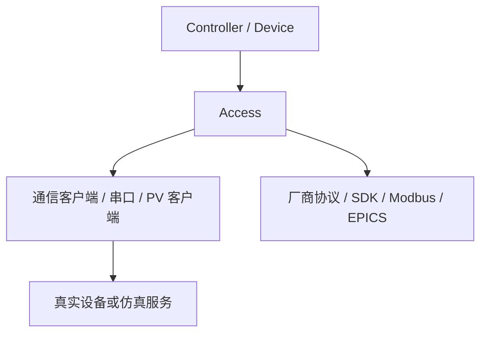
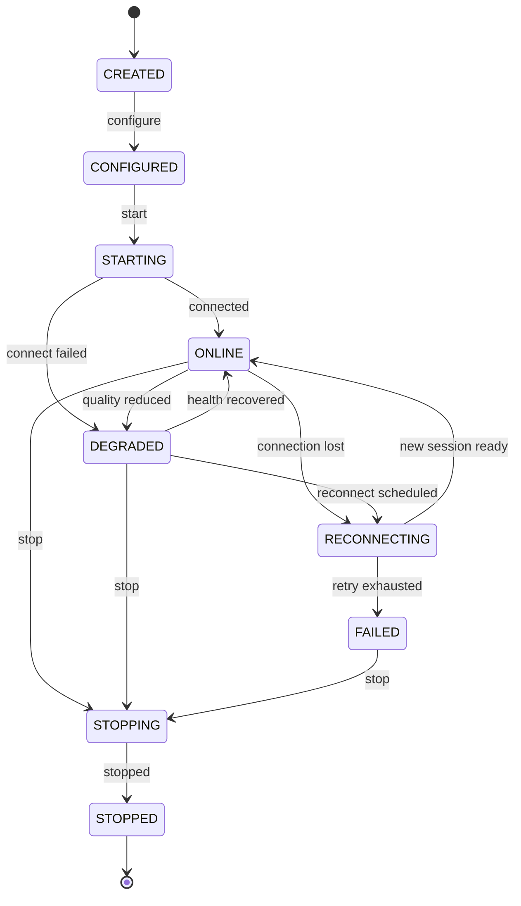
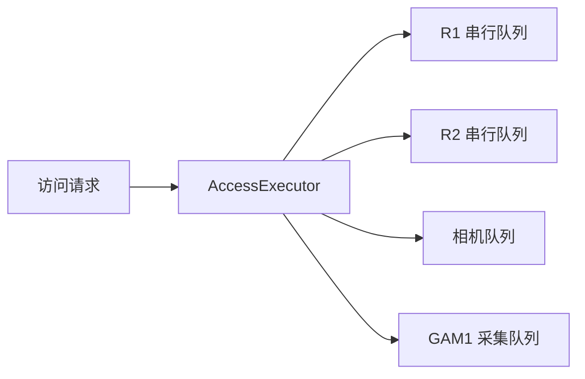
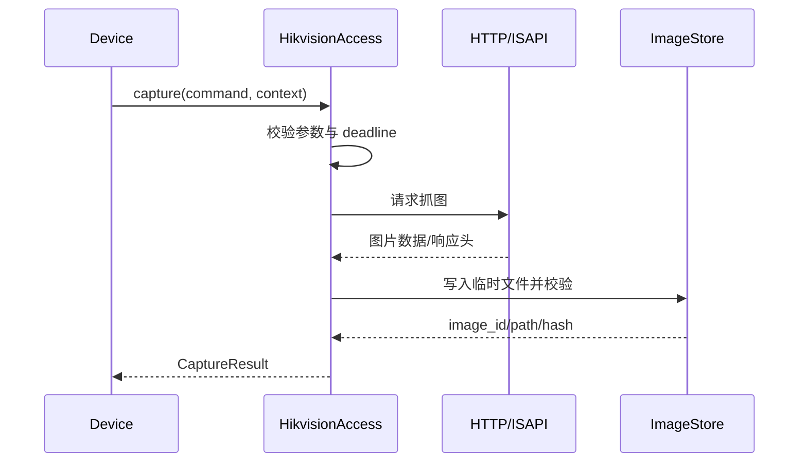
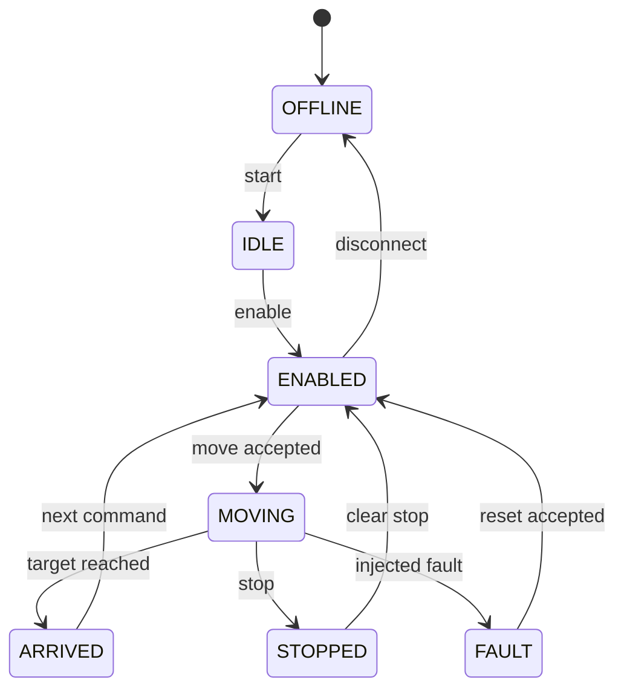
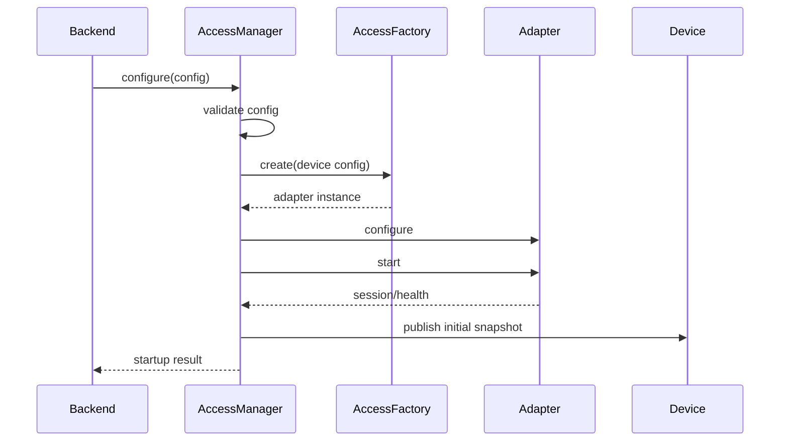
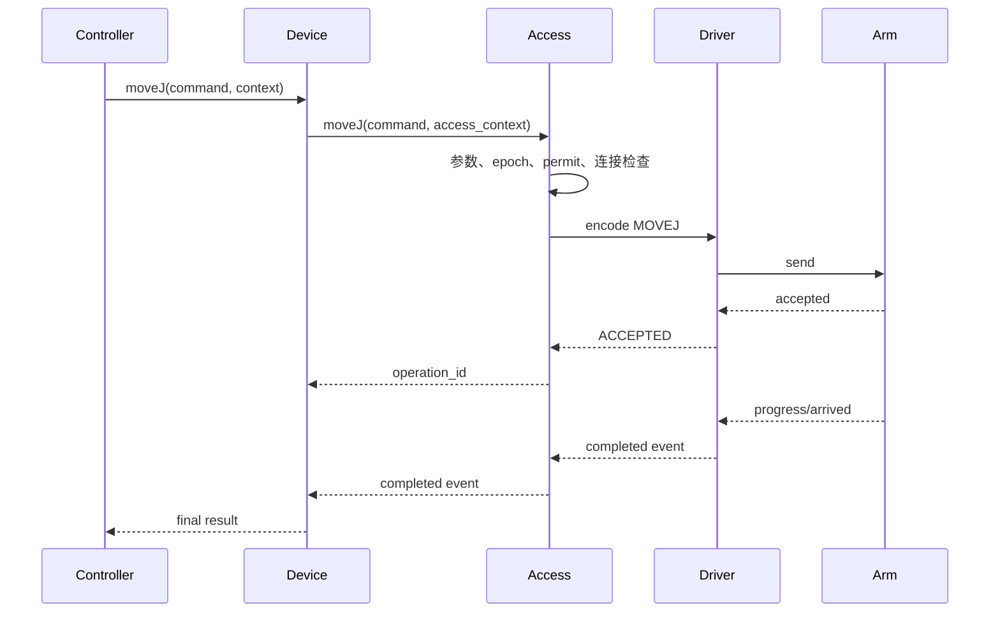
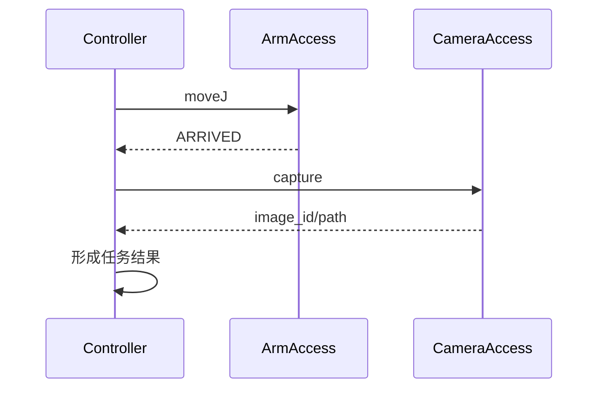
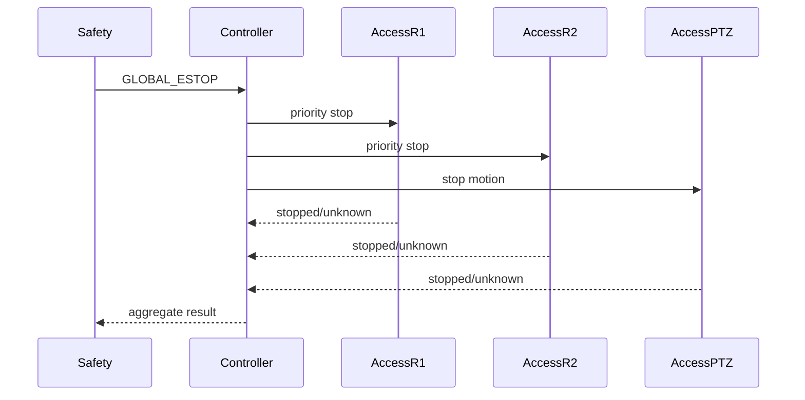

# 第8章 Access 设计

## 8.1 概述

Access 模块是 MRSS Backend 面向设备和外部系统的访问适配层，位于 Device 之下、厂商 SDK/协议和物理设备之上。它负责把不同厂商、不同传输方式和不同运行形态的设备访问能力，转换为 Device 可以使用的稳定接口。

Access 只表达“如何访问设备”，不表达“什么时候应该执行任务”“哪个用户有权限”“哪个设备拥有资源”以及“系统如何进行业务协同”。这些职责分别由 Controller、service、auth、db 和 core 等模块承担。

一期运行不引入 IOC。R1、R2、HIK_FIX1、HIK_PTZ1 和 GAM1 均通过 Backend 的统一 Device → Access 链路访问仿真或真实适配器。后续如需要接入 EPICS，EPICS 只能作为一种 Access 实现，不能反向改变 Device、Controller 和 service 的公共接口。

## 8.2 设计目标

Access 模块应满足以下目标：

1. 为同一类设备提供统一的强类型访问接口。
2. 隔离瑞尔曼、海康、辐射传感器等厂商 SDK、HTTP、TCP、UDP、串口和 Modbus 细节。
3. 支持仿真、真实和混合三种运行方式，并保证上层调用语义一致。
4. 将设备连接、协议会话、数据转换、错误映射和重连策略集中管理。
5. 保证同一设备的控制写操作有序执行，读操作具备超时、质量和新鲜度信息。
6. 为急停、停止、复位等高优先级操作提供独立的抢占通道。
7. 防止旧连接、旧任务和迟到回调污染当前设备状态。
8. 为后续 EPICS/PV、SDK 版本升级和新增设备型号保留扩展点。
9. 不让单个设备的通信异常影响其他设备或 Backend 主循环。
10. 为日志、告警、审计和测试提供可追踪的访问记录。

## 8.3 非目标

Access 不负责以下事项：

| 非目标 | 负责模块 |
| --- | --- |
| 用户登录、角色和 RBAC | `auth` |
| HTTP/WebSocket API 路由 | `api`、`Communication` |
| 任务编排和多设备协同 | `Controller`、`service` |
| OWNER 分配和业务资源仲裁 | `Controller`、模式与资源仲裁模块 |
| 业务数据持久化 | `db`、`service` |
| 系统级日志和审计策略 | `core`、`service` |
| 全局安全策略和急停流程 | 安全与急停模块 |
| 设备最终的业务状态机 | `Device`、`Controller` |

Access 可以拒绝底层不安全、参数非法、连接不可用或会话已过期的访问请求，但不替代上层业务权限和资源仲裁。

## 8.4 模块位置与依赖方向



依赖关系必须保持单向：

```text
api -> service -> Controller -> Device -> Access -> Communication/core/lib
```

Access 不得依赖 api、service 或具体用户界面；Access 的公共头文件不得暴露厂商 SDK 类型、HTTP 库类型、PV 客户端类型或串口库类型。

## 8.5 Access 的两层结构

Access 内部划分为访问语义层和协议实现层：

| 层次 | 职责 | 示例 |
| --- | --- | --- |
| 访问语义层 | 定义设备访问接口、参数、结果、质量和错误 | `IArmAccess`、`ICameraAccess` |
| 协议实现层 | 实现具体厂商和传输协议 | `RealmanSdkAdapter`、`HikvisionIsapiAdapter` |

访问语义层向上保持稳定；协议实现层可按型号、固件、网络地址和部署模式替换。仿真适配器与真实适配器必须实现同一访问语义接口。

## 8.6 一期设备访问矩阵

| 逻辑设备 | 访问接口 | 仿真实现 | 一期真实实现方向 | 后续实现 |
| --- | --- | --- | --- | --- |
| `R1` | `IArmAccess` | `SimArmAccess` | 瑞尔曼 SDK/TCP/UDP 适配 | EPICS Arm Access |
| `R2` | `IArmAccess` | `SimArmAccess` | 与 R1 相同的访问协议 | EPICS Arm Access |
| `HIK_FIX1` | `IFixedCameraAccess` | `SimFixedCameraAccess` | 海康 HTTP/ISAPI 或 SDK | EPICS Vision Access |
| `HIK_PTZ1` | `IPtzCameraAccess` | `SimPtzCameraAccess` | 海康 PTZ/ISAPI 或 SDK | EPICS PTZ Access |
| `GAM1` | `IRadiationAccess` | `SimRadiationAccess` | 串口、Modbus RTU 或厂商协议 | EPICS Sensor Access |

R1 与 R2 使用相同接口和相同结果模型，只通过配置区分 `device_id`、端点、凭据和能力限制。不得为 R2 复制一套与 R1 不一致的上层访问语义。

## 8.7 核心访问对象

Access 的核心对象如下：

| 类/结构 | 作用 |
| --- | --- |
| `IAccessAdapter` | 所有访问适配器的生命周期和通用能力 |
| `IArmAccess` | 机械臂状态、使能、点动、运动和停止 |
| `IFixedCameraAccess` | 固定相机状态、抓图和流信息 |
| `IPtzCameraAccess` | PTZ 云台、变倍、预置位和抓图 |
| `IRadiationAccess` | 辐射数据采集、质量和阈值相关原始数据 |
| `AccessManager` | 注册、创建、启动、停止和查询适配器 |
| `AccessFactory` | 根据配置创建仿真或真实适配器 |
| `AccessSession` | 管理一次协议连接或设备会话 |
| `AccessExecutor` | 管理访问队列、优先级和串行化 |
| `AccessErrorMapper` | 将厂商错误映射为系统错误 |
| `AccessHealthMonitor` | 维护连接健康度、延迟和数据新鲜度 |

## 8.8 `IAccessAdapter` 公共接口

所有适配器至少实现以下生命周期接口：

```cpp
class IAccessAdapter {
public:
    virtual ~IAccessAdapter() = default;

    virtual DeviceId deviceId() const = 0;
    virtual DeviceType deviceType() const = 0;
    virtual AccessMode accessMode() const = 0;

    virtual AccessResult<void> configure(const AccessConfig& config) = 0;
    virtual AccessResult<void> start() = 0;
    virtual AccessResult<void> stop(StopReason reason) = 0;
    virtual AccessResult<void> reconnect() = 0;

    virtual AccessConnectionState connectionState() const = 0;
    virtual AccessHealthSnapshot health() const = 0;
    virtual AccessCapabilities capabilities() const = 0;
};
```

该接口只包含访问生命周期和通用观测信息，不包含任务、用户、OWNER 或 API 请求对象。

## 8.9 强类型设备访问接口

### 8.9.1 机械臂访问接口

```cpp
class IArmAccess : public IAccessAdapter {
public:
    virtual AccessResult<ArmSnapshot> readSnapshot() = 0;
    virtual AccessResult<void> enable(const AccessContext& ctx) = 0;
    virtual AccessResult<void> disable(const AccessContext& ctx) = 0;
    virtual AccessResult<void> resetFault(const AccessContext& ctx) = 0;
    virtual AccessResult<void> jog(const JogCommand& command,
                                   const AccessContext& ctx) = 0;
    virtual AccessResult<void> moveJ(const MoveJCommand& command,
                                     const AccessContext& ctx) = 0;
    virtual AccessResult<void> executeTrajectory(
        const TrajectoryCommand& command,
        const AccessContext& ctx) = 0;
    virtual AccessResult<void> stop(const StopCommand& command,
                                    const AccessContext& ctx) = 0;
};
```

Access 负责把这些语义映射到瑞尔曼 SDK、网络协议、仿真状态机或后续 EPICS PV，不负责判断任务是否应该执行。

### 8.9.2 固定相机访问接口

```cpp
class IFixedCameraAccess : public IAccessAdapter {
public:
    virtual AccessResult<CameraSnapshot> readSnapshot() = 0;
    virtual AccessResult<CaptureResult> capture(
        const CaptureCommand& command,
        const AccessContext& ctx) = 0;
    virtual AccessResult<StreamInfo> readStreamInfo() = 0;
};
```

固定相机不提供云台和变倍控制。其核心控制操作是抓图，抓图返回 `image_id`、路径、时间戳、分辨率和校验信息，不在事件总线中传输大块图片二进制。

### 8.9.3 PTZ 相机访问接口

```cpp
class IPtzCameraAccess : public IFixedCameraAccess {
public:
    virtual AccessResult<void> panTilt(
        const PanTiltCommand& command,
        const AccessContext& ctx) = 0;
    virtual AccessResult<void> zoom(
        const ZoomCommand& command,
        const AccessContext& ctx) = 0;
    virtual AccessResult<void> focus(
        const FocusCommand& command,
        const AccessContext& ctx) = 0;
    virtual AccessResult<void> gotoPreset(
        const PresetCommand& command,
        const AccessContext& ctx) = 0;
};
```

PTZ 只有在执行云台、变倍、聚焦或预置位运动时才属于运动类控制；仅查询状态、读取码流信息和抓图时属于读操作。两者不能使用相同的安全判定路径。

### 8.9.4 辐射传感器访问接口

```cpp
class IRadiationAccess : public IAccessAdapter {
public:
    virtual AccessResult<RadiationSnapshot> readSnapshot() = 0;
    virtual AccessResult<RadiationSample> readSample() = 0;
    virtual AccessResult<void> startSampling() = 0;
    virtual AccessResult<void> stopSampling() = 0;
};
```

传感器访问接口必须携带单位、原始值、转换值、质量、采样序号、设备时间和 Backend 接收时间。传感器异常应转换为设备质量或告警事件，不得静默返回默认的零值。

## 8.10 `AccessContext` 设计

访问上下文用于传递一次访问的追踪、安全和取消信息：

```cpp
struct AccessContext {
    std::string request_id;
    std::string trace_id;
    std::string operation_id;
    std::string source;
    UserId user_id{0};
    uint64_t mode_epoch{0};
    uint64_t safety_epoch{0};
    uint64_t driver_generation{0};
    Deadline deadline;
    CancellationToken cancellation;
    AccessPriority priority{AccessPriority::NORMAL};
    bool safety_stop{false};
};
```

规则如下：

1. `request_id` 用于一次接口请求的幂等和审计关联。
2. `operation_id` 用于追踪一次设备操作的完整生命周期。
3. `mode_epoch` 和 `safety_epoch` 用于拒绝跨模式、跨安全状态的旧命令。
4. `driver_generation` 用于隔离重连前创建的旧会话和回调。
5. `deadline` 必须由访问层检查，不能只依赖上层线程超时。
6. `safety_stop=true` 的停止操作可以走独立高优先级通道，但仍必须记录来源和结果。

## 8.11 结果、质量和错误模型

### 8.11.1 `AccessResult`

访问结果必须区分“请求已发送”“设备已接受”“设备正在执行”和“设备最终完成”，不能用一个 `bool` 表达所有状态。

```cpp
template <typename T>
struct AccessResult {
    AccessResultState state{AccessResultState::FAILED};
    std::optional<T> value;
    std::optional<AccessError> error;
    AccessQuality quality{AccessQuality::UNKNOWN};
    uint64_t latency_ms{0};
    uint64_t observed_at_ms{0};
    std::string vendor_code;
    std::string message;
};
```

### 8.11.2 结果状态

| 状态 | 含义 |
| --- | --- |
| `ACCEPTED` | 访问请求已通过本地校验并被适配器接受 |
| `SENT` | 命令已经发送到设备或下游服务 |
| `RUNNING` | 设备已反馈正在执行 |
| `SUCCEEDED` | 设备动作或读取已完成 |
| `CANCELLED` | 在完成前被取消 |
| `TIMEOUT` | 在截止时间内未得到确认 |
| `REJECTED` | 因参数、门禁、状态或权限被拒绝 |
| `FAILED` | 访问过程发生确定性失败 |
| `UNKNOWN` | 请求可能已到达设备，但最终结果不可确认 |

### 8.11.3 数据质量

```cpp
enum class AccessQuality {
    GOOD,
    STALE,
    UNCERTAIN,
    BAD,
    DISCONNECTED,
    NOT_READY,
    UNKNOWN
};
```

`STALE` 和 `BAD` 不能被转换成 `GOOD`；对于控制操作，质量不为 `GOOD` 的关键状态不得被当作安全确认。

### 8.11.4 错误分类

| 错误类别 | 示例 | 默认策略 |
| --- | --- | --- |
| 参数错误 | 关节数量不匹配、速度超范围 | 不重试，立即拒绝 |
| 协议错误 | 返回报文非法、字段缺失 | 记录并短暂熔断 |
| 连接错误 | TCP 断开、HTTP 无响应 | 标记断线，按策略重连 |
| 超时 | 设备未在截止时间内响应 | 查询型可重试，控制型结果可能未知 |
| 设备拒绝 | 设备未使能、内部保护动作 | 不盲目重试，返回设备原因 |
| 安全拒绝 | 急停、许可失效、门禁关闭 | 立即拒绝并告警 |
| 会话过期 | 旧代次回调、模式 epoch 不一致 | 丢弃结果并记录 |
| 资源错误 | 队列满、内存或文件空间不足 | 降级或拒绝新请求 |

## 8.12 访问适配器生命周期

适配器状态如下：



生命周期约束：

1. `configure` 只能在 `CREATED` 或停止后的重新创建阶段执行。
2. `start` 必须是幂等的，不能重复创建读线程和写线程。
3. `stop` 必须停止接收新请求、取消可取消操作、关闭会话并等待回调收敛。
4. 重连成功后必须递增 `driver_generation`，重新读取完整状态快照。
5. 任何旧代次回调都不能更新当前设备状态。

## 8.13 `AccessManager` 设计

`AccessManager` 管理所有逻辑设备的 Access 实例：

```cpp
class AccessManager {
public:
    AccessResult<void> configure(const AccessSystemConfig& config);
    AccessResult<void> createDevices();
    AccessResult<void> startAll();
    AccessResult<void> stopAll(StopReason reason);

    std::shared_ptr<IAccessAdapter> find(DeviceId id) const;
    std::shared_ptr<IArmAccess> arm(DeviceId id) const;
    std::shared_ptr<IFixedCameraAccess> fixedCamera(DeviceId id) const;
    std::shared_ptr<IPtzCameraAccess> ptzCamera(DeviceId id) const;
    std::shared_ptr<IRadiationAccess> radiation(DeviceId id) const;

    AccessHealthSnapshot health(DeviceId id) const;
};
```

成员变量至少包括：

```cpp
class AccessManager {
private:
    AccessFactory& factory_;
    AccessRegistry registry_;
    AccessEventBus& event_bus_;
    AccessConfigValidator validator_;
    std::shared_ptr<AccessExecutor> executor_;
    std::atomic<bool> stopping_{false};
};
```

`AccessManager` 不保存用户会话，不直接处理 API JSON，也不执行跨设备协同。

## 8.14 `AccessFactory` 与注册机制

工厂根据 `device_type`、`access_mode` 和 `driver` 创建适配器：

```cpp
class AccessFactory {
public:
    using Creator = std::function<std::shared_ptr<IAccessAdapter>(
        const AccessCreateContext&)>;

    void registerCreator(std::string driver, Creator creator);
    std::shared_ptr<IAccessAdapter> create(
        const AccessCreateContext& context) const;
};
```

一期至少注册：

```text
sim.arm
sim.fixed_camera
sim.ptz_camera
sim.radiation
real.realman
real.hikvision.isapi
real.radiation.modbus
epics.arm             # 后续
epics.vision          # 后续
epics.sensor          # 后续
```

新设备型号优先增加新的工厂注册项和协议适配器，不在 Controller、service 或 API 中增加厂商判断。

## 8.15 传输与协议职责

Access 与 Communication 的分工如下：

| 能力 | Communication | Access |
| --- | --- | --- |
| TCP/UDP/HTTP/串口通道建立 | 是 | 使用 |
| 连接池、心跳、基础超时 | 是 | 配置和补充设备语义超时 |
| 重连执行器 | 提供通用能力 | 决定设备重连策略 |
| 厂商报文编码/解码 | 否 | 是 |
| ISAPI XML/JSON 语义 | 否 | 是 |
| Modbus 寄存器含义 | 否 | 是 |
| PV 名称与字段映射 | 否 | 是 |
| 任务和业务命令 | 否 | 否，由 Controller 负责 |

Access 可以组合 Communication 提供的 `TcpClient`、`UdpChannel`、`HttpClient`、`SerialChannel` 和 `PvClient`，但不得把这些类型泄露到 Device 的公共接口中。

## 8.16 会话与端点模型

```cpp
struct AccessEndpoint {
    std::string host;
    uint16_t port{0};
    std::string protocol;
    std::string channel;
    uint32_t connect_timeout_ms{1000};
    uint32_t read_timeout_ms{1000};
    uint32_t write_timeout_ms{1000};
};

struct AccessSessionInfo {
    uint64_t session_id{0};
    uint64_t driver_generation{0};
    AccessConnectionState state{AccessConnectionState::DISCONNECTED};
    uint64_t connected_at_ms{0};
    uint64_t last_rx_at_ms{0};
    uint64_t last_tx_at_ms{0};
};
```

会话必须与逻辑设备标识分离。设备重连或重新创建 Access 后，新的会话拥有新的 `session_id` 和 `driver_generation`；旧会话不得继续写入设备状态。

## 8.17 并发与队列模型

Access 采用“设备内有序、设备间并行”的执行模型：



规则如下：

1. 同一设备的普通写操作按入队顺序串行发送。
2. 同一设备的读操作可以由读通道执行，但状态快照仍由单一提交点写入。
3. R1、R2、两类相机和 GAM1 之间可以并行。
4. `STOP`、`EMERGENCY_STOP` 和底层安全断开使用独立高优先级队列。
5. 普通队列满时拒绝新请求并返回 `QUEUE_FULL`，不得无限增长。
6. 采样、状态轮询和控制写入必须设置配额，控制操作不得被低优先级采样长期阻塞。

## 8.18 高优先级停止通道

停止通道必须满足：

| 要求 | 设计 |
| --- | --- |
| 不等待普通队列 | 单独的停止队列和执行入口 |
| 不被旧命令覆盖 | 使用递增 `stop_epoch` |
| 不被普通 OWNER 阻断 | 上层已确认的安全停止不依赖普通控制锁 |
| 结果可追踪 | 返回设备确认、超时或未知结果 |
| 停止后不自动续跑 | 清理该设备普通队列和活动令牌 |

停止请求的处理顺序：

```text
接收 STOP
  -> 生成 stop_epoch
  -> 标记设备 stopping
  -> 取消可取消的普通操作
  -> 直接发送底层停止
  -> 等待停止确认或截止时间
  -> 清理旧动作
  -> 发布 STOPPED/STOP_FAILED/UNKNOWN
```

## 8.19 超时、重试和熔断

Access 的重试必须按操作类型区分：

| 操作 | 是否自动重试 | 原因 |
| --- | --- | --- |
| 状态读取 | 可以，有限次数 | 读操作通常可重复 |
| 心跳 | 可以，按连接策略 | 用于恢复会话 |
| 抓图 | 可按 `request_id` 幂等重试 | 必须避免重复保存结果 |
| 点动 | 默认不自动重试 | 重试可能造成额外运动 |
| MOVEJ | 默认不自动重试 | 超时后结果可能未知 |
| 连续轨迹 | 默认不自动重试 | 必须由 Controller 决定恢复 |
| STOP | 可以快速重发一次 | 目标是尽快停机 |

熔断状态：

```text
CLOSED -> OPEN：连续协议/连接错误达到阈值
OPEN -> HALF_OPEN：冷却时间到期
HALF_OPEN -> CLOSED：探测成功
HALF_OPEN -> OPEN：探测失败
```

熔断只影响对应 Access 实例，不得使整个 Backend 进入故障状态；涉及设备安全的错误应由 Device 和安全模块按规则升级为设备或系统告警。

## 8.20 数据转换和单位规范

Access 负责协议数据到系统数据的转换，但不得丢失原始信息：

```cpp
template <typename T>
struct AccessValue {
    T value{};
    T raw_value{};
    std::string unit;
    AccessQuality quality{AccessQuality::UNKNOWN};
    uint64_t device_timestamp_ms{0};
    uint64_t received_timestamp_ms{0};
    uint64_t sequence{0};
};
```

转换规则：

1. 角度、速度、距离和剂量率必须在适配器中明确单位。
2. 单位转换必须配置化或由固定协议定义，禁止在不同适配器中隐式猜测。
3. 无效值必须同时设置质量和错误原因，不能只填零。
4. 设备时间缺失时使用接收时间，但必须标记时间来源。
5. 浮点值的精度和范围必须在能力描述中给出。
6. 传感器原始值与转换值都要保留，便于校准和故障分析。

## 8.21 机械臂真实适配器

### 8.21.1 适配职责

`RealmanArmAccess` 负责：

1. 建立和维护瑞尔曼设备通信会话。
2. 将 `ArmSnapshot` 映射为厂商状态、关节角、笛卡尔位姿和错误信息。
3. 将 JOG、MOVEJ、连续轨迹、ENABLE、RESET 和 STOP 转换为厂商命令。
4. 检查命令参数数量、单位、范围和设备能力。
5. 处理设备回执、运动完成、到位、异常和连接丢失。
6. 对 R1、R2 维护独立的会话、队列、代次和错误统计。

### 8.21.2 机械臂访问映射

| 统一操作 | Access 动作 | 结果要求 |
| --- | --- | --- |
| `ENABLE` | 厂商使能命令 | 返回使能状态确认 |
| `JOG` | 点动方向、速度和时间/距离 | 返回发送和停止结果 |
| `MOVEJ` | 目标关节、速度、加速度 | 返回接受、执行和最终状态 |
| `TRAJECTORY` | 连续点列或轨迹句柄 | 返回轨迹句柄和完成事件 |
| `STOP` | 厂商停止或急停接口 | 优先返回停机确认 |
| `RESET` | 清除设备故障 | 只能清除可复位故障 |
| `READ_STATE` | 状态查询 | 携带质量和时间戳 |

### 8.21.3 运动门禁

Access 侧的运动写入必须接受安全快照，并在发送前检查：

```text
SAFE_READY
&& SYS_PERMIT
&& ARM_MOTION_PERMIT
&& DEVICE_CONNECTED
&& DEVICE_ENABLED
&& !DEVICE_FAULT
&& !MOTION_LIMIT
&& mode_epoch 一致
&& safety_epoch 一致
```

该检查是设备访问的最后一道软件门禁，不能代替硬件急停、STO、安全 PLC 或上层资源仲裁。

## 8.22 R1/R2 独立性

R1 和 R2 具有相同的访问接口，但必须保持完全独立：

| 资源 | R1 | R2 |
| --- | --- | --- |
| 访问对象 | 独立实例 | 独立实例 |
| 会话 | 独立 | 独立 |
| 普通队列 | 独立 | 独立 |
| 停止队列 | 独立 | 独立 |
| 状态缓存 | 独立 | 独立 |
| 重连代次 | 独立 | 独立 |
| 错误计数 | 独立 | 独立 |
| 配置端点 | 独立配置 | 独立配置 |

R1 故障时，R2 的状态采集、停止和控制不应被 Access 层全局锁阻断。双臂协同由 Controller 管理：任一机械臂故障时，协同任务由 Controller 根据策略终止、降级或转入人工处理。

## 8.23 固定相机真实适配器

`HikvisionFixedCameraAccess` 负责固定相机的连接、认证、状态查询、抓图和流信息读取。

### 8.23.1 抓图流程



### 8.23.2 抓图约束

1. 图片二进制写入受控存储目录，不进入普通日志。
2. 文件写入采用临时文件、校验、原子重命名。
3. 图片保存失败时返回明确错误，不能只返回相机抓图成功。
4. 认证信息不写入 URL、日志和异常文本。
5. 重试必须带有幂等标识或由调用方确认是否允许重复抓图。
6. 相机离线只影响相机相关任务，不改变机械臂基础状态。

## 8.24 PTZ 相机真实适配器

`HikvisionPtzCameraAccess` 在固定相机访问能力之上增加云台、变倍、聚焦和预置位操作。

### 8.24.1 控制分类

| 操作 | 分类 | 是否需要运动门禁 |
| --- | --- | --- |
| 读取在线状态 | 读 | 否 |
| 读取预置位 | 读 | 否 |
| 抓图 | 读/采集 | 否，但需要相机在线 |
| PAN/TILT | 运动写 | 是 |
| ZOOM | 运动写 | 是，按设备能力配置 |
| FOCUS | 光学控制 | 按配置决定 |
| GOTO_PRESET | 运动写 | 是 |

PTZ 控制必须有独立命令序列号。旧的 PTZ 操作超时或取消后，不得让新的预置位命令被旧回调覆盖。

## 8.25 GAM1 辐射传感器真实适配器

`RadiationModbusAccess` 或厂商协议适配器负责：

1. 打开串口或网络通道。
2. 按设备协议读取剂量率、计数率、状态字和故障码。
3. 进行寄存器合并、字节序处理、比例换算和单位转换。
4. 维护采样序号、时间戳和质量。
5. 识别通信异常、传感器异常、超量程和数据冻结。
6. 将原始寄存器保存到诊断信息，不直接暴露给普通业务接口。

### 8.25.1 数据模型

```cpp
struct RadiationSample {
    double dose_rate{0.0};
    double count_rate{0.0};
    std::string dose_unit{"uSv/h"};
    std::string count_unit{"CPS"};
    uint32_t device_status{0};
    uint32_t vendor_error{0};
    AccessQuality quality{AccessQuality::UNKNOWN};
    uint64_t sequence{0};
    uint64_t observed_at_ms{0};
    std::string extra_info;
};
```

`GAM1` 的 `OVER=1` 应产生传感器超量程或高值告警，但不自动改变系统 `MODE`，也不直接改变 R1/R2 的基础控制状态；是否停止任务由安全策略和 Controller 根据需求决定。

## 8.26 仿真访问适配器

仿真适配器用于一期闭环验证，必须模拟访问层的真实行为，而不是直接修改 Device 的状态变量。

### 8.26.1 仿真原则

1. 仿真适配器实现与真实适配器相同的强类型接口。
2. 状态变化通过仿真会话和仿真状态机产生。
3. 具备可配置延迟、丢包、断线、超时、错误、迟到回调和结果未知注入能力。
4. 支持固定随机种子，保证测试可重复。
5. 仿真结果带有 `SIM` 来源标识，但上层结果结构不变。
6. 仿真不能绕过安全快照、模式 epoch、队列和停止路径。

### 8.26.2 仿真机械臂状态机



仿真机械臂必须返回与真实设备等价的 `ARRIVED`、`MOVING`、`FAULT`、`STOPPED` 和连接质量信息。

## 8.27 EPICS Access 的定位

EPICS 不属于 MRSS Backend 的核心业务层，也不属于 Device 公共接口。EPICS Access 是一种可插拔的设备访问实现，可将统一设备访问操作映射到 PV 读写。

```text
Device
  -> IArmAccess / ICameraAccess / IRadiationAccess
  -> EpicsArmAccess / EpicsVisionAccess / EpicsSensorAccess
  -> PV Client / Channel Access / 后续 EPICS 协议
  -> PV 服务或 IOC
```

一期不要求部署正式 IOC 拓扑，也不允许因 EPICS 接入而改变现有 Web、Backend、Controller、Device 和数据库接口。若一期测试使用 PV 服务，该服务只提供约定的 PV 名称、PV 值和仿真状态变化，不能作为最终 IOC 子系统划分的依据。

## 8.28 EPICS PV 映射原则

PV 名称采用统一形式：

```text
MRSS:{SUBSYS}:{DEVICE}:{SIGNAL}
```

示例：

| PV | 含义 | 访问方向 |
| --- | --- | --- |
| `MRSS:ARM:R1:STATE` | R1 状态 | 读 |
| `MRSS:ARM:R1:MOVEJ:EXEC` | R1 单点运动执行 | 写 |
| `MRSS:ARM:R1:STOP` | R1 停止请求 | 写 |
| `MRSS:ARM:R1:ARRIVED` | R1 到位状态 | 读 |
| `MRSS:ARM:R2:STATE` | R2 状态 | 读 |
| `MRSS:VIS:HIK_FIX1:SNAPSHOT` | 固定相机抓图请求/结果 | 读写按映射定义 |
| `MRSS:PTZ:HIK_PTZ1:PAN` | PTZ 水平控制 | 写 |
| `MRSS:SNS:GAM1:DOSE_RATE` | 剂量率 | 读 |
| `MRSS:SYS:SAFE_READY` | 系统安全就绪 | 读 |

R2 采用与 R1 相同的 PV 家族，仅将设备标识由 `R1` 替换为 `R2`。PV 名称是 EPICS Access 的映射配置，不应出现在 Device、Controller 和 service 的业务代码中。

## 8.29 EPICS 读写和门禁

EPICS Access 必须区分可读 PV、受控写 PV 和维护写 PV：

| PV 类别 | 普通用户 | Backend 服务账号 | 工程维护账号 |
| --- | --- | --- | --- |
| 状态、质量、报警 PV | 只读 | 只读 | 读 |
| 业务控制 PV | 不直接写 | 按 Controller 授权写 | 维护模式按规则写 |
| 原始/内部 PV | 不可见或只读 | 默认不可写 | 仅本地维护可写 |
| 安全复位 PV | 不直接写 | 需安全流程 | 按硬件和维护流程 |

`MOVEJ:EXEC`、JOG、PTZ 运动等写入必须同时满足统一访问上下文中的模式 epoch、安全 epoch 和设备门禁。PV 客户端收到写权限并不代表业务请求已经获得 Controller 授权。

## 8.30 PV 运动门禁

EPICS Access 对运动类 PV 采用双层保护：

```text
上层 Controller 授权
  -> Access 生成安全上下文
  -> PV 写入前检查 SAFE_READY / PERMIT / OWNER / LIMIT / CONNECTED
  -> PV 服务或 IOC 内部再检查设备保护条件
  -> 设备执行
```

`MOVEJ:EXEC` 可以使用 `SDIS`/`DISS` 或等价的 PV 处理门禁实现，但 PV 门禁不能替代 Backend 的模式、权限、任务和审计检查。

## 8.31 一期 PV 服务与正式 EPICS 的边界

一期 PV 服务的定位是最小访问测试替身：

1. 提供约定 PV 名称。
2. 保存当前 PV 值和质量。
3. 根据仿真状态机改变 PV。
4. 支持 Backend Access 的读写和回调。
5. 注入断线、超时、拒绝和错误。

它不定义最终 IOC 的数量、子系统划分、PLC 接线方式或安全认证边界。后续正式 EPICS 架构应重新评审 Safety、Control、Arm、Sensor、Vision/PTZ 等域的 IOC 拆分。

## 8.32 混合模式

混合模式允许不同设备选择不同 Access 实现：

```yaml
access:
  mode: hybrid
  devices:
    - id: R1
      type: arm
      driver: real.realman
    - id: R2
      type: arm
      driver: sim.arm
    - id: HIK_FIX1
      type: fixed_camera
      driver: real.hikvision.isapi
    - id: HIK_PTZ1
      type: ptz_camera
      driver: sim.ptz_camera
    - id: GAM1
      type: radiation
      driver: sim.radiation
```

混合模式的约束：

1. 每个设备只能绑定一个活动 Access 实例。
2. 仿真和真实设备都必须发布同一结构的快照和事件。
3. 协同任务必须通过 Device 能力判断，不得通过 `driver` 字符串分支。
4. 真实设备切换为仿真设备前，必须停止活动动作并释放资源。
5. Access 切换后递增 `driver_generation`，旧回调全部失效。

## 8.33 访问配置模型

```yaml
access:
  default_timeouts:
    connect_ms: 1000
    read_ms: 1000
    write_ms: 1500
    operation_ms: 30000
  retry:
    max_attempts: 3
    backoff_ms: 200
    circuit_break_threshold: 5
  devices:
    - id: R1
      type: arm
      driver: sim.arm
      endpoint:
        protocol: simulator
      capabilities:
        joint_count: 7
        max_velocity: 1.0
    - id: HIK_FIX1
      type: fixed_camera
      driver: real.hikvision.isapi
      endpoint:
        protocol: http
        host: 192.168.1.64
        port: 80
      credential_ref: hikvision_fixed_1
    - id: GAM1
      type: radiation
      driver: real.radiation.modbus
      endpoint:
        protocol: serial
        channel: /dev/ttyUSB0
      protocol_options:
        slave_id: 1
        baud_rate: 9600
```

配置加载阶段必须校验：

1. `id` 唯一且符合设备标识规则。
2. `type` 与 `driver` 兼容。
3. 真实设备端点完整，仿真设备不依赖真实端点。
4. 超时、重试、队列和缓存上限在允许范围内。
5. 机械臂关节数、相机能力和传感器单位有效。
6. 凭据只允许使用引用，不允许直接写入日志或普通配置回显。
7. R1、R2 不能错误地共享写会话。

## 8.34 配置热更新

一期只支持启动时加载 Access 配置。后续热更新必须遵循：

```text
读取新配置
  -> 静态校验
  -> 计算设备差异
  -> 检查设备是否安全空闲
  -> 停止受影响的 Access
  -> 创建新实例并递增代次
  -> 读取完整快照
  -> 原子替换注册表
```

在有活动运动、急停未复位、任务未收敛或设备状态未知时，拒绝更换真实访问端点。

## 8.35 连接和重连策略

每个 Access 实例独立维护：

```cpp
struct AccessReconnectPolicy {
    uint32_t initial_delay_ms{200};
    uint32_t max_delay_ms{10000};
    uint32_t max_attempts{0}; // 0 表示持续重试
    uint32_t health_period_ms{1000};
    uint32_t stale_after_ms{3000};
};
```

重连流程：

1. 检测到读写错误或心跳超时。
2. 标记连接为 `DEGRADED` 或 `DISCONNECTED`。
3. 停止向旧会话发送普通控制命令。
4. 对运动类设备触发 Device 侧安全策略。
5. 按退避策略建立新会话。
6. 成功后递增 `driver_generation`。
7. 读取完整设备快照和能力。
8. 发布恢复事件；不自动续跑未完成动作。

## 8.36 状态新鲜度

Access 必须维护每类数据的更新时间和有效期：

| 数据 | 超时后的处理 |
| --- | --- |
| 连接状态 | 标记 `DISCONNECTED` 或 `UNKNOWN` |
| 安全状态 | 不得继续作为安全确认 |
| 机械臂位置 | 标记 `STALE`，禁止基于旧位置判断到位 |
| PTZ 位置 | 标记 `STALE`，新运动前重新读取 |
| 相机在线状态 | 抓图请求直接检查当前会话 |
| 辐射采样 | 发布质量异常并触发数据告警 |

新鲜度判断不能依赖系统时钟倒退。时间异常时应使用单调时钟计算延迟，并在观测数据中保留墙上时间。

## 8.37 事件模型

Access 发布的事件包括：

```cpp
enum class AccessEventType {
    CONNECTED,
    DISCONNECTED,
    HEALTH_CHANGED,
    SNAPSHOT_UPDATED,
    COMMAND_ACCEPTED,
    COMMAND_SENT,
    COMMAND_PROGRESS,
    COMMAND_COMPLETED,
    COMMAND_FAILED,
    COMMAND_UNKNOWN,
    SAFETY_REJECTED,
    DRIVER_REPLACED
};

struct AccessEvent {
    AccessEventType type;
    DeviceId device_id;
    uint64_t session_id{0};
    uint64_t driver_generation{0};
    std::string operation_id;
    uint64_t timestamp_ms{0};
    AccessQuality quality{AccessQuality::UNKNOWN};
    std::string error_code;
    std::string message;
};
```

事件消费者必须检查 `session_id`、`driver_generation` 和 `operation_id`。只匹配设备 ID 不足以防止重连后的迟到事件污染当前状态。

## 8.38 访问异常处理

异常处理分为同步异常和异步异常：

| 类型 | 处理方式 |
| --- | --- |
| 参数校验失败 | 在发送前返回 `REJECTED` |
| 传输异常 | 转换为 `CONNECTION_ERROR`，更新健康度 |
| 协议解析异常 | 丢弃无效报文，保留诊断信息 |
| SDK 抛出异常 | 在适配器边界捕获并映射 |
| 回调异常 | 在回调入口捕获，不穿透线程边界 |
| 文件存储异常 | 返回图像存储失败，不伪造抓图成功 |
| 结果未知 | 发布 `UNKNOWN`，交由 Controller 决定恢复 |

Access 线程不得因为单次 SDK 异常退出。若第三方库无法保证异常安全，应在适配器边界增加保护线程或进程隔离方案，并通过标准错误模型向上报告。

## 8.39 安全与凭据保护

Access 安全要求如下：

1. 账号、密码、Token 和证书通过 `credential_ref` 引用安全存储。
2. 日志只记录设备标识、操作类型、结果和脱敏端点。
3. 不在异常信息中输出 Authorization、Digest、Cookie 或完整报文中的密码字段。
4. HTTP 适配器必须限制允许的方法、路径和响应大小。
5. TCP/UDP/串口适配器必须限制报文长度、解析深度和请求频率。
6. PV 写入必须绑定服务账号和 Access 上下文。
7. 外部数据不能直接作为文件路径、命令行参数或 SQL 片段使用。
8. 图片、诊断报文和原始传感器数据按数据分级控制访问。

## 8.40 访问审计

需要审计的 Access 操作包括：

| 操作 | 审计内容 |
| --- | --- |
| 设备连接/断开 | 设备、端点脱敏信息、原因、时间 |
| 机械臂控制 | 用户、设备、命令摘要、参数摘要、结果 |
| STOP/急停 | 来源、优先级、响应和最终状态 |
| 相机抓图 | 用户、设备、任务、图片 ID 和结果 |
| PV 写入 | PV、值摘要、账号、门禁结果 |
| 驱动切换 | 旧驱动、新驱动、代次和原因 |
| 访问配置修改 | 配置版本、差异和审批信息 |

审计记录不得保存不必要的密码、完整图片二进制或完整运动轨迹敏感内容；需要关联时使用摘要、引用或校验值。

## 8.41 启动流程



启动失败策略：

1. 配置错误是致命启动错误，Backend 不应带错误配置运行。
2. 单个真实设备连接失败不应阻止其他设备和 Backend 启动，除非配置明确标记为必需设备。
3. 失败设备进入 `DEGRADED` 或 `FAILED`，并发布告警。
4. 仿真设备启动失败通常表示程序配置或资源错误，应作为启动错误处理。

## 8.42 停止流程

```text
Backend shutdown
  -> 禁止新的普通访问请求
  -> Controller 停止新任务并发出设备停止
  -> AccessExecutor 停止普通队列
  -> AccessExecutor 执行高优先级 STOP
  -> 等待可确认操作结束或超时
  -> AccessManager stopAll
  -> 关闭会话、采样器和回调
  -> 发布 stopped
```

关闭必须具备总截止时间。超过截止时间时记录未收敛设备、活动操作和会话 ID，不能无限等待某个厂商 SDK 的阻塞调用。

## 8.43 典型访问时序：机械臂 MOVEJ



如果发送后连接断开，Access 必须返回 `UNKNOWN` 或保持运行态等待恢复查询，不能直接返回成功；恢复动作由 Controller 按任务策略决定。

## 8.44 典型访问时序：机械臂到位后拍照

协同流程由 Controller 编排，Access 只提供单设备访问能力：



Access 不应知道“机械臂到位后拍照”这一业务语义，也不应在相机适配器中反向查找机械臂状态。

## 8.45 典型访问时序：三源急停

三源急停包括仿真 `SIM`、硬件 `HW` 和软件 `SW`。Access 负责执行对应设备的底层停止或断开动作：



硬件急停的物理切断和 STO 不由 Access 代替；Access 的停止结果用于软件状态、告警和恢复流程记录。

## 8.46 访问与模式协作

Access 只接收已经由 Controller 形成的访问上下文，但必须验证上下文是否仍然有效：

| 场景 | Access 行为 |
| --- | --- |
| 自动模式控制 | 接受带有效自动模式 epoch 的命令 |
| 手动模式控制 | 接受带有效手动模式 epoch 的命令 |
| 模式切换中 | 拒绝新的普通写操作 |
| 维护模式 | 仅接受被允许的维护操作 |
| 急停锁存 | 拒绝运动和普通控制，允许停止/状态读取 |
| 设备禁用 | 拒绝设备控制，允许诊断读 |
| 连接降级 | 控制写入按设备策略拒绝或进入结果未知 |

模式定义和切换权限由上层模块维护；Access 只做访问时刻的有效性和低层安全校验。

## 8.47 访问与 OWNER 协作

OWNER 属于资源仲裁语义，不属于 Access 的所有权模型。Access 可接收 `owner_token` 的摘要用于防止旧命令，但不能自行分配或转移 OWNER：

```cpp
struct AccessOwnershipGuard {
    std::string resource_id;
    std::string owner_token_hash;
    uint64_t owner_epoch{0};
};
```

普通运动命令必须带有效的 OWNER 代次；安全停止使用独立路径，不因普通 OWNER 失效而被阻断。Access 不得把一个设备的 OWNER 错误扩展为所有设备的全局锁。

## 8.48 访问接口与 Device 的边界检查

以下代码允许存在于 Access：

```cpp
// Access 内部：厂商协议转换
VendorMoveJPacket packet = encodeMoveJ(command);
realman_client_->send(packet);
```

以下代码不允许出现在 Device 或 Controller：

```cpp
// 禁止：上层直接调用厂商 SDK、caget/caput 或拼接 PV 名称
realman_client_->moveJ(...);
std::system("caget MRSS:ARM:R1:STATE");
```

EPICS Access 可以在实现内部使用 PV 客户端，但不应将 `caget`/`caput` 子进程作为一期 Backend 的设备访问方式。后续若使用 libca 或其他 EPICS 客户端，也只替换 Access 实现。

## 8.49 可观测性指标

每个 Access 实例至少上报：

```text
access_requests_total{device,operation,result}
access_request_latency_ms{device,operation}
access_connection_state{device}
access_reconnect_total{device,result}
access_queue_depth{device,priority}
access_queue_rejected_total{device,reason}
access_stale_snapshot_total{device}
access_unknown_result_total{device,operation}
access_protocol_error_total{device,code}
access_driver_generation{device}
```

指标标签不得包含用户输入、完整 URL、Token、图片路径中的敏感信息或高基数的原始轨迹内容。

## 8.50 测试分层

### 8.50.1 接口单元测试

覆盖参数校验、单位转换、错误映射、结果状态、质量、新鲜度和代次判断。

### 8.50.2 适配器测试

使用协议桩测试：

1. 正常连接和断开。
2. 正常状态读取。
3. 命令编码和响应解码。
4. 设备拒绝和厂商错误码。
5. 报文截断、乱序、重复和非法长度。
6. 超时、重连和熔断。
7. 迟到回调和旧会话结果隔离。

### 8.50.3 仿真闭环测试

使用 `Sim*Access` 验证：

1. R1、R2 独立控制。
2. 双臂协同和协同失败。
3. 机械臂到位后相机抓图。
4. PTZ 控制和抓图并行边界。
5. GAM1 数据采集、质量和超量程告警。
6. 手动/自动模式下的访问门禁。
7. 三源急停和停止后不自动续跑。
8. 单设备断线不影响其他设备。

### 8.50.4 真实设备联调测试

真实联调必须在安全隔离环境执行，优先验证读状态、低速、低风险、停止和恢复流程。真实设备测试不得绕过 Backend 的安全上下文、审计和 Controller 门禁。

## 8.51 故障注入矩阵

| 故障 | 预期 Access 行为 | 上层可见结果 |
| --- | --- | --- |
| 连接断开 | 标记断线，停止普通写入，调度重连 | 设备离线/降级 |
| 读取超时 | 有限重试并标记陈旧 | 数据质量异常 |
| MOVEJ 发送后断线 | 返回未知或等待查询 | 任务结果未知 |
| STOP 发送失败 | 快速重发并告警 | 急停未确认 |
| 迟到完成事件 | 检查代次和操作 ID 后丢弃 | 当前任务不受污染 |
| 协议非法报文 | 丢弃并计数 | 通信/协议告警 |
| 图像存储满 | 拒绝结果落盘 | 抓图失败 |
| GAM1 数据冻结 | 标记 STALE | 传感器质量告警 |
| R1 适配器崩溃 | 隔离 R1 | R2 继续工作 |

## 8.52 性能与资源约束

1. Access 线程数应按设备和通道配置，不得按请求无限创建线程。
2. 普通访问队列、停止队列、事件缓存和诊断缓存都必须设置上限。
3. 图片响应、协议报文和 PV 批量读取必须限制最大大小。
4. 状态采样采用固定周期和抖动控制，避免所有设备同时发送请求。
5. 读写超时采用单调时钟，不能因为系统时间调整而无限延长。
6. Access 关闭时必须回收会话、定时器、线程、文件句柄和 SDK 对象。
7. 事件投递失败必须计数并采取丢弃或降级策略，不能阻塞设备控制线程。

## 8.53 扩展设计

### 8.53.1 新设备类型

新增设备时依次完成：

1. 在 Device 中定义稳定的设备语义和能力模型。
2. 在 Access 中定义强类型访问接口。
3. 实现仿真适配器和故障注入能力。
4. 实现真实协议或 SDK 适配器。
5. 增加工厂注册、配置校验和错误映射。
6. 增加快照、事件、健康度和审计字段。
7. 增加单元、协议、闭环和故障测试。

### 8.53.2 新厂商型号

同类设备的新型号优先增加新的协议适配器或能力配置，不改变上层 `IArmAccess`、`IPtzCameraAccess` 等公共接口。若型号差异无法通过能力描述表达，应在 Access 语义层增加兼容的可选能力，而不是把厂商名称传入 Controller。

### 8.53.3 EPICS 接入

新增 EPICS 接入时，应实现 PV 连接、PV 映射、质量转换、写入门禁、回调代次和错误映射；Device 继续使用现有快照、命令和事件模型。不得因为 EPICS 接入而新增一套与真实/仿真路径不同的业务状态机。

## 8.54 设计检查项

代码和设计评审至少检查：

1. Access 是否只承担设备访问和协议适配职责。
2. Device、Controller 和 service 是否没有厂商 SDK、PV 名称和底层通道代码。
3. 一期是否没有错误引入正式 IOC 依赖。
4. 仿真、真实和混合模式是否使用相同强类型接口。
5. R1 和 R2 是否拥有独立会话、队列、缓存、代次和故障统计。
6. 同设备写操作是否串行，设备间是否可并行。
7. STOP 是否拥有不依赖普通队列的高优先级路径。
8. 超时、重试、熔断和结果未知是否按操作类型区分。
9. 所有回调是否校验 session、generation 和 operation ID。
10. 数据质量、单位、新鲜度和原始值是否完整保留。
11. 机械臂运动和 PTZ 运动是否在发送前检查安全上下文。
12. `GAM1 OVER=1` 是否只产生传感器告警而不直接改写系统模式。
13. 相机图片是否使用受控存储和脱敏日志。
14. 凭据是否只通过引用加载且不写入日志。
15. EPICS PV 写入是否区分业务控制、维护控制和原始内部 PV。
16. 一期 PV 服务是否没有被误认为最终 IOC 拓扑。
17. 单个设备故障是否不会阻塞其他设备。
18. 关闭阶段是否有总超时并记录未收敛操作。
19. 访问审计是否能关联用户、请求、操作和设备结果。
20. 故障注入是否覆盖迟到、重复、冻结、断线和结果未知。

## 8.55 本章小结

本章完成了 MRSS Access 模块的详细设计，明确了 Access 作为设备访问适配层的边界，定义了强类型设备访问接口、访问上下文、结果质量和错误模型、适配器生命周期、工厂与注册机制、传输与协议分工、队列与停止通道、超时重试、数据转换、仿真/真实/混合模式以及 R1、R2、两类海康相机和 GAM1 的访问方案。

本章同时明确：一期不引入 IOC，EPICS 仅作为后续可插拔的 Access 实现；厂商协议、SDK、HTTP、TCP/UDP、串口、Modbus 和 PV 映射均封装在 Access 内部；Device 和 Controller 只依赖稳定的设备访问语义。这样既保证一期 Web + Backend + 仿真闭环可以独立验证，也为后续真实设备和 EPICS 接入保留统一扩展路径。
